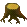

+++
title = "Introduction to Programming with Kara"
date = 2012-10-02
image = "kara-example-collect-leafs.png"
description = "Kara offers a playful introduction to fundamental concepts of programming."
prettify = true
comments = true
tags = [ "Java", "Dart" ]
+++

Kara offers a playful introduction to fundamental concepts of programming. Kara is a ladybug that lives in a simple world with trees, leafs and mushrooms.

   

The rules of Kara's world are simple:

#### Actions

* Kara can move around with `move()` (Kara can push a mushroom, can step on leafs but can't walk through trees)
* Kara turns left or right with `turnLeft()` or `turnRight()`
* Kara puts down a leaf with `putLeaf()`
* Kara picks up a leaf with `removeLeaf()`

#### Sensors

* Kara checks if he stands on a leaf with `onLeaf()`
* Kara checks if there is a tree with `treeFront()`, `treeLeft()`, or `treeRight()`
* Kara checks if there is a mushroom in front with `mushroomFront()`

## A Sample Exercise

Kara is placed in the following world setup and must be programmed to collect all leafs until he reaches the tree:

 

One solution would be as follows:

#### Kara Collects Leafs

<pre class="prettyprint lang-java">
while (!treeFront()) {

  if (onLeaf()) {
    removeLeaf();
  }
  
  move();
}
</pre>

## Kara Versions - Which Kara Should I Use?

Kara has many different versions. The original Kara is designed as a finite state machine with a purely graphical program editor. See the full list of [available Kara versions](http://www.swisseduc.ch/informatik/karatojava/index.html).

I usually prefer to start directly with writing code in the Java language. Now there are quite a few possible editors/libraries:

### GreenfootKara (Java)

Since I really like the editor of the [Greenfoot IDE](http://greenfoot.org) I decided to create a Kara version that works with Greenfoot, it is called GreenfootKara. In addition to this I wrote an entire beginners course of 16-20 lessons with exercises and handouts to go along with GreenfootKara. You can find the links to the German and English versions on the [GreenfootKara](/library/greenfoot-kara/) page.

### GameGridKara (Java)

Sometimes, especially if time is too short, it might be good to directly start with a professional development environment like Eclipse or NetBeans. Since it was not possible to integrate Greenfoot into Eclipse/NetBeans, I had to find another solution. Altough, we could start JavaKara from Eclipse/NetBeans, there are just some things that are not possible (like programming an interactive Kara game). The solution was to port the code to work with a library called *JGameGrid*.

GameGridKara enables us to use Kara in any IDE of our choice by simply adding two jar files to a project. The link to GameGridKara with the adjusted beginners course in German and English can be found on the [GameGridKara](/library/gamegrid-kara/) page.

### JavaKara (Java)

JavaKara is the original editor. You can find the [JavaKara download and resources here](http://www.swisseduc.ch/informatik/karatojava/javakara/index.html) (in German).

