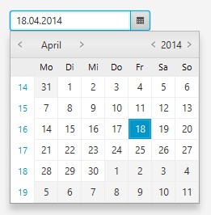

+++
title = "JavaFX 8 Date Picker"
date = 2014-04-18
updated = 2014-05-14
image = "date-picker.png"
description = "Finally, with JavaFX 8 a DatePicker control was added! Learn how to use it, together with the new Java 8 Date and Time API."
prettify = true
# comments = true
tags = [ "Java", "JavaFX" ]
+++

Finally, with JavaFX 8 a `DatePicker` control was added (for JavaFX 2 we had to [create our own](/blog/javafx-2-date-picker))! 

The `DatePicker` works well in combination with the new **Java 8 Date and Time API**. Those two things together provide a much better experience when working with dates in Java!

## Basic Usage

Using the DatePicker is straight forward:

<pre class="prettyprint lang-java">
// Create the DatePicker.
DatePicker datePicker = new DatePicker();

// Add some action (in Java 8 lambda syntax style).
datePicker.setOnAction(event -> {
    LocalDate date = datePicker.getValue();
    System.out.println("Selected date: " + date);
});

// Add the DatePicker to the Stage.
StackPane root = new StackPane();
root.getChildren().add(datePicker);
stage.setScene(new Scene(root, 500, 650));
stage.show();
</pre>

#### Using FXML

I usually prefer keeping as much of the view in `fxml` instead of instantiating the controls in Java code as above. With [Scene Builder 2.0](http://www.oracle.com/technetwork/java/javase/downloads/javafxscenebuilder-info-2157684.html) and above you can even drag-and-drop the DatePicker into your `fxml`.

## Options

### Hide Week Numbers

We can set the `showWeekNumbersProperty` to true/false to show/hide a column showing week numbers. Note: The default value depends on the country of the current locale. 

<pre class="prettyprint lang-java">
datePicker.setShowWeekNumbers(false);
</pre>

### Date Converter

The date in the text field is automatically converted to the local format (in my case, it's `dd.MM.yyyy`). By setting a `StringConverter` we can change this, for example, to `yyyy-MM-dd`.

<pre class="prettyprint lang-java">
String pattern = "yyyy-MM-dd";

datePicker.setPromptText(pattern.toLowerCase());

datePicker.setConverter(new StringConverter&lt;LocalDate&gt;() {
     DateTimeFormatter dateFormatter = DateTimeFormatter.ofPattern(pattern);

     @Override 
     public String toString(LocalDate date) {
         if (date != null) {
             return dateFormatter.format(date);
         } else {
             return "";
         }
     }

     @Override 
     public LocalDate fromString(String string) {
         if (string != null &amp;&amp; !string.isEmpty()) {
             return LocalDate.parse(string, dateFormatter);
         } else {
             return null;
         }
     }
 });
</pre>

### Other Calendar Systems

If you need a different chronology, e.g. the Japanese Imperial calendar system, you can change it as follows:

<pre class="prettyprint lang-java">
// Japanese calendar.
datePicker.setChronology(JapaneseChronology.INSTANCE);

// Hijrah calendar.
datePicker.setChronology(HijrahChronology.INSTANCE);

// Minguo calendar.
datePicker.setChronology(MinguoChronology.INSTANCE);

// Buddhist calendar.
datePicker.setChronology(ThaiBuddhistChronology.INSTANCE);
</pre>

Here is a screenshot of the Hijrah calendar:

