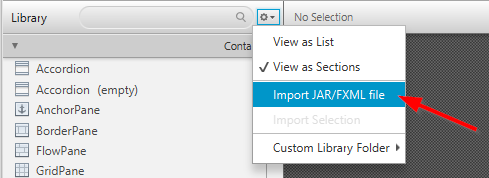

+++
title = "Update to JavaFX 8 - What's New?"
date = 2014-05-10
image = "addressapp-javafx8.png"
description = "I describe the changes I made when updating to JavaFX 8. This should give you a fairly good overview of the new possibilities of Java 8 and JavaFX 8."
prettify = true
# comments = true
tags = [ "Java", "JavaFX" ]
+++

JavaFX 8 is included in JDK 8 and is the **officially recommended graphics toolkit for Java 8 applications**. I've been using JavaFX 2 since 2012 and am very pleased as it was already a major step forward compared to Swing. Now with JavaFX 8 it has become even better, with new UI controls like [DatePicker](/blog/javafx-8-date-picker/), a modern theme called *Modena*, rich text support, to just name a few. 

## Updated Tutorial and Blog Articles

  

    

      I decided to rewrite the entire [tutorial series on JavaFX 2](/library/javafx-2-tutorial/) for [JavaFX 8](/library/javafx-tutorial/). There are quite a few things that are more comfortable now. 
    

  

### Updated Tutorial

<table class="table table-striped">
  <thead>
    <tr>
      <th>JavaFX 2</th>
      <th></th>
      <th>JavaFX 8</th>
    </tr>
  </thead>
  <tbody>
    <tr>
      <td><a href="/library/javafx-2-tutorial/">Introduction</a></td>
      <td><i class="fa fa-fw fa-hand-o-right"></i></td>
      <td><a href="/library/javafx-tutorial/">Introduction</a></td>
    </tr>
    <tr>
      <td><a href="/library/javafx-2-tutorial/part1/">Part 1: Scene Builder</a></td>
      <td><i class="fa fa-fw fa-hand-o-right"></i></td>
      <td><a href="/library/javafx-tutorial/part1/">Part 1: Scene Builder</a></td>
    </tr>
    <tr>
      <td><a href="/library/javafx-2-tutorial/part2/">Part 2: Model and TableView</a></td>
      <td><i class="fa fa-fw fa-hand-o-right"></i></td>
      <td><a href="/library/javafx-tutorial/part2/">Part 2: Model and TableView</a></td>
    </tr>
    <tr>
      <td><a href="/library/javafx-2-tutorial/part3/">Part 3: Interacting with the User</a></td>
      <td><i class="fa fa-fw fa-hand-o-right"></i></td>
      <td><a href="/library/javafx-tutorial/part3/">Part 3: Interacting with the User</a></td>
    </tr>
    <tr>
      <td><a href="/library/javafx-2-tutorial/part4/">Part 4: CSS Styling</a></td>
      <td><i class="fa fa-fw fa-hand-o-right"></i></td>
      <td><a href="/library/javafx-tutorial/part4/">Part 4: CSS Styling</a></td>
    </tr>
    <tr>
      <td><a href="/library/javafx-2-tutorial/part5/">Part 5: Storing Data as XML</a></td>
      <td><i class="fa fa-fw fa-hand-o-right"></i></td>
      <td><a href="/library/javafx-tutorial/part5/">Part 5: Storing Data as XML</a></td>
    </tr>
    <tr>
      <td><a href="/library/javafx-2-tutorial/part6/">Part 6: Statistics Chart</a></td>
      <td><i class="fa fa-fw fa-hand-o-right"></i></td>
      <td><a href="/library/javafx-tutorial/part6/">Part 6: Statistics Chart</a></td>
    </tr>
    <tr>
      <td><a href="/library/javafx-2-tutorial/part7/">Part 7: Deployment</a></td>
      <td><i class="fa fa-fw fa-hand-o-right"></i></td>
      <td><a href="/library/javafx-tutorial/part7/">Part 7: Deployment</a></td>
    </tr>
  </tbody>
</table>

### Updated Articles

<table class="table table-striped">
  <thead>
    <tr>
      <th>JavaFX 2</th>
      <th></th>
      <th>JavaFX 8</th>
    </tr>
  </thead>
  <tbody>
    <tr>
      <td><a href="/blog/javafx-2-dialogs/">Dialogs</a></td>
      <td><i class="fa fa-fw fa-hand-o-right"></i></td>
      <td><a href="/blog/javafx-8-dialogs/">Dialogs</a></td>
    </tr>
    <tr>
      <td><a href="/blog/javafx-2-date-picker/">Date Picker</a></td>
      <td><i class="fa fa-fw fa-hand-o-right"></i></td>
      <td><a href="/blog/javafx-8-date-picker/">Date Picker</a></td>
    </tr>
    <tr>
      <td><a href="/blog/javafx-2-event-handlers-and-change-listeners/">Event Handlers and Change Listeners</a></td>
      <td><i class="fa fa-fw fa-hand-o-right"></i></td>
      <td><a href="/blog/javafx-8-event-handling-examples/">Event Handling Examples</a></td>
    </tr>
    <tr>
      <td><a href="/blog/javafx-2-tableview-filter/">TableView Filter</a></td>
      <td><i class="fa fa-fw fa-hand-o-right"></i></td>
      <td><a href="/blog/javafx-8-tableview-sorting-filtering/">TableView Sorting and Filtering</a></td>
    </tr>
    <tr>
      <td><a href="/blog/javafx-2-tableview-cell-renderer/">TableView Cell Renderer</a></td>
      <td><i class="fa fa-fw fa-hand-o-right"></i></td>
      <td><a href="/blog/javafx-8-tableview-cell-renderer/">TableView Cell Renderer</a></td>
    </tr>
  </tbody>
</table>

*****

## What's New?

In the following I will describe the most significant changes I made. This should give you a fairly good overview of the **new possibilities of Java 8 and JavaFX 8**.

## New JavaFX 8 UI Components

&rarr; See [JavaFX 8 Tutorial - Part 1](/library/javafx-tutorial/part1/)

JavaFX 8 includes some new UI components:

* `TextFlow` - supports Rich Text
* `TreeTableView` - a combination of TreeView and TableView
* `DatePicker` -  yes, finally! Here is a short [how-to article for the new DatePicker](/blog/javafx-8-date-picker/)
* `SwingNode` - for embedding Swing content into a JavaFX application
* Various controls for 3D support

They are all supported in Scene Builder 2.

### Adding Custom UI Components

I tried to add custom components in Scene Builder 1 but it didn't work properly. It is now possible to permanently add a custom UI component in Scene Builder 2. It is bit difficult to find, though:

You should also be able to drag-and-drop a custom component into the library.

### Various Scene Builder Improvements

There are various smaller improvements that were made. Overall, it's a very pleasant experience to work with Scene Builder 2!

*****

## JavaFX Properties

&rarr; See [JavaFX 8 Tutorial - Part 2 (Create the Model Class)](/library/javafx-tutorial/part2/#create-the-model-class)

[JavaFX Properties](http://docs.oracle.com/javase/8/javafx/properties-binding-tutorial/binding.htm) were already available in JavaFX 2 but I chose not to use them to keep the model class simpler. Now, I think the advantages are enough to justify a little more code in the model class.

Properties provide means to listen for changes. This helps keep the view in sync with data changes in model classes. When working with JavaFX you will find Properties used all over the place. So it is important to understand a little bit about the their philosophy.

Let's take a look at a small part of the `Person` class in the tutorial: 

<pre class="prettyprint lang-java">
public class Person {
    
    // Define a variable to store the property.
    private final StringProperty firstName;

    // The getter for the property's value.
    public String getFirstName() {
        return firstName.get();
    }
    
    // The setter for the property's value.
    public void setFirstName(String firstName) {
        this.firstName.set(firstName);
    }
    
    // The getter for the property itself.
    public StringProperty firstNameProperty() {
        return firstName;
    }
}
</pre>

The new convention here is to use a wrapper class like `StringProperty` instead of a simple `String` value. By returning the `StringProperty` with the `firstNameProperty()` method other classes can get access to the property. The three methods should always be named exactly according to the convention. 

With the properties in place we can add a listener as follows:

<pre class="prettyprint lang-java">
Person p = new Person();
p.firstNameProperty().addListener((observable, oldValue, newValue) -> {
    System.out.println(newValue);
});
</pre>

Another example: Listening to [text changes of a TextBox](/blog/javafx-8-event-handling-examples/#textbox-events). 

*****

## Java 8 Date and Time API

&rarr; See [JavaFX 8 Tutorial - Part 2 (Create the Model Class)](/library/javafx-tutorial/part2/#create-the-model-class)

In the `Person` class we're using the [`LocalDate`](http://docs.oracle.com/javase/8/docs/api/java/time/LocalDate.html) type for the `birthday`. `LocalDate` is part of the new [Date and Time API](http://docs.oracle.com/javase/tutorial/datetime/iso/). Finally(!), Java has a consistent and convenient way to work with dates and time!

*****

## Java 8 Lambda Expressions

&rarr; See [JavaFX 8 Tutorial - Part 2 (The PersonOverviewController)](/library/javafx-tutorial/part2/#the-personoverviewcontroller)   
&rarr; See [JavaFX 8 Tutorial - Part 3 (Listen for Table Selection Changes)](/library/javafx-tutorial/part3/#listen-for-table-selection-changes)

From the start, JavaFX 8 has been designed to support the new **Java 8 language features**. Especially *Lambdas* make the UI code much more pleasant. 

As an example, let's take a look at how to set a `cellValueFactory` to a `TableView` column. The `cellValueFactory` is used to determine which field inside our `Person` object should be used for a particular column.

##### CellValueFactory with and without Lambdas

<pre class="prettyprint lang-java">
// With Lambdas
firstNameColumn.setCellValueFactory(
        cellData -> cellData.getValue().firstNameProperty());

// Without Lambdas
firstNameColumn.setCellValueFactory(new Callback&lt;TableColumn.CellDataFeatures&lt;Person,String>, ObservableValue&lt;String>>() {
    @Override
    public ObservableValue&lt;String> call(CellDataFeatures&lt;Person, String> cellData) {
        return cellData.getValue().firstNameProperty();
    }
});
</pre>

Another option would be to use the `PropertyValueFactory` (we used it in the JavaFX 2 version of the tutorial). For the `PropertyValueFactory` we need to provide the property `firstName` as a String. I prefer the versions above as this isn't type-safe and thus error prone: When you change the name of the property you might forget to change the String of the `PropertyValueFactory`. 

<pre class="prettyprint lang-java">
// With PropertyValueFactory (not type-safe)
firstNameColumn.setCellValueFactory(
        new PropertyValueFactory&lt;Person, String>("firstName"));
</pre>

*****

## ControlsFX Dialogs

&rarr; See [JavaFX 8 Dialogs](/blog/javafx-8-dialogs/)   
&rarr; See [JavaFX 8 Tutorial - Part 3 (Error Handling)](/library/javafx-tutorial/part3/#error-handling)

If you need a UI component that is not included in the standard JavaFX you can always take a look at the excellent [ControlsFX](http://fxexperience.com/controlsfx/) project. I use it mostly for the great Dialogs.

<pre class="prettyprint lang-java">
Dialogs.create()
        .owner(stage)
        .title("Information Dialog")
        .masthead("Look, an Information Dialog")
        .message("I have a great message for you!")
        .showInformation();
</pre>

*****

## Using JAXB instead of XStream

&rarr; See [JavaFX 8 Tutorial - Part 5 (Persisting Data as XML)](/library/javafx-tutorial/part5/#persisting-data-as-xml)

In the JavaFX 2 version of the tutorial we were using [XStream](http://xstream.codehaus.org/) for converting to and from XML. This was working ok for the simple model classes. Now that we're using JavaFX `Properties` in our `Person` model, XStream causes some trouble. XStream tries to convert the entire `Properties` to XML which generates a very large file.

With the JavaFX `Properties` in the model we need to tell the XML converter to use the `getters` and `setters` and not the `Property` fields. This can be done in JAXB with the `@XmlAccessorType`. In fact, the default accessor type is `PUBLIC_MEMBER` which means that our private `Property` fields will be ignored.

Another reason to use JAXB is that it is already included in the JDK which means we don't need to add another library.

### LocalDate Adapter

&rarr; See [JavaFX 8 Tutorial - Part 5 (LocalDateAdapter.java)](/library/javafx-tutorial/part5/#localdateadapter-java)

JAXB doesn't know how to convert the new `LocalDate` type. We must provide a custom `LocalDateAdapter` that tells JAXB how to *marshal* (convert `LocalDate` to `String`) and *unmarshal* (convert `String` to `LocalDate`).

*****

## Deplyoment

&rarr; See [JavaFX 8 Tutorial - Part 7](/library/javafx-tutorial/part7/)

The [e(fx)clipse](http://www.eclipse.org/efxclipse/index.html) plugin has been improved: We don't need to worry about editing the `eclipse.ini` file to ensure Eclipse is started with the correct JDK. That's great and I hope this actually works on all platforms...

Deplyoment is always difficult. I've tried to write it as simple and clear as possible but I'm pretty sure there will still be some obstacles.

*****

I hope the new tutorial and articles will help you create some fantastic apps. I'd love to hear how it's working for you. <a href="#disqus_thread"><i class="fa fa-comment-o"></i></a>

<i class="fa fa-beer"></i> Marco
