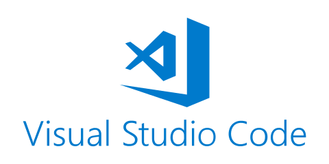
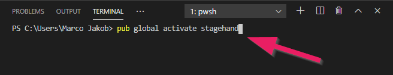

+++
title = "Installation"
date = 2015-05-01
updated = 2020-05-05
description = "Installing Dart and Visual Studio Code."
image = "dart-sdk-icon.png"
prettify = true
comments = true

sidebarName = "<i class=\"fa fa-fw fa-cog\"></i> Installation"
pagingName = "<i class=\"fa fa-fw fa-cog\"></i>"
weight = 2

[[sidebars]]
header = "Links"
[[sidebars.items]]
text = "<i class=\"fa fa-fw fa-external-link\"></i> Dart SDK"
link = "https://dart.dev/tools/sdk/archive"
[[sidebars.items]]
text = "<i class=\"fa fa-fw fa-external-link\"></i> Visual Studio Code"
link = "https://code.visualstudio.com/"
+++

To start programming we need...

- Dart SDK
- Visual Studio Code Editor
- `Hello Dart` scenarios

## Installing Dart SDK

1. Go to [Dart SDK Website](https://dart.dev/tools/sdk/archive).
2. Under `Stable channel` download the Dart SDK as zip file for your operating system.
3. Unzip the downloaded files to a folder like `C:\dart-sdk\` (on Windows).

### Configure PATH Environment Variable

To run the Dart tools from command line we need to add two directories to the PATH [environment variables](https://www.computerhope.com/issues/ch000549.htm).

- The `bin` subfolder where you put your Dart SDK: `C:\dart-sdk\bin` (or similar)
- The [pub cache](https://dart.dev/tools/pub/cmd/pub-global#running-a-script-from-your-path) (Dart's package manager): `%APPDATA%\Pub\Cache\bin` (on Windows) or `$HOME/.pub-cache/bin` (on macOS)

## Installing Visual Studio Code

Go to the [Visual Studio Code](https://code.visualstudio.com/) website and install it. This will be our code editor.

### Install Dart Extension

In Visual Studio Code open the extensions menu.

Then install the Dart extension. This will give us support for the Dart language in the code editor.

## Install Web Server

We need a web server, called [webdev](https://dart.dev/tools/webdev), to be able to start our Dart programs. 

Open the terminal in the menu with **View | Terminal**.

Use the command `pub global activate webdev` and hit enter.

## Install Web Server

We need a web server, called [webdev](https://dart.dev/tools/webdev), to be able to start our Dart programs. 

Open the terminal in the menu with **View | Terminal**.

Use the command `pub global activate webdev` and hit enter.

## Install Project Generator (Stagehand)

For setting up basic web applications we will use [Stagehand](https://pub.dev/packages/stagehand).

Open the terminal in the menu with **View | Terminal**.

Use the command `pub global activate stagehand` and hit enter.

## Ready

Now you are ready to start your Dart adventures, for example with [Hello Dart](/library/hello-dart/) or [Dart Kanban](/library/dart-kanban/).