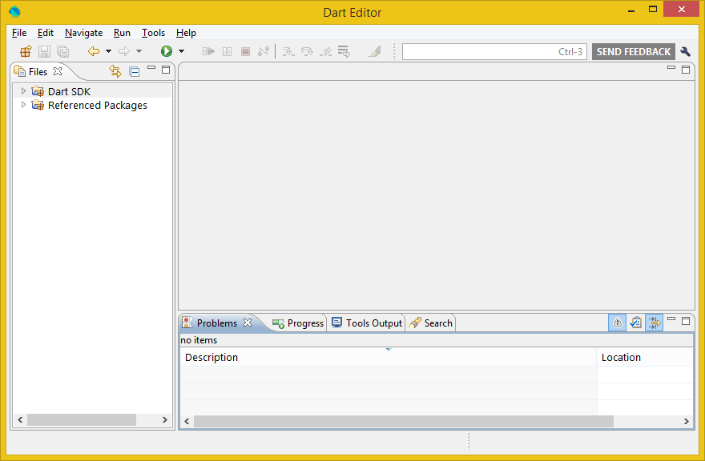

+++
title = "Dart Editor installieren"
date = 2015-03-23
description = "Dart Editor installieren und starten. Was enthält die Installation?"
image = "dart-editor.png"
prettify = false
comments = true
commentsIdentifier = "/library/dart-kanban/de/install/"
aliases = [ 
  "/library/dart-kanban/de/install/" 
]

sidebarName = "<i class=\"fa fa-fw fa-cog\"></i> Dart Editor installieren"
pagingName = "<i class=\"fa fa-fw fa-cog\"></i>"
weight = 1

[[sidebars]]
header = "Source Code"

[[sidebars.items]]
text = "<i class=\"fa fa-fw fa-github-alt\"></i> Beispielcode auf GitHub"
link = "https://github.com/marcojakob/tutorial-dart-kanban"
+++

*Falls Sie den Dart Editor bereits installiert haben, können Sie diesen Teil überspringen.*

## Dart Editor herunterladen

1. Laden Sie den [Dart Editor hier](https://www.dartlang.org/tools/download.html) herunter.
2. Entpacken Sie das Zip mit dem Dart Editor auf Ihre Festplatte.

  <strong>Hinweis:</strong> Dart Editor benötigt Java in der Version 6 oder höher. Falls Sie noch keine Java Runtime installiert haben, laden Sie diese herunter und installieren Sie sie. Bei anderen Problemen mit der Installation, suchen Sie unter <a href="https://www.dartlang.org/tools/editor/troubleshoot.html" class="alert-link">Troubleshoot</a> nach einer Lösung.

### Was enthält die Installation?

***

  

    
  

  

    Dart Editor ist ein einfacher aber trotzdem mächtiger Editor. Damit können Dart-Projekte erstellt, editert und verwaltet werden. 
  

***

  

    
  

  

    Dies ist eine spezielle Version des Chrome Web Browsers, genannt Dartium, welcher die Dart VM (virtual machine) enthält. Dart Programme können direkt in diesem Browser laufen. Der Dart Editor führt Projekte automatisch darin aus.
  

***

  

    
  

  

    Das Verzeichnis <strong>dart-sdk</strong> enthält das Dart Software Development Kit. Hier befinden sich die Dart Standard-Bibliotheken und Tools für die Kommandozeile.
  

***

## Dart Editor starten

 Starten Sie den Dart Editor mit einem Doppelklick auf die ausführbare Datei im Installationsordner.

