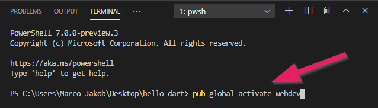

+++
title = "Dart installieren"
date = 2015-03-23
updated = 2020-05-05
image = "dart-editor.png"
description = "Dart installieren und starten. Was enthält die Installation?"
prettify = false
comments = true
commentsIdentifier = "/library/dart-kanban/de/install/"
aliases = [ 
  "/library/dart-kanban/de/install/" 
]

sidebarName = "<i class=\"fa fa-fw fa-cog\"></i> Dart installieren"
pagingName = "<i class=\"fa fa-fw fa-cog\"></i>"
weight = 1

[[sidebars]]
header = "Source Code"

[[sidebars.items]]
text = "<i class=\"fa fa-fw fa-github-alt\"></i> Beispielcode auf GitHub"
link = "https://github.com/marcojakob/tutorial-dart-kanban"
+++

*Falls Sie den Dart bereits installiert haben, können Sie diesen Teil überspringen.*

## Dart installieren

1. Gehe zur [Dart SDK Website](https://dart.dev/tools/sdk/archive).
2. Unter `Stable channel` lade das Dart SDK als zip für dein Betriebssystem herunter.
3. Entpacke das heruntergeladene Zip in den Ordner `C:\dart-sdk\` (auf Windows).
4. Füge `C:\dart-sdk\bin` zu den [Umgebungsvariablen](https://www.computerhope.com/issues/ch000549.htm) in deinen Systemeinsteillungen hinzu.

## Visual Studio Code installieren

Gehe zur [Visual Studio Code](https://code.visualstudio.com/) Website und installiere es. Visual Studio Code wird unser Programmiereditor sein.

### Dart Extension installieren

In Visual Studio Code öffne das "extensions" Menu.

Installiere nun die Dart "extension". Dies macht den Code Editor parat für die Dart Sparche.

## Web Server installieren

Wir brauchen einen Web Server, genannt [webdev](https://dart.dev/tools/webdev), um unsere Dart-Programme zu starten.

Öffne das Terminal unter dem Menu **View | Terminal**.

Gib den Befehl `pub global activate webdev` ein und drücke Enter.

##  Web Server starten

Gib nun `webdev serve` im Terminal ein.

Dies wird den Web Server lokal starten. Du solltest eine lokale Web-Adresse sehen (beginnt mit http://127....). Nutze Ctrl+click auf diese URL, um den Browser zu öffnen (am besten Chrome verwenden).