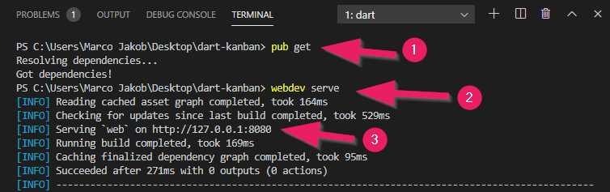
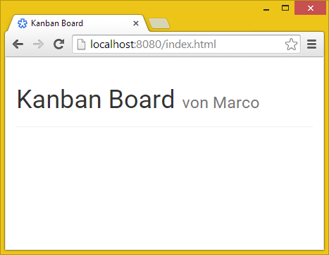

+++
title = "Teil 1: Webapp erstellen"
date = 2015-03-23
description = "Eine erste Webapplikation mit Dart erstellen. Dart mit HTML verknüpfen und ein HTML-Element mit Dart verändern."
image = "first-run.de.png"
prettify = true
comments = true
commentsIdentifier = "/library/dart-kanban/de/part1/"
aliases = [ 
  "/library/dart-kanban/de/part1/" 
]

pagingName = "1"
weight = 2

[[sidebars]]
header = "Source Code"

[[sidebars.items]]
text = "<i class=\"fa fa-fw fa-github-alt\"></i> Beispielcode auf GitHub"
link = "https://github.com/marcojakob/tutorial-dart-kanban"
+++

## Eine Webapplikation erstellen

Um eine Webapplikation zu erstellen öffnen Sie das Menu **File | New Project...**

1. Schreiben Sie `dart_kanban` in das Feld für den *Project name*.
2. Legen Sie im zweiten Feld den Ordner fest, wo Sie das Projekt speichern wollen.
3. Wählen Sie **ubersimplewebapp** aus der Liste der Vorlagen aus.
4. Klicken Sie auf **Finish**.

Der Dart Editor erstellt daraufhin alle Dateien, die es für eine Webapplikation braucht. Wir schauen uns nun die wichtigsten Dateien an.

### Die HTML-Datei

Die Datei `web/index.html` ist die Datei, die vom Browser geladen wird und die Grundstruktur vorgibt. Ersetzen Sie den automatisch erstellen Code mit dem folgenden HTML.

<pre class="prettyprint lang-html">
&lt;!DOCTYPE html>
&lt;html>
  &lt;head>
    &lt;meta charset="utf-8">
    &lt;meta http-equiv="X-UA-Compatible" content="IE=edge">
    &lt;meta name="viewport" content="width=device-width, initial-scale=1.0">
    &lt;link rel="stylesheet" href="https://maxcdn.bootstrapcdn.com/bootstrap/3.3.4/css/bootstrap.min.css">
    &lt;link rel="stylesheet" href="styles/main.css">
    &lt;title>Kanban Board&lt;/title>
  &lt;/head>

  &lt;body>
    &lt;div class="container">
      &lt;div class="page-header">
        &lt;h1>Kanban Board &lt;small id="subtitle">&lt;/small>&lt;/h1>
      &lt;/div>
    &lt;/div>

    &lt;script type="application/dart" src="main.dart">&lt;/script>
    &lt;script src="packages/browser/dart.js">&lt;/script>
  &lt;/body>
&lt;/html>
</pre>

Speichern Sie die Datei nach den Änderungen mit **File | Save** oder der Tastenkombination **Ctrl+S**.

#### Erklärungen zum HTML-Code

Im `head` werden zwei Stylesheets eingefügt. Wir verwenden hier das [Bootstrap](http://holdirbootstrap.de/) CSS für ein attraktives Aussehen. Das zweite ist unser eigenes CSS.

Der `body` enthält zwei Div-Container mit Bootstrap-Klassen und einen Titel und Untertitel. Der Untertitel hat eine ID `subtitle`, die wir später noch verwenden werden.

Am Schluss befinden sich die zwei wichtigen `script`-Tags. Das erste gibt an, dass die `main.dart`-Datei geladen werden soll. Das zweite Script, `dart.js`, wird verwendet für Browser, die kein Dart unterstützten. Darin wird `main.dart` mit dem entsprechenden JavaScript ersetzt.

### Die Dart-Datei

Öffnen Sie die Datei `main.dart` und ändern Sie den Code so ab, dass er wie folgt aussieht.

<pre class="prettyprint lang-dart">
import 'dart:html';

void main() {
  Element subtitle = querySelector('#subtitle');
  subtitle.text = 'von Marco';
}
</pre>

#### Erklärungen zum Dart-Code

In der ersten Zeile wird Darts HTML-Bibliothek importiert. Diese beinhaltet die wichtigsten Klassen und Funktionen, um mit dem HTML-Dokument zu interagieren.

##### Die main()-Funktion

Dann folgt die `main()`-Funktion. Diese Funktion ist der Startpunkt des Dart-Programms. Jede Dart-Applikation muss **genau eine main-Funktion** haben.

##### querySelector() verwenden

Die Funktion `querySelector()` stammt aus der importierten `dart:html` Bibliothek. Damit kann man ein Element aus dem HTML-Dokument holen. In unserem Fall ist dies das Element mit der ID `subtitle`.

Wir speichern das Untertitel-Element in eine Variable. Mit dem **Punkt-Operator** können wir auf Eigenschaften zugreifen und diese verändern. 

Mit dem Gleichheits-Zeichen (`=`) setzen wir den Text auf den String-Wert `'von Marco'`.

    <strong>Alternative:</strong> Wir könnten die zwei Schritte in unserem Programm auch auf einer Zeile zusammenfassen. Damit bräuchten wir keine Variable.
<pre class="prettyprint lang-dart">
querySelector('#subtitle').text = 'von Marco';
</pre>

## Die Webapplikation starten

Selektieren Sie nun die `index.html` und klicken Sie auf den Run-Knopf . Der Dart Editor öffnet Dartium (spezieller Chrome Browser mit integrierter Dart VM) und lädt die `index.html`. Der Dart-Code sorgt dafür, dass der Untertitel gesetzt wird, wie im folgenden Screenshot.

### Andere Browser

Wenn Sie die Webapplikation in einem anderen Browser laufen lassen möchten, dann kann der Dart-Code nach JavaScript übersetzt werden mittels dem [dart2js](https://www.dartlang.org/tools/dart2js/) Tool (ist bereits im Dart Editor enthalten). Dazu gibt es im Dart Editor ein praktisches Kontextmenu:

Im letzten Teil dieser Serie wird noch genauer beschrieben, wie eine Dart-Applikation in JavaScript übersetzt und auf einem Webserver veröffentlicht werden kann.

## Wie weiter?

Im [Teil 2](/de/library/dart-kanban/part2/) bereiten wir die Grundstruktur der HTML-Datei für unser Kanban Board vor.

