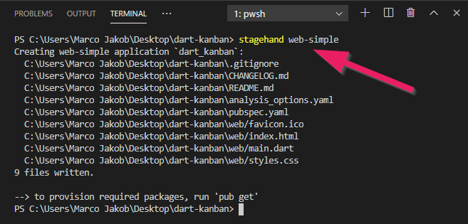
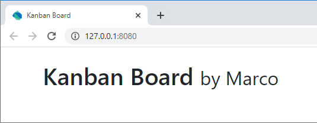

+++
title = "Teil 1: Webapp erstellen"
date = 2015-03-23
updated = 2020-05-05
image = "first-run.png"
description = "Eine erste Webapplikation mit Dart erstellen. Dart mit HTML verknüpfen und ein HTML-Element mit Dart verändern."
prettify = true
comments = true
commentsIdentifier = "/library/dart-kanban/de/part1/"
aliases = [ 
  "/library/dart-kanban/de/part1/" 
]

pagingName = "1"
weight = 2

[[sidebars]]
header = "Source Code"

[[sidebars.items]]
text = "<i class=\"fa fa-fw fa-github-alt\"></i> Beispielcode auf GitHub"
link = "https://github.com/marcojakob/tutorial-dart-kanban"
+++

## Eine Webapplikation erstellen

Erstelle zuerst einen Ordner auf deinem Computer für deine Webapplikation (z.B. `dart-kanban`).

Öffne den leeren Ordner in **Visual Studio Code**.

Öffne das Terminal unter dem Menu **View | Terminal**.

Gib den Befehl `stagehand web-simple` ein und drücke Enter.

*Hinweis: Wenn du hier eine Fehlermeldung erhältst, dann kann es sein, dass deine Installation noch nicht korrekt ist (siehe [Dart Installation](/de/library/dart-install/)).*

Dies erstellt alle Dateien, die es für eine Webapplikation braucht. Wir schauen uns nun die wichtigsten Dateien an.

### Die HTML-Datei

Die Datei `web/index.html` ist die Datei, die vom Browser geladen wird und die Grundstruktur vorgibt.

<pre class="prettyprint lang-html">
&lt;!DOCTYPE html>

&lt;html>
  &lt;head>
    &lt;meta charset="utf-8" />
    &lt;meta http-equiv="X-UA-Compatible" content="IE=edge" />
    &lt;meta name="viewport" content="width=device-width, initial-scale=1.0" />
    <mark>&lt;link rel="stylesheet" href="https://stackpath.bootstrapcdn.com/bootstrap/4.5.0/css/bootstrap.min.css"></mark>
    <mark>&lt;title>Kanban Board&lt;/title></mark>
    &lt;link rel="stylesheet" href="styles.css" />
    &lt;link rel="icon" href="favicon.ico" />
    &lt;script defer src="main.dart.js">&lt;/script>
  &lt;/head>

  &lt;body>
    <mark>&lt;div class="container"></mark>
    <mark>  &lt;div class="page-header mt-4 mb-4"></mark>
    <mark>    &lt;h1>Kanban Board &lt;small id="subtitle">&lt;/small>&lt;/h1></mark>
    <mark>  &lt;/div></mark>
    <mark>&lt;/div></mark>
  &lt;/body>
&lt;/html>
</pre>

Wir ändern die HTML Datei etwas ab und machen folgende Ergänzungen (siehe Markierungen):

- Zeile mit [Bootstrap](https://getbootstrap.com/).
- Anpassung des Titels im Head.
- Inhalt mit Container, Titel und Platzhalter für den Untertitel (werden wir später noch verwenden).

Speichere die Datei nach den Änderungen mit der Tastenkombination <kbd>Ctrl+S</kbd>.

### Die Dart-Datei

Öffne die Datei `main.dart` und ändere den Code so ab, dass er wie folgt aussieht.

<pre class="prettyprint lang-dart">
import 'dart:html';

void main() {
  var subtitle = querySelector('#subtitle');
  subtitle.text = 'by Marco';
}
</pre>

#### Erklärungen zum Dart-Code

In der ersten Zeile wird Darts HTML-Bibliothek importiert. Diese beinhaltet die wichtigsten Klassen und Funktionen, um mit dem HTML-Dokument zu interagieren.

##### Die main()-Funktion

Dann folgt die `main()`-Funktion. Diese Funktion ist der Startpunkt des Dart-Programms. Jede Dart-Applikation muss **genau eine main-Funktion** haben.

##### querySelector() verwenden

Die Funktion `querySelector()` stammt aus der importierten `dart:html` Bibliothek. Damit kann man ein Element aus dem HTML-Dokument holen. In unserem Fall ist dies das Element mit der ID `subtitle`.

Wir speichern das Untertitel-Element in eine Variable. Mit dem **Punkt-Operator** können wir auf Eigenschaften zugreifen und diese verändern. 

Mit dem Gleichheits-Zeichen (`=`) setzen wir den Text auf den String-Wert `'von Marco'`.

    <strong>Alternative:</strong> Wir könnten die zwei Schritte in unserem Programm auch auf einer Zeile zusammenfassen. Damit bräuchten wir keine Variable.
<pre class="prettyprint lang-dart">
querySelector('#subtitle').text = 'von Marco';
</pre>

## Die Webapplikation starten

Öffne das Terminal (**View | Terminal**) und gib folgende Befehle ein:

`pub get` (ist nur das erste Mal nötig, um die benötigten Packages herunterzuladen).

`webdev serve` (startet den Webserver)

Klicke nun auf mit Ctrl+Click auf die URL, damit diese im Browser geöffnet wird.

Nun solltest du folgenden Bildschirm sehen. Der Dart-Code sorgt dafür, dass der Untertitel gesetzt wird, wie im folgenden Screenshot.

    <strong>Zum Beenden:</strong>  Um den Webserver zu beenden, nutze die Tastenkombination <kbd>Ctrl+C</kbd> im Terminal (geht für alle Prozesse, die im Terminal laufen).

## Wie weiter?

Im [Teil 2](/de/library/dart-kanban/part2/) bereiten wir die Grundstruktur der HTML-Datei für unser Kanban Board vor.

