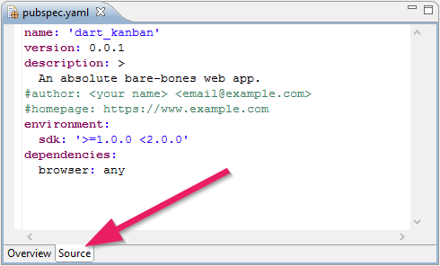
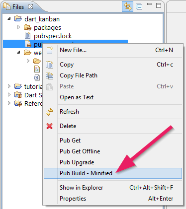
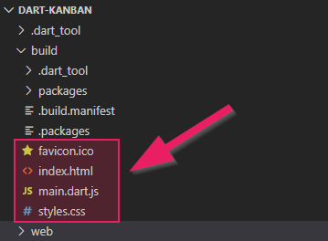

+++
title = "Teil 5: Veröffentlichen"
date = 2015-03-23
image = "dart-kanban.png"
description = "Die Dart Applikation nach JavaScript übersetzen. Den generierten Build-Ordner auf einem Webserver veröffentlichen."
prettify = true
comments = true
commentsIdentifier = "/library/dart-kanban/de/part5/"
aliases = [ 
  "/library/dart-kanban/de/part5/" 
]

pagingName = "5"
weight = 6

[[sidebars]]
header = "Source Code"

[[sidebars.items]]
text = "<i class=\"fa fa-fw fa-github-alt\"></i> Beispielcode auf GitHub"
link = "https://github.com/marcojakob/tutorial-dart-kanban"
+++

Wenn man eine coole App mit Dart programmiert hat, dann möchte man diese natürlich auch veröffentlichen.

## Dart nach JavaScript übersetzen

Damit alle Browser unser Programm verstehen, müssen wir es nach JavaScript übersetzen lassen. 

### pubspec.yaml anpassen

In jedem Dart-Projekt hat es eine `pubspec.yaml`-Datei. Darin wird beschrieben, welche externen Bibliotheken (*Packages*) in unserem Projekt verwendet werden. Dazu kann man auch Einstellungen vornehmen, die die Übersetzung in JavaScript beeinflussen.

Öffnen Sie `pubspec.yaml` und wechseln Sie in die **Source**-Ansicht.

Wir brauchen nun noch ein zusätzliches *Package* und die Angabe eines *Transformers*. Ersetzen Sie den Inhalt von `pubspec.yaml` mit folgendem Code:

<pre class="prettyprint">
name: dart_kanban
version: 0.0.1
description: Ein Kanban Board programmiert mit Dart
environment:
  sdk: '>=1.0.0 &lt;2.0.0'
dependencies:
  browser: any
<mark>  dart_to_js_script_rewriter: any
transformers:
- dart_to_js_script_rewriter</mark>
</pre>

Der `dart_to_js_script_rewriter` wird in unserem HTML den Link auf die Dart-Datei erstezen mit einem Link auf die neu generierte JavaScript-Datei.

### Pub Build

Nun sind wir bereit für das Übersetzen in JavaScript: **Rechtsklick** auf `pubspec.yaml` | **Pub Build - Minified**. 

Dann dauert es ein paar Sekunden und ein neuer Ordner mit Namen `build` wird erstellt mit dem übersetzten JavaScript.

## Der Build Ordner

Im generierten `build`-Ordner befinden sich nun all die Dateien, die wir brauchen, um unser Programm auf einen Webserver zu stellen.

Neben den oben abgebildeten Dateien und Ordner gibt es noch einen Ordner `build/web/packages`, welcher im Dart Editor ausgeblendet wird (im Datei-Explorer oder Finder ist dieser sichtbar). Dieser Ordner enthält Dateien von anderen *Packages*, die das Dart-Programm allenfalls benötigt.

## Veröffentlichen (Deployment)

Das Veröffentlichen geht ganz einfach. Wir können den gesamten Ordner `build/web` auf einen Server kopieren, zum Beispiel per FTP. Da unser ganzes Programm im Browser auf dem Client läuft, haben wir keine speziellen Anforderungen an den Server.

  <strong>Tipp:</strong> Der Unterordner `build/web/packages` wird im Dart Editor ausgeblendet. Bei manchen Projekten werden in der Endversion Dateien aus dem *Packages* Ordner verwendet (in unserem Kanban Board noch nicht). Vergessen Sie bei zukünftigen Projekten nicht, diesen Ordner auch auf den Webserver zu kopieren.

### Hostingmöglichkeiten

Im [HTML & CSS Tutorial Teil 2](/de/library/html-css/part2/) habe ich verschiedene Möglichkeiten beschrieben, wie man eine Website gratis oder sehr günstig hosten lassen kann. All diese Hosting-Anbieter können genau gleich verwendet werden für unsere Dart-Programme.

#### Netlify

Speziell empfehlen kann ich [Netlify](https://www.netlify.com), da es kaum eine einfachere Möglichkeit gibt für Hosting: Einfach die Dateien per Drag-and-Drop in den (Chrome) Browser ziehen und schon ist die Seite live. Dies funktioniert sogar ohne Login!

#### Andere Hostinganbieter

Neben Netlify geibt es natürlich zahlreiche andere Hostingmöglichkeiten. Ein paar sind wie gesagt im [HTML & CSS Tutorial](/de/library/html-css/part2/) beschrieben.

## Wie weiter?

Erfahren Sie die [nächsten Schritte](/de/library/dart-kanban/next/) und wie Sie das Kanban Board weiterentwickeln können.

