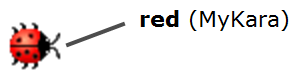
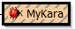
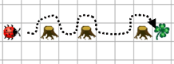

+++
title = "Kapitel 1: Erste Schritte"
date = 2012-10-03
updated = 2014-03-08
image = "greenfootkara-screenshot.png"
description = "In diesem Kapitel wagen wir unsere ersten Schritte im Programmieren."
prettify = true
# comments = true
commentsIdentifier = "/library/greenfoot-kara/de/chapter1/"
aliases = [ 
  "/library/greenfoot-kara/de/chapter1/" 
]

pagingName = "1"
weight = 2

[[sidebars]]
header = "Lösungen"
[[sidebars.items]]
text = "<i class=\"fa fa-fw fa-check-square-o\"></i> Lösungen Kapitel 1"
link = "/de/library/greenfoot-kara/chapter1/solutions/"

[[sidebars]]
header = "Downloads"
[[sidebars.items]]
text = "<i class=\"fa fa-fw fa-file-archive-o\"></i> scenarios-chapter-1.zip"
link = "https://github.com/marcojakob/greenfoot-kara/releases/download/v2.1.1/scenarios-chapter-1.zip"
[[sidebars.items]]
text = "<i class=\"fa fa-fw fa-file-word-o\"></i> Seite als Word-Datei"
link = "/de/library/convert-web-page-to-word/"
+++

In diesem Kapitel wagen wir unsere ersten Schritte im Programmieren.

## Greenfoot starten

Starten Sie [Greenfoot](https://www.greenfoot.org).

(Wenn Sie Greenfoot das erste Mal öffnen, erscheint ein Dialogfenster, das fragt, was Sie tun möchten. Klicken Sie dort auf *Choose Scenario*.)

Öffnen Sie das Szenario `Kara 101 First Steps` aus dem Ordner `scenarios-chapter-1`. Es erscheint nun das Hauptfenster von Greenfoot mit dem geöffneten Szenario ähnlich folgender Abbildung:

Das Greenfoot-Fenster besteht im Wesentlichen aus drei Bereichen und einigen zusätzlichen Knöpfen. Diese drei Hauptbereiche sind:

* Die **Welt** (world): Der grösste Bereich wird Welt genannt. Dies ist der Bereich, in dem das Programm ausgeführt wird und in dem wir verfolgen können, was passiert. Im Kara-Szenario ist die Welt eine grüne Wiese mit Gitterlinien.
* Das **Klassendiagramm**: Der Bereich zur Rechten enthält die Klassen, die uns zur Verfügung stehen. In unserem Kara-Szenario brauchen wir zuerst vor allem den Käfer Kara.
* Die **Greenfoot-Steuerung**: Die Knöpfe Act, Run, und Reset und der Schieberegler für die Geschwindigkeit ganz unten dienen der Programmsteuerung. Darauf werden wir später zu sprechen kommen.

***

## Klassen und Objekte

Für unsere Projekte verwenden wir die Programmiersprache **Java**. Java ist eine sogenannte objektorientierte Sprache. Für objektorientierte Programmierung sind die Konzepte von Klassen und Objekten von grundlegender Bedeutung.

Betrachten wir einmal die **Klasse** `Kara`. Die Klasse `Kara` steht für das allgemeine Konzept eines Käfers – sie ist sozusagen wie ein Bauplan, aus dem wir einzelne Käfer erstellen können. Die erzeugten Käfer werden als Objekte (oder auch Instanzen) bezeichnet.

In Greenfoot erstellen wir neue Objekte wie folgt: Rechte Maustaste auf die Klasse Kara und Menüpunkt *new Kara()* auswählen. Anschliessend kann das Objekt irgendwo in der Welt (auf der grünen Wiese) mit einem Klick abgesetzt werden.

#### <i class="fa fa-rocket"></i> AUFGABE 1.01: First Steps

Erzeugen Sie ein Objekt vom (**grauen**!) Kara. Erzeugen Sie mehrere Objekte von den Kleeblättern (Leaf).

*Tipp: Um mehrere Objekte der gleichen Klasse zu erstellen, kann die Shift-Taste gedrückt werden.*

***

## Mit Objekten interagieren

Zum Interagieren mit Objekten in der Welt klicken wir sie mit der rechten Maustaste an, um das **Objektmenu** aufzurufen. Das Objektmenu von Kara zeigt uns, was dieser spezielle Kara alles machen kann. Diese Operationen werden in Java **Methoden** genannt.

#### <i class="fa fa-rocket"></i> AUFGABE 1.02

1. Was bewirkt die Methode move()?
2. Platzieren Sie zwei Karas in Ihrer Welt und sorgen Sie dafür, dass sie sich anschauen. Welche Methode brauchen Sie dazu?
3. Testen Sie die weiteren Methoden. In welche zwei Arten können die Methoden unterteilt werden?

***

## Rückgabetypen

Das Wort vor einer Methodenbezeichnung wird auch als **Rückgabetyp** bezeichnet. Es teilt uns mit, was die Methode zurückliefert, wenn wir sie aufrufen. Das Wort `void` bedeutet in diesem Falle *nichts* – sie liefern also nichts zurück und führt nur eine Aktion aus.

Wird anstelle von `void` irgendetwas anderes angegeben, wissen wir, dass die Methode uns ein Resultat zurückliefert und auch von welchem Typ dieses Resultat ist. Der Typ `boolean` kennt zwei mögliche Werte: `true` (wahr) oder `false` (falsch). Dann gibt es noch eine Reihe weiterer Typen, auf die wir später eingehen werden.

#### <i class="fa fa-rocket"></i> AUFGABE 1.03

1. Rufen Sie die Methode `onLeaf()` für einen Kara auf. Liefert Sie immer `false` zurück? Oder gibt es auch Situationen, in denen sie `true` zurückliefert?
2. Setzen Sie zusätzlich einen Baum (Tree) in die Welt. Mit welcher Methode können Sie überprüfen, ob Kara vor einem Baum steht?
3. Was passiert, wenn Sie Kara mittels der Methode `move()` in einen Baum fahren lassen?

***

## Objektzustand

Mittels *Rechtsklick | Inspect (Inspizieren)* auf einem Kara-Objekt können wir den Zustand des Objektes ermitteln. 

#### <i class="fa fa-rocket"></i> AUFGABE 1.04

Welche Zustandswerte hat Kara in den folgenden Situationen (beachten Sie nur die Koordinaten und die Drehung)?

1. x: ?, y: ?, rotation: ?   

2. x: ?, y: ?, rotation: ?   

**Beachte: Das erste Feld oben links hat die Koordinaten (0, 0) und NICHT (1, 1)!**

***

## Ausführen von Programmen in Greenfoot

Bis jetzt haben wir immer nur mit Mausklicks mit den Objekten interagiert. Es gibt aber noch eine weitere Möglichkeit, nämlich indem wir Programme schreiben.

Von nun an arbeiten wir mit dem **roten Kara** (Klasse `MyKara`)! 

In diese Klasse schreiben wir dann unsere Programme.

#### <i class="fa fa-rocket"></i> AUFGABE 1.05

1. Platzieren Sie ein Objekt von `MyKara` in Ihre Welt. Welche Methode haben Sie nun neu zur Verfügung?
2. Was macht diese Methode?
3. Was passiert, wenn Sie in der Greenfoot-Steuerung (unten links) auf den **Act-Button** drücken?
4. Klicken Sie auf den **Run-Button**. Was geschieht? (Versuchen Sie mal die Geschwindigkeit zu verstellen)
5. Welche Methoden finden Sie unter *Rechtsklick | inherited from Kara*? Können Sie die auch benutzen?

***

## Quellcode

Vorhin haben wir die `act()`-Methode kennen gelernt. Nun wollen wir uns anschauen, wo das Verhalten dieser Methode denn überhaupt programmiert wurde. Dazu müssen wir den **Quelltext** im Editor öffnen: *Rechtsklick* auf die Klasse *MyKara | Open editor* (oder einfach *Doppelklick*).

Der Quelltext ist in **Java** geschrieben und enthält alle Details zu einer Klasse und ihren Objekten. Für den Moment interessiert uns nur der unterste Teil, wo die Methode `act()` definiert ist. Hier sollten die drei Befehle: `move()`, `turnRight()` und `move()` untereinander stehen. Sie können nun diese Befehle verändern und erweitern. 

Wenn Sie die Änderungen abgeschlossen haben, schliessen Sie das Editorfenster. Sie werden feststellen, dass die Klasse grau schraffiert angezeigt wird. 

Dies ist ein Hinweis darauf, dass die Klasse bearbeitet wurde und jetzt neu übersetzt (oder fachsprachlich: kompiliert) werden muss. Das **Kompilieren** ist ein Übersetzungsprozess: Der Quelltext der Klasse wird in Maschinencode übersetzt, den der Computer ausführen kann.

Die Klassen in Greenfoot werden mit dem Knopf **Compile** (unten rechts im Hauptfenster) übersetzt. Sobald die Klassen übersetzt sind, verschwinden die Streifen und wir können wieder Objekte erstellen.

### Der Übersetzungsprozess (Kompilieren)

#### <i class="fa fa-rocket"></i> AUFGABE 1.06: Putting Leaf

Ändern Sie den Inhalt der `act()`-Methode so, dass Kara zuerst einen Schritt macht, dann ein Kleeblatt legt und wieder einen Schritt macht. (Am Anfang der Klasse finden Sie als Kommentar alle Aktionen, die Kara durchführen kann.)

*Beachten Sie: Nach jedem Befehl muss ein Strichpunkt stehen!*

#### <i class="fa fa-rocket"></i> AUFGABE 1.07: Around Tree

Erstellen Sie folgende Welt:

**Tipp:** Damit Sie nicht bei jedem Start die Welt wieder neu zusammenstellen müssen, können Sie die Welt speichern: *Recktsklick auf die Welt | saveWorldSetupToFile()*. Dann wählen Sie am besten einen neuen Dateinamen.
Damit Ihre Welt auch geladen wird, müssen Sie in der Klasse `KaraWorld` die Konstante `WORLD_SETUP_FILE` ändern:

<pre class="prettyprint lang-java">
public static final String WORLD_SETUP_FILE = "[MyName].txt";
</pre>

Schreiben Sie nun ein Programm, welches Kara auf dem angegebenen Weg zum Kleeblatt führt. Er muss dabei um die Bäume herumlaufen. Beim Kleeblatt angekommen, soll er es aufheben.

***

## Kara erhält neue Methoden

#### <i class="fa fa-rocket"></i> AUFGABE 1.08: Around Tree with Method

Wenn Sie Aufgabe 1.07 korrekt gelöst haben, so sollte Ihr Programm **drei gleiche Teile** enthalten, nämlich für das Herumgehen um jeden Baum. Dies können wir zur besseren Übersicht noch etwas erweitern, indem wir eine neue Methode einführen. Unterhalb der `act()`-Methode erstellen wir eine neue Methode:

<pre class="prettyprint lang-java">
public void goAroundTree() {

}
</pre>

Schreiben Sie zwischen die geschweiften Klammern der Methode die Befehle, die es braucht, um um den Baum zu kommen.

Benutzen Sie nun innerhalb der `act()`-Methode die Methode `goAroundTree()` für jeden der drei Bäume.

***

## Lernkontrolle zu Kapitel 1

1. Bezeichnen Sie die folgenden Elemente im Bild:   
*Welt, Klassendiagramm, Knopf zum Kompilieren, eine Klasse, ein Objekt*   

2. Was macht eine Methode mit `void` als Rückgabetyp?   
*Führt eine Aktion aus, gibt aber kein Resultat zurück*

3. Was macht eine Methode mit `boolean` als Rückgabetyp?   
*Gibt als Resultat einen boolean zurück.*

4. Welche Werte kann ein `boolean` haben?   
*true oder false*

5. Was ist der Unterschied zwischen `move()` und `act()` in unserem Kara-Szenario?   
*`move()` bewegt Kara um eins vorwärts. In `act()` können beliebige Methoden aufgerufen werden.*

6. Was bedeutet Kompilieren? Weshalb ist es nötig?   
*Kompilieren ist die Übersetzung von Quelltext in Maschinencode, damit es der Computer verstehen kann.*

*** 

***Credits:*** *Dieses Kapitel basiert auf dem Buch [Einführung in Java mit Greenfoot](https://www.greenfoot.org/book) von Michael Kölling. [Ideen und Konzepte von Kara](http://www.swisseduc.ch/informatik/karatojava/) wurden entwickelt von Jürg Nievergelt, Werner Hartmann, Raimond Reichert et al.*

***

## Wie weiter?

Fahren Sie weiter mit [Kapitel 2: Programmfluss](/de/library/greenfoot-kara/chapter2)

