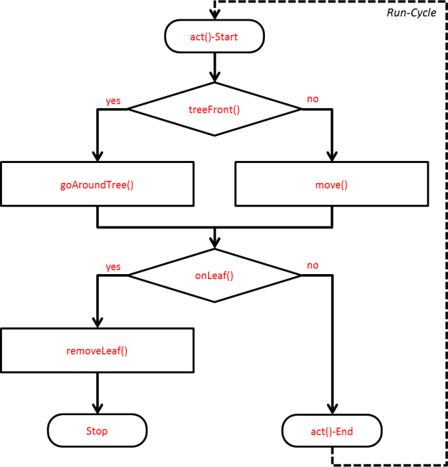
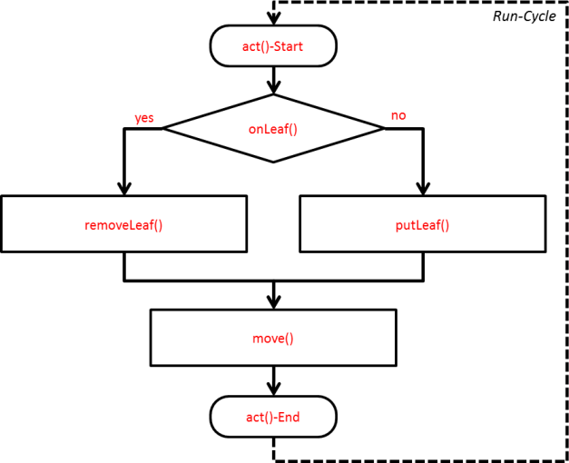
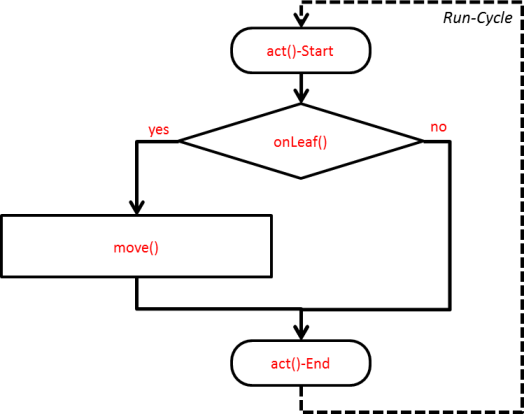
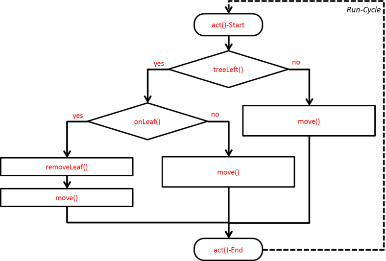

+++
title = "Solutions"
date = 2014-07-10
prettify = true
# comments = true
commentsIdentifier = "/library/greenfoot-kara/fr/chapter2-solutions/"
aliases = [ 
  "/library/greenfoot-kara/fr/chapter2-solutions/" 
]

pagingName = "<i class=\"fa fa-fw fa-check-square-o\"></i>"
sidebarName = "<i class=\"fa fa-fw fa-check-square-o\"></i> Solutions"

[[sidebars]]
header = "Downloads"
[[sidebars.items]]
text = "<i class=\"fa fa-fw fa-file-archive-o\"></i> scenarios-chapter-2-solutions.zip"
link = "https://github.com/marcojakob/greenfoot-kara/releases/download/v2.1.1/scenarios-chapter-2-solutions.zip"
[[sidebars.items]]
text = "<i class=\"fa fa-fw fa-file-word-o\"></i> Page en fichier Word"
link = "/library/convert-web-page-to-word/"
+++

#### <i class="fa fa-check-square-o"></i> SOLUTION TÂCHE 2.01

***

#### <i class="fa fa-check-square-o"></i> SOLUTION TÂCHE 2.02

***

#### <i class="fa fa-check-square-o"></i> SOLUTION TÂCHE 2.03

1. Décrivez avec des mots ce que réalise le code suivant.   
  **Supprime une feuille s'il y en a une, dépose une feuille là où il n'y en n'a pas.**

2. Puis décrivez chacune d'entre elles dans un diagramme.

***

#### <i class="fa fa-check-square-o"></i> SOLUTION TÂCHE 2.04

1. Décrivez avec des mots ce que réalise le code suivant.   
  **Si Kara est sur une feuille elle avance d'un pas.**

2. Puis décrivez chacune d'entre elles dans un diagramme.

***

#### <i class="fa fa-check-square-o"></i> SOLUTION TÂCHE 2.05

1. Décrivez avec des mots ce que réalise le code suivant.   
  **Supprime la feuille s'il y a un arbre sur la gauche.**

2. Puis décrivez chacune d'entre elles dans un diagramme.

***

#### <i class="fa fa-check-square-o"></i> SOLUTION TÂCHE 2.06 : Autour de l'arbre II

<pre class="prettyprint lang-java">
public void act() {
    if (treeFront()) {
        goAroundTree();
    } else {
        move();
    }

    if (onLeaf()) {
        removeLeaf();
        stop();
    }
}

public void goAroundTree() {
    turnLeft();
    move();
    turnRight();
    move();
    move();
    turnRight();
    move();
    turnLeft();
}
</pre>

***

#### <i class="fa fa-check-square-o"></i> SOLUTION TÂCHE 2.07 : Conditions imbriquées

<pre class="prettyprint lang-java">
public void act() {
    if (treeLeft()) {
        move();
    } else {
        if (onLeaf()) {
            removeLeaf();
            move();
        } else {
            move();
        }
    }
}
</pre>

***

#### <i class="fa fa-check-square-o"></i> SOLUTION TÂCHE 2.08 : Peur du tunnel

<pre class="prettyprint lang-java">
public void act() {
    if (treeLeft() && treeRight()) {
        putLeaf();
        stop();
    } else {
        move();
    }
}
</pre>

***

#### <i class="fa fa-check-square-o"></i> SOLUTION TÂCHE 2.09 : Feuille sur l'arbre

<pre class="prettyprint lang-java">
public void act() {
    if (treeLeft() || treeRight()) {
        putLeaf();
        move();
    } else {
        move();
    }

    if (onLeaf()) {
        stop();
    }
}
</pre>

***

#### <i class="fa fa-check-square-o"></i> SOLUTION TÂCHE 2.10 : Réaliser une ligne de feuilles

<pre class="prettyprint lang-java">
public void act() {
    if (!onLeaf()) {
        putLeaf();
    }

    if (!treeFront()) {
        move();
    } else {
        stop();
    }
}
</pre>

***

#### <i class="fa fa-check-square-o"></i> SOLUTION TÂCHE 2.11 : Round Trip

<pre class="prettyprint lang-java">
public void act() {
    if (onLeaf()) {
        removeLeaf();
    } else {
        if (!treeFront()) {
            move();
        } else {
            if (!treeLeft()) {
                turnLeft();
                move();
            } else {
                turnRight();
                move();
            }
        }
    }
}
</pre>

***

#### <i class="fa fa-check-square-o"></i> SOLUTION TÂCHE 2.12 : Kara joue à Pacman

<pre class="prettyprint lang-java">
public void act() {
    if (!treeFront()) {
        removeLeaf();
        findNextLeaf();
    } else {
        removeLeaf();
        stop();
    }
}

public void findNextLeaf() {
    // look for leaf in front
    move();
    if (!onLeaf()) {
        // no leaf in front, go back and look left
        turnAndGoBack();
        turnRight();
        move();
        if (!onLeaf()) {
            // no leaf left; leaf must be on right side
            turnAndGoBack();
            move();
        }
    }
}

public void turnAndGoBack() {
    turnLeft();
    turnLeft();
    move();
}
</pre>

***

#### <i class="fa fa-check-square-o"></i> SOLUTION TÂCHE 2.13

<table class="table">
  <thead>
    <tr>
      <th>#</th>
      <th>Code</th>
      <th>Explication</th>
      <th>Nbre de pas</th>
    </tr>
  </thead>
  <tbody>
    <tr>
      <td>a.</td>
      <td><pre>while (treeLeft()) {
  move();
}</pre></td>
      <td>Se déplace tant qu'il y a un arbre sur sa gauche.</td>
      <td>4</td>
    </tr>
    
    <tr>
      <td>b.</td>
      <td><pre>while (treeRight()) {
  move();
}</pre></td>
      <td>Se déplace tant qu'il y a un arbre sur sa droite.</td>
      <td>0</td>
    </tr>
    
    <tr>
      <td>c.</td>
      <td><pre>while (treeLeft() || treeRight()) {
  move();
}</pre></td>
      <td>Se déplace tant qu'il y a un arbre sur sa gauche ou sur sa droite ou de chaque côté.</td>
      <td>5</td>
    </tr>
    
    <tr>
      <td>d.</td>
      <td><pre>if (treeLeft()) {
  move();
} while (treeLeft() && treeRight()) {
  move();
}</pre></td>
      <td>D'abord, se déplace s'il y a un arbre sur la gauche ; 
Puis se déplace tant qu'il y a un arbre à gauche et à droite.
</td>
      <td>4</td>
    </tr>

    <tr>
      <td>e.</td>
      <td><pre>while (!treeFront) {
  if (treeLeft()) {
    move();
  }
}</pre></td>
      <td>Aussi longtemps qu'il n'y a pas d'arbre de-vant Kara : S'il y a un arbre à gauche, fait un pas.
      
      **Attention : boucle infinie !**
</td>
      <td>4</td>
    </tr>
    
  </tbody>
</table>

***

#### <i class="fa fa-check-square-o"></i> SOLUTION TÂCHE 2.14 : Autour de l'arbre III

<pre class="prettyprint lang-java">
public void act() {
    while (!onLeaf()) {
        if (treeFront()) {
            goAroundTree();
        } else {
            move();
        }
    }

    // Found leaf --> eat it
    removeLeaf();

    stop();
}

public void goAroundTree() {
    turnLeft();
    move();
    turnRight();
    move();

    while (treeRight()) {
        move();
    }

    turnRight();
    move();
    turnLeft();
}
</pre>

***

#### <i class="fa fa-check-square-o"></i> SOLUTION TÂCHE 2.15 : Grimper

<pre class="prettyprint lang-java">
public void act() {
    while (treeFront()) {
        oneStepUp();
    }

    stop();
}

public void oneStepUp() {
    turnLeft();
    move();
    turnRight();
    move();
}
</pre>

***

#### <i class="fa fa-check-square-o"></i> SOLUTION TÂCHE 2.16 : Kara garde forestier

<pre class="prettyprint lang-java">
public void act() {
    makeOneStep();
}

public void makeOneStep() {
    if (!treeRight()) {
        // no tree right --> go right
        turnRight();
        move();
    } else {
        // there is a tree right
        if (!treeFront()) {
            // no tree in front --> move
            move();
        } else {
            // trees right and front
            if (!treeLeft()) {
                // no tree left --> go left
                turnLeft();
                move();
            } else {
                // trees right, front and left: dead end
                turnLeft();
                turnLeft();
                move();
            }
        }
    }
}
</pre>

