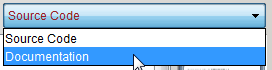

+++
title = "Chapter 4: Sokoban Game"
date = 2012-10-03
updated = 2014-03-08
image = "greenfootkara-screenshot.png"
description = "In this chapter of GreenfootKara we learn how to program a Sokoban game."
prettify = true
comments = true

pagingName = "4"
weight = 5

[[sidebars]]
header = "Solutions"
[[sidebars.items]]
text = "<i class=\"fa fa-fw fa-check-square-o\"></i> Solutions Chapter 4"
link = "/library/greenfoot-kara/chapter4/solutions/"

[[sidebars]]
header = "Downloads"
[[sidebars.items]]
text = "<i class=\"fa fa-fw fa-file-archive-o\"></i> scenarios-chapter-4.zip"
link = "https://github.com/marcojakob/greenfoot-kara/releases/download/v2.1.1/scenarios-chapter-4.zip"
[[sidebars.items]]
text = "<i class=\"fa fa-fw fa-file-word-o\"></i> Page as Word File"
link = "/library/convert-web-page-to-word/"
+++

## Sokoban 

Sokoban (倉庫番, Japanese "Warehouse Manager") is a computer game developed by Hiroyuki Imabayashi in 1982 under the name "Thinking Rabbit" and was published on different computer systems. (Source: [Sokoban on Wikipedia](https://en.wikipedia.org/wiki/Sokoban))

### Gameplay

In In a simple game the principle task is to have a character move successively all objects - usually boxes - to the designated target areas. The boxes can only be moved and cannot be pulled by the character, nor can several boxes be simultaneously pushed. Besides mastering a level it is a continuing challenge to minimize the necessary steps.

In our Kara Sokoban the mushrooms must be pushed on the target fields (leaves).

### Description of Levels

Many Sokoban games use a simple ASCII format to describe the levels (ASCII is a character set containing the latin alphabet, arabic numbers and some other signs). To create our own levels any text editor can be used. The following example shows a Kara world and its ASCII representation:

 

<pre class="prettyprint">
####
# .#
#  ###
# @  #
#  $ #
#  ###
####
</pre>

The different elements are represented by the following symbols:

* `#`: Tree
* `@`: Kara
* `.`: Leaf
* `$`: Mushroom
* `*`: Mushroom on a Leaf
* `+`: Kara on a Leaf

***

## Programming Sokoban

So that we can play with Kara Sokoban, we have to program the behavior of Kara. The player should be able to control Kara with the arrow keys:

### Control with Arrow Keys

Open the scenario **Kara 401 Sokoban** from the folder **scenarios-chapter-4**. 

Now you'll see the usual Kara-world with a few extra classes. The extra classes should not disturb us, we will continue to primarily deal with the classes `Kara` and `MyKara`.

Double-click to open the editor for the (gray) `KaraSokoban` class. This class contains the methods that are available to `MyKara`. The methods of `Kara` are also inherited. In the top right dropdown inside the editor choose *documentation* instead of *source code* . 

 

In the documentation you'll only see the comments for the class and methods. The most important thing for us will appear under the title *Method Summary*.

 

Kara has some of the same, and some new methods. Make yourself familiar with the methods and click the blue links for more detailed information.

Now, find the method by which we receive **information about pressed keys**.

The appropriate method has a return type that is a `String`. A `String` is a text (e.g. a word or phrase) that is enclosed in double quotation marks. The following examples are all `String` examples:

* `"I am a string"`
* `"Hello"`
* `"a"`

In our case, the resulting `String` is the name of the key that was pressed last. We can save this `String` with the following line into a variable:

<pre class="prettyprint lang-java">
String key = getKey();
</pre>

Write this code in the `act()` method from the (red) MyKara!

Strings can be compared by a special method called `equals()`. In order to react when a certain button is pressed, we must add the following if statement:

<pre class="prettyprint lang-java">
if (key.equals("left")) {
	// Left key was pressed -> do something
}
</pre>

#### <i class="fa fa-rocket"></i> TASK 4.01: Controlling Kara with Arrow Keys

Complete the code in the `act()` method so that Kara responds to all four arrow keys and moves in that direction. Use methods found in the documentation of the (gray) Kara! To test, press the **Run button**!

### Obstacles for Kara

What happens when you move into a tree or a mushroom?

#### <i class="fa fa-rocket"></i> TASK 4.02: Protecting Kara From Trees

Fix the error so that Kara does not move when he stands before a tree.

*Reminder:* You should not repeat code. It is recommended that you write a method that you can call more than once!

#### <i class="fa fa-rocket"></i> TASK 4.03: Kara Pushes Mushrooms

Kara is obviously supposed to push the mushrooms. Program Kara so that he can move a mushroom. Make sure that there are no error messages shown any more.

*Note: If you are stuck somewhere, you can press the button Retry Level.*

#### <i class="fa fa-rocket"></i> TASK 4.04: Work Done

After Kara has done his work, he should get a new task, i.e. the next level should be loaded. Kara has a way with which he can verify whether a level is completed. Find out which method it is and call it in the right place in your program.

Then you should be taken to the next level. Right now you have four levels that you can play. We'll add more levels later.

#### <i class="fa fa-rocket"></i> TASK 4.05: Kara Counts the Steps

At the bottom of the screen you will find an indicator for moves, however, it does not work yet. Kara also has a method to set this number. The following command will set the number to 3, for example: `setNumberOfMoves(3);`

Extend your program so that it counts the number of steps. For this you will need to declare a variable outside the `act()` method. This is called an *instance variable*, because it is available for the entire object.

#### <i class="fa fa-rocket"></i> TASK 4.06: Play the Game

Now, our Sokoban game is ready to be played. The game already has a main menu, which can be unlocked as follows:

In the `MyKara` class you will find a constant called `DEVELOPER_MODE`. If you set this constant to `false`, and compile, the main menu will start. In the main menu, you can enter the level password. This way you can continue your game at the level where you left off the last time.

#### <i class="fa fa-rocket"></i> TASK 4.07: Design Your Own Levels
 
The levels are read from the file **Levels.txt**. Locate the file in the scenario and open it in a text editor. Try to create an additional level.

*Hints:*

1. You can create levels in Greenfoot a bit easier with a little trick. Make sure the `DEVELOPER_MODE` is set to `true`. Now, you can place the actors in the Greenfoot world.   
When you are finished, press on a blank spot in the world with the right mouse button. Select the command `generateASCIILevel()`. This will print a level in ASCII format to the console. This code you can copy directly into the level file.
2. The file with the levels can also be exchanged with others. In order that you can have several different level-files, the variable `LEVEL_FILE` can be modified in the `MyKara` class.
3. For additional levels, you can get inspiration from the following websites:
  * http://sneezingtiger.com/sokoban/levels.html (look at Microban levels - the others are very large! - and open as text)
  * http://www.sourcecode.se/sokoban/levels.php (if you click on the *T*, you get the desired level in ASCII text format)

#### <i class="fa fa-rocket"></i> TASK 4.08 (creative): Change Images

The pictures of Kara, mushroom, leaf, tree and background can be replaced. To select a different image, right-click on the classes and choose *set image...*. Most of the images are 28 x 28 pixels in size.

#### <i class="fa fa-rocket"></i> TASK 4.09 (advanced): The Highscore

In the class `MyKara`, if the constant `HIGHSCORE_ENABLED` is set to `true`, the highscores are displayed. In the main menu an additional button is turned on.

There are always three highscores for each level. Kara has methods to change the highscore.

Try expanding your program so that it checks whether the player has achieved a highscore. If so, the highscore should be added.

#### <i class="fa fa-rocket"></i> FURTHER IDEAS: Sound 

You could add sound to your Kara scenario with Greenfoot. Information on Sound can be found in the Greenfoot documentation for the Class `GreenfootSound`.

***

I hope you had fun with the ladybug Kara.

If you would like to share your scenario with others, select the menu *Scenario* and choose *Export*. The export can either be made to the Greenfoot Gallery (online) or as an executable Java Program. 

## What's Next?

Continue with [Chapter 5: Methods](/library/greenfoot-kara/chapter5)
