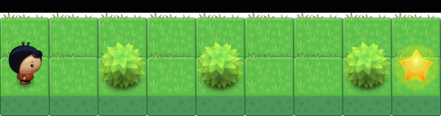
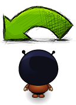
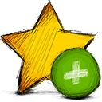

+++
title = "Hello Dart: Einführung in die Programmierung (Deutsch)"
date = 2015-01-21
updated = 2020-05-05
description = "Hello Dart ist eine spielerische Einführung in die Programmierung. Lernen Sie die Grundlagen der Programmierung mit Dart."
image = "hello-dart.png"
prettify = false
# comments = true
commentsIdentifier = "/library/hello-dart/de/"
aliases = [ 
  "/library/hello-dart/de/" 
]

sidebarName = "Einleitung"
pagingName = "Intro"
+++

> `Hello Dart` ist eine spielerische Einführung in die Programmierung mit Dart.

Bisher war es kaum realistisch, als Programmieranfänger mobile oder webbasierte Applikationen zu entwickeln. Die Programmiersprache Dart bietet neue Möglichkeiten, wie solche Applikationen viel einfacher programmiert werden können.

`Hello Dart` führt Sie schrittweise durch die Grundlagen der Programmierung. Es werden keine Programmierkenntnisse vorausgesetzt. Die spielerische Welt von `Hello Dart` veranschaulicht Ihre Programme. Bald werden Sie aber aus den engen Regeln dieser Welt ausbrechen wollen, was auch das Ziel ist. Nach der Einführung mit `Hello Dart` haben Sie eine gute Grundlage, um schon bald eigene Web-Programmierprojekte zu realisieren.

<!--

Lesen Sie unter <a class="alert-link" href="/library/hello-dart/de/background/">Hintegrundinfos</a>, warum ich Dart im Moment als optimale Sprache für Web und Mobile Apps sehe, die sich sowohl für Einsteiger wie auch für professionelle Softwareentwickler eignet.

-->

## Die Welt

Die Welt von `Hello Dart` besteht aus Feldern, Bäumen und Sternen.

## Die Spieler

In der Welt von `Hello Dart` bewegen wir uns mit unserem Spielcharakter. Sie können aus einem von vier Charakteren auswählen. 

Ein Spielcharakter, genannt `Player`, hat folgende Möglichkeiten:

### Aktionen

<table class="table">
  <thead>
    <tr>
      <th>Aktion</th>
      <th>Befehl</th>
      <th>Beschreibung</th>
    </tr>
  </thead>
  <tbody>
    <tr>
      <td style="vertical-align:middle"></td>
      <td style="vertical-align:middle"><code>move()</code></td>
      <td style="vertical-align:middle">Der Spieler macht einen Schritt vorwärts.</td>
    </tr>
    <tr>
      <td style="vertical-align:middle"></td>
      <td style="vertical-align:middle"><code>turnLeft()</code></td>
      <td style="vertical-align:middle">Der Spieler dreht sich um 90° nach links.</td>
    </tr>
    <tr>
      <td style="vertical-align:middle"></td>
      <td style="vertical-align:middle"><code>turnRight()</code></td>
      <td style="vertical-align:middle">Der Spieler dreht sich um 90° nach rechts.</td>
    </tr>
    <tr>
      <td style="vertical-align:middle"></td>
      <td style="vertical-align:middle"><code>putStar()</code></td>
      <td style="vertical-align:middle">Der Spieler legt einen Stern hin.</td>
    </tr>
    <tr>
      <td style="vertical-align:middle"></td>
      <td style="vertical-align:middle"><code>removeStar()</code></td>
      <td style="vertical-align:middle">Der Spieler nimmt einen Stern weg.</td>
    </tr>
    <tr>
      <td style="vertical-align:middle"></td>
      <td style="vertical-align:middle"><code>say('Hello')</code></td>
      <td style="vertical-align:middle">Der Spieler sagt etwas in einer Sprechblase.</td>
    </tr>
  </tbody>
</table>

### Sensoren

<table class="table">
  <thead>
    <tr>
      <th>Sensor</th>
      <th>Befehl</th>
      <th>Beschreibung</th>
    </tr>
  </thead>
  <tbody>
    <tr>
      <td style="vertical-align:middle"></td>
      <td style="vertical-align:middle"><code>canMove()</code></td>
      <td style="vertical-align:middle">Der Spieler schaut nach, ob er sich auf das nächste Feld bewegen kann.</td>
    </tr>
    <tr>
      <td style="vertical-align:middle"></td>
      <td style="vertical-align:middle"><code>treeFront()</code></td>
      <td style="vertical-align:middle">Der Spieler schaut nach, ob sich vor ihm ein Baum befindet.</td>
    </tr>
    <tr>
      <td style="vertical-align:middle"></td>
      <td style="vertical-align:middle"><code>treeLeft()</code></td>
      <td style="vertical-align:middle">Der Spieler schaut nach, ob sich links von ihm ein Baum befindet.</td>
    </tr>
    <tr>
      <td style="vertical-align:middle"></td>
      <td style="vertical-align:middle"><code>treeRight()</code></td>
      <td style="vertical-align:middle">Der Spieler schaut nach, ob sich rechts von ihm ein Baum befindet.</td>
    </tr>
    <tr>
      <td style="vertical-align:middle"></td>
      <td style="vertical-align:middle"><code>onStar()</code></td>
      <td style="vertical-align:middle">Der Spieler schaut nach, ob er auf einem Stern steht.</td>
    </tr>
  </tbody>
</table>

## Los geht's

#### Installation

Als erstes sollten Sie Dart und die `Hello Dart`-Szenarien [installieren](/de/library/hello-dart/install/).

#### Hintergrundinfos

Falls Sie mehr darüber erfahren möchten, weshalb ich Dart und `Hello Dart` für die Programmierung empfehle, finden Sie unter [Hintergrundinfos](/de/library/hello-dart/background/) weiterführende Informationen.

***

### Copyright

Ich veröffentliche das Material von `Hello Dart` unter der [Creative Commons Attribution 4.0](https://creativecommons.org/licenses/by/4.0/) Lizenz. Dies bedeutet, dass Sie damit so ziemlich alles machen dürfen, was Sie möchten. Bitte beachten Sie aber Folgendes:

* Wenn Sie meine Unterlagen oder Programme verwenden, müssen Sie klar angeben, dass dieses Material von mir stammt. Die Angabe muss meinen Namen, einen Link zum Original und einen Link zur Lizenz enthalten. Es könnte etwa so aussehen, wie meine Quellenangaben für die Bilder unten an den Seiten.

***

*Quellen* 
<em class="small">
[Planet Cute](http://www.lostgarden.com/2007/05/dancs-miraculously-flexible-game.html) Bilder stammen von Daniel Cook (Lostgarden.com), veröffentlicht unter [CC BY 3.0](http://creativecommons.org/licenses/by/3.0/us/). 
[Oleg Yadrov](https://www.linkedin.com/in/olegyadrov) hat die "Planet Cute" Bilder weiterentwickelt und mir zur Verfügung gestellt. Optimiert wurden sie mit dem grossartigen [TexturePacker](https://www.codeandweb.com/texturepacker).
</em>