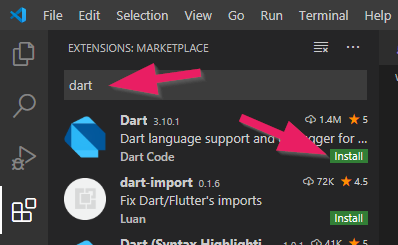

+++
title = "Installation"
date = 2015-01-26
updated = 2020-05-05
description = "Dart und Visual Studio Code. Die Hello Dart Szenarien laden und ein erstes Dart Programm starten."
image = "hello-dart.png"
prettify = true
comments = true
commentsIdentifier = "/library/hello-dart/de/install/"
aliases = [ 
  "/library/hello-dart/de/install/" 
]

sidebarName = "<i class=\"fa fa-fw fa-cog\"></i> Installation"
pagingName = "<i class=\"fa fa-fw fa-cog\"></i>"
weight = 2

[[sidebars]]
header = "Links"
[[sidebars.items]]
text = "<i class=\"fa fa-fw fa-external-link\"></i> Dart SDK"
link = "https://dart.dev/tools/sdk/archive"
[[sidebars.items]]
text = "<i class=\"fa fa-fw fa-external-link\"></i> Visual Studio Code"
link = "https://code.visualstudio.com/"
[[sidebars.items]]
text = "<i class=\"fa fa-fw fa-external-link\"></i> Hello Dart Szenarien"
link = "https://github.com/marcojakob/hello-dart/releases"
[[sidebars.items]]
text = "<i class=\"fa fa-fw fa-file-word-o\"></i> Seite als Word-Datei"
link = "/de/library/convert-web-page-to-word/"
+++

Zum Programmieren brauchen wir... 

- Dart SDK
- Visual Studio Code Editor
- `Hello Dart`-Szenarien

## Dart installieren

1. Gehe zur [Dart SDK Website](https://dart.dev/tools/sdk/archive).
2. Unter `Stable channel` lade das Dart SDK als zip für dein Betriebssystem herunter.
3. Entpacke das heruntergeladene Zip in einen Ordner, z.B. `C:\dart-sdk\` (auf Windows).

### PATH Umgebungsvariable definieren

Um die Dart-Tools von der Kommandozeile aus aufrufen zu können, müssen wir zwei Verzeichnise zur PATH [Umgebungsvariable](https://www.computerhope.com/issues/ch000549.htm) hinzufügen:

- Den `bin` Unterordner aus dem Ort, wo du das Dart SDK gespeichert hast: `C:\dart-sdk\bin` (oder so ähnlich).
- Den [pub cache](https://dart.dev/tools/pub/cmd/pub-global#running-a-script-from-your-path) (Darts package manager): `%APPDATA%\Pub\Cache\bin` (auf Windows) or `$HOME/.pub-cache/bin` (auf macOS)

## Visual Studio Code installieren

Gehe zur [Visual Studio Code](https://code.visualstudio.com/) Website und installiere es. Visual Studio Code wird unser Programmiereditor sein.

### Dart Extension installieren

In Visual Studio Code öffne das "extensions" Menu.

Installiere nun die Dart "extension". Dies macht den Code Editor parat für die Dart Sparche.

## `Hello Dart` Szenarien öffnen

1. Lade die Zip-Datei von [Hello Dart Releases](https://github.com/marcojakob/hello-dart/releases) herunter (achte darauf, die neuste Version zu nehmen).  
2. Entpacke das Zip auf deinem Computer.
3. In Visual Studio Code: Klicke auf **File | Open Folder...**. Wähle den `hello-dart` Ordner, den du soeben entpackt hast.
4. Rechtsklick auf die Datei `pubspec.yaml` und dann `Get Packages`.   

Dies wird alle Abhängikeiten herunterladen, die unser Programm braucht.

## Web Server installieren

Wir brauchen einen Web Server, genannt [webdev](https://dart.dev/tools/webdev), um unsere Dart-Programme zu starten.

Öffne das Terminal unter dem Menu **View | Terminal**.

Gib den Befehl `pub global activate webdev` ein und drücke Enter.

##  Web Server starten

Gib nun `webdev serve` im Terminal ein.

*Hinweis: Wenn du hier eine Fehlermeldung erhältst, dann kann es sein, dass deine PATH Umgebungsvariable noch nicht korrekt definiert wurde (siehe oben).*

Dies wird den Web Server lokal starten. Du solltest eine lokale Web-Adresse sehen (beginnt mit http://127....). Nutze Ctrl+click auf diese URL, um den Browser zu öffnen (am besten Chrome verwenden).

Im Browser solltest du eine Liste von Szenarien sehen. Wenn du das erste Szenario öffnest, so sollte so was in dieser Art erscheinen:

***

### Wie weiter?

Im [Teil 1](/de/library/hello-dart/part1/) machen wir unsere ersten Schritte beim Programmieren.

***

*Quellen* 
<em class="small">
[Planet Cute](http://www.lostgarden.com/2007/05/dancs-miraculously-flexible-game.html) Bilder stammen von Daniel Cook (Lostgarden.com), veröffentlicht unter [CC BY 3.0](http://creativecommons.org/licenses/by/3.0/us/). 
[Oleg Yadrov](https://www.linkedin.com/in/olegyadrov) hat die "Planet Cute" Bilder weiterentwickelt und mir zur Verfügung gestellt. Optimiert wurden sie mit dem grossartigen [TexturePacker](https://www.codeandweb.com/texturepacker).
</em>