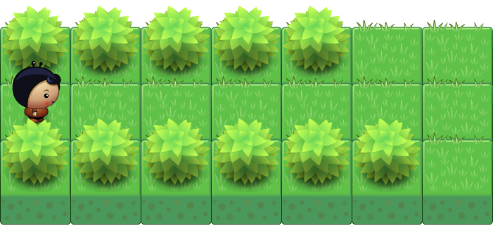
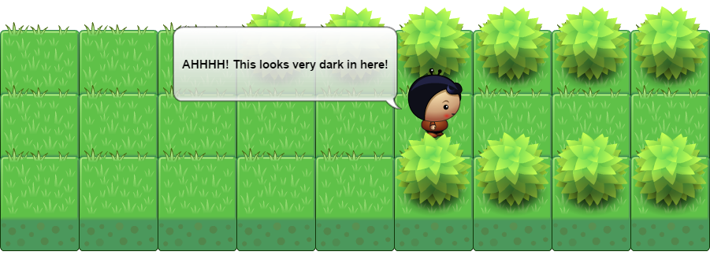

+++
title = "Part 2: Loops"
date = 2015-05-01
description = "Learn to program loops with Dart. With logical operators we control the program flow."
image = "leaving-the-tunnel.png"
prettify = true
comments = true

pagingName = "2"
weight = 4

[[sidebars]]
header = "Solutions"
[[sidebars.items]]
text = "<i class=\"fa fa-fw fa-check-square-o\"></i> Solutions Part 2"
link = "/library/hello-dart/part2/solutions/"

[[sidebars]]
header = "Links"
[[sidebars.items]]
text = "<i class=\"fa fa-fw fa-file-word-o\"></i> Page as Word File"
link = "/library/convert-web-page-to-word/"
+++

In the last part, we learned how we can give our player a set of instructions. Instead of listing each and every statement, we can also repeat instructions. In programming such repetitions are called **loops**.

As a first example of a loop, we will do the following:

#### <i class="fa fa-rocket mg-t"></i> TASK 2.01: Loop

The player should move forward until he can't move any more.

In Dart we can express this as follows:

<pre class="prettyprint lang-dart">
while (canMove()) {
  move();
}
</pre>

The `while` loop is repeated as long as the condition in the paranthesis returns `true`. Once the player arrives at the edge, the sensor function `canMove()` will return `false` and the player stops moving.

Test the program by adding the above `while` loop to the `start()` function of `scenario2.01`.

## Logical Operators

Our sensor functions (see [Introduction](/library/hello-dart/#sensors)) all respond with either `true` or `false` when you call them. A data type that can either be true or false is called a [Boolean](http://en.wikipedia.org/wiki/Boolean_data_type).

Boolean values can also be combined or changed by means of logical operators. The following table shows the three most important logical operators in Dart:

<table class="table">
  <thead>
    <tr>
      <th>Operator</th>
      <th>Description</th>
      <th>Example</th>
      <th></th>
    </tr>
  </thead>
  <tbody>
    <tr>
      <td><code>&&</code></td>
      <td>and</td>
      <td><code>treeFront() && onStar()</code></td>
      <td>Is true if both expressions are true, that means if the player is facing a tree <strong>and</strong> is on a star.</td>
    </tr>
    <tr>
      <td><code>||</code></td>
      <td>or</td>
      <td><code>treeFront() || onStar()</code></td>
      <td>Is true if either the first <strong>or</strong> the second expression, or both are true.</td>
    </tr>
    <tr>
      <td><code>!</code></td>
      <td>not</td>
      <td><code>!treeFront()</code></td>
      <td>Changes the expression from true to false and vice versa. This expression would return true if the player is <strong>not</strong> facing a tree.</td>
    </tr>
  </tbody>
</table>

An example in Dart could look like this:

<pre class="prettyprint lang-dart">
if (treeLeft() && onStar()) {
  // Do something ...
}
</pre>

or combined:

<pre class="prettyprint lang-dart">
if (treeLeft() && !treeRight()) {
  // Do something ...
}
</pre>

#### <i class="fa fa-rocket mg-t"></i> TASK 2.02: Loop Star

Open the `scenario 2.02` and program the player with a loop so that he runs forward until he stands on the star.

#### <i class="fa fa-rocket mg-t"></i> TASK 2.03: Leaving the Tunnel

Our player is in a tunnel and wants to get out. Write a program for `scenario2.03` where the player walks out of the tunnel and stops as soon as there is no tree on one of the sides.

At the end he should also put down a star.

#### <i class="fa fa-rocket mg-t"></i> TASK 2.04: Afraid of Tunnel

The player is afraid of tunnels. He should look on every field if it is a tunnel entrance (that is, whether it has trees on both sides). If this is the case, then he should stop and say that he is afraid in a speech bubble.

#### <i class="fa fa-rocket mg-t"></i> TASK 2.05: Climbing Up

The player must climb arbitraily long stairs.

Write a function called `oneStepUp()` to make the player climb a single step. You'll need to figure out how the player knows if he still has to climb a step or if he's arrived at the top.

## For Loops

In addition to the `while` loop there is an other very important type of loop, the `for` loop.

<pre class="prettyprint lang-dart">
for (var i = 0; i &lt; 4; i++) {
  move();
}
</pre>

In this example, a counter `i` is used. The counter is first set to `0`. At every loop cycle the program checks if `i` is smaller than `4` and increments `i` by one. This means that the `move()` statement is executed four times in this loop.

You will encounter the `for` loop a lot, in various forms. For the moment it is enough for us to know that it exists.

## What's next?

&rarr; Continue with [Part 3: Conditionals](/library/hello-dart/part3/)

***

*Credits* 
<em class="small">
  [Planet Cute](http://www.lostgarden.com/2007/05/dancs-miraculously-flexible-game.html) images by Daniel Cook (Lostgarden.com), published under [CC BY 3.0](http://creativecommons.org/licenses/by/3.0/us/). 
[Oleg Yadrov](https://www.linkedin.com/in/olegyadrov) improved the "Planet Cute" images and was so kind to let me use them. The images were optimized with the great [TexturePacker](https://www.codeandweb.com/texturepacker). 
Some exercises in `Hello Dart`were inspired by [Kara](http://www.swisseduc.ch/compscience/karatojava/javakara/). Kara was developed by Jürg Nievergelt, Werner Hartmann, Raimond Reichert et. al.
</em>