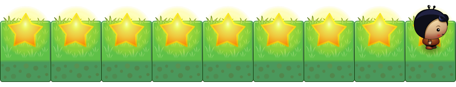
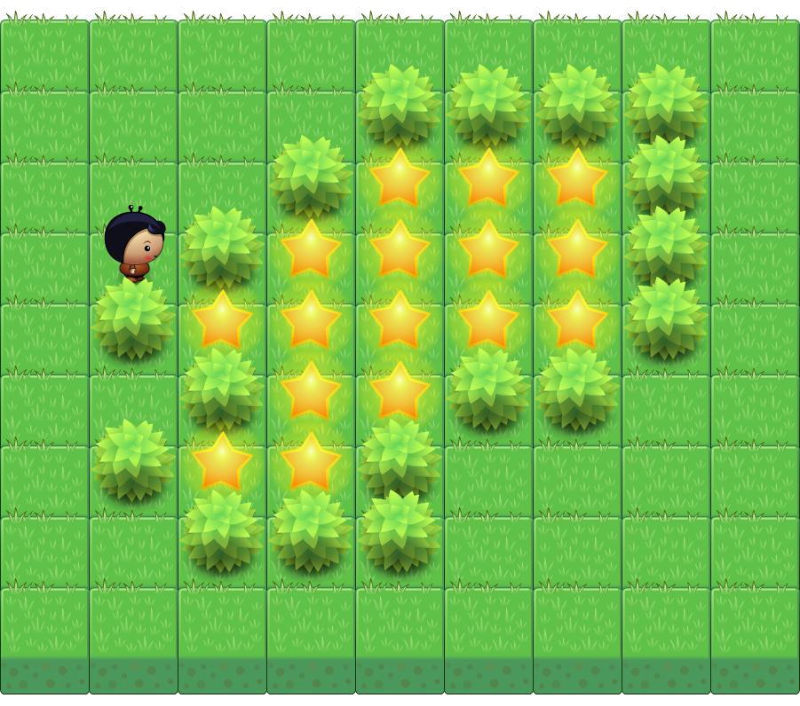

+++
title = "Part 3: Conditionals"
date = 2015-05-01
updated = 2020-05-05
description = "Learn to control the program flow with conditional statements. Numerous Hello Dart exercises will help you understand it."
image = "guard.png"
prettify = true
comments = true

pagingName = "3"
weight = 5

[[sidebars]]
header = "Solutions"
[[sidebars.items]]
text = "<i class=\"fa fa-fw fa-check-square-o\"></i> Solutions Part 3"
link = "/library/hello-dart/part3/solutions/"

[[sidebars]]
header = "Links"
[[sidebars.items]]
text = "<i class=\"fa fa-fw fa-file-word-o\"></i> Page as Word File"
link = "/library/convert-web-page-to-word/"
+++

In addition to loops there is a second structure, which is very important to control the program flow. With **conditional statements** we can specify if a block of statements should be executed or not.

<pre class="prettyprint lang-dart">
if (treeFront()) {  // Condition.
  turnLeft();       // Block 1, executed if the condition is true.
} else {
  move();           // Block 2, executed if the condition is false.
}
</pre>

  <strong>Note:</strong> The <code>else</code> part (block 2) may be omitted if it is not needed.

#### <i class="fa fa-rocket mg-t"></i> TASK 3.01: Conditionals

Describe in words the effect of the following code examples. Then test them in `scenario3.01`. For the conditional statements to be executed more than once you should put them into the loop that is already in the scenario.

##### a.

<pre class="prettyprint lang-dart">
if (onStar()) {
  removeStar();
}
move();
</pre>

##### b.

<pre class="prettyprint lang-dart">
if (onStar()) {
  removeStar();
} else {
  putStar();
}
move();
</pre>

##### c.

Conditional statements may be nested:

<pre class="prettyprint lang-dart">
if (treeLeft()) {
  if (onStar()) {
    removeStar();
  }
}
move();
</pre>

#### <i class="fa fa-rocket mg-t"></i> TASK 3.02: Star Track

The player is to move forward and always put a star where there is none. Make sure that he also puts a star on the last field.

Open the `scenario3.02` and write the program.

#### <i class="fa fa-rocket mg-t"></i> TASK 3.03: Star at Tree

Let the player go straight ahaid and put a star anywhere where there is a tree on his left or right or on both sides.

Note that you can use the *logical operators* `&&`, `||`, and `!` in the same way we did in loops.

#### <i class="fa fa-rocket mg-t"></i> TASK 3.04: Around Tree II

How to walk around trees we already know from the first part. We had solved it like this:

<pre class="prettyprint lang-dart">
class MyPlayer extends Player {

  start() {
    move();
    goAroundTree();
    goAroundTree();
    move();
    goAroundTree();
    removeStar();
  }

  goAroundTree() {
    turnLeft();
    move();
    turnRight();
    move();
    move();
    turnRight();
    move();
    turnLeft();
  }
}
</pre>

This program works very well as long as the world and trees looks exactly the same. Once a tree is moved, like in the following example, the program will fail.

The `scenario3.04` has three variants. Open this scenario and in the `main()` function change the text `scenario-a.txt` to `scenario-b.txt`. Now test what happens when you start the program in the alternate world.

By now you know various ways you can respond to circumstances with the help of sensor methods. Try to change the program so that your player reaches the star in all worlds with the following properties:

* The star is always right in front of the player. He must walk around the trees to get to the star.
* There are never two trees standing next to each other.

#### <i class="fa fa-rocket mg-t"></i> TASK 3.05: Round Trip

The player makes a round trip in search of a star (and removes it). Each field in the tour has exactly two empty adjacent fields. One is always behind the player which is the field the player came from.

Open the `scenario3.05` and write a program for it. Test your program in **all three worlds**, `scenario-a.txt`, `scenario-b.txt`, and `scenario-c.txt`.

*Hint: First write a loop that stops when the player is on a star. Then imagine what must happen after every step through the loop.*

#### <i class="fa fa-rocket mg-t"></i> TASK 3.06: Around Tree III

This is a similar exercise as task 3.04: The player has to find the star that lies before him. Now, however, any number of trees may stand next to each other.

Load the `scenario3.06` und improve the `goAroundTree()` method so that the player can go around multiple trees. Test your program in all the available worlds (a, b, c, and d).

#### <i class="fa fa-rocket mg-t"></i> TASK 3.07 (difficult): Follow the Trail

The player has to follow a trail of stars and pick them up. Before the trees he should stop.

*Important: Write new methods for specific parts of your program. This greatly improves the clarity of your program.*

#### <i class="fa fa-rocket mg-t"></i> TASK 3.08 (difficult): Guard

The player is to guard a forest full of stars. He should walk along the outer edge of the forest.

Start with a single walk around the forest. Then you can let the player make multiple rounds with an infinite loop `while (true)`.

Also test your program in the second world that is available.

## What's next?

&rarr; Continue with [Part 4: Variables](/library/hello-dart/part4/)

***

*Credits* 
<em class="small">
  [Planet Cute](http://www.lostgarden.com/2007/05/dancs-miraculously-flexible-game.html) images by Daniel Cook (Lostgarden.com), published under [CC BY 3.0](http://creativecommons.org/licenses/by/3.0/us/). 
[Oleg Yadrov](https://www.linkedin.com/in/olegyadrov) improved the "Planet Cute" images and was so kind to let me use them. The images were optimized with the great [TexturePacker](https://www.codeandweb.com/texturepacker). 
Some exercises in `Hello Dart`were inspired by [Kara](http://www.swisseduc.ch/compscience/karatojava/javakara/). Kara was developed by Jürg Nievergelt, Werner Hartmann, Raimond Reichert et. al.
</em>