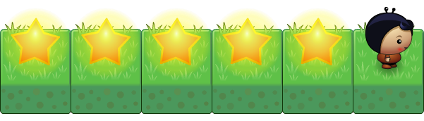
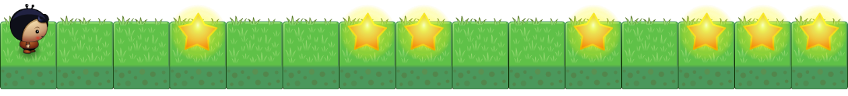

+++
title = "Teil 4: Variablen"
date = 2015-01-21
description = "Mit Variablen können wir Daten speichern in Dart. Lernen Sie die verschiedenen Datentypen von Dart kennen."
image = "chessboard.png"
prettify = true
comments = true
commentsIdentifier = "/library/hello-dart/de/part4/"
aliases = [ 
  "/library/hello-dart/de/part4/" 
]

pagingName = "4"
weight = 6

[[sidebars]]
header = "Lösungen"
[[sidebars.items]]
text = "<i class=\"fa fa-fw fa-check-square-o\"></i> Lösungen Teil 4"
link = "/de/library/hello-dart/part4/solutions/"

[[sidebars]]
header = "Links"
[[sidebars.items]]
text = "<i class=\"fa fa-fw fa-file-word-o\"></i> Seite als Word-Datei"
link = "/de/library/convert-web-page-to-word/"
+++

Mit Schleifen haben wir gelernt, bestimmte Ereignisse zu wiederholen, solange eine Bedingung erfüllt ist. Nun möchten wir aber folgendes tun:

*Der Spieler soll eine Spur von fünf Sternen legen.*

Dies wäre natürlich recht einfach, wenn wir `putStar()` und `move()` fünfmal aufrufen, jedoch wenig elegant. Schöner wäre es, wenn unser Spieler mitzählt, wie viele Sterne er bereits abgelegt hat. Damit der Spieler zählen kann, braucht er ein "Gedächtnis", d.h. konkret einen Speicher. Beim Programmieren sind die Speicherplätze durch Variablen ansprechbar.

## Zählen mit Variablen

<pre class="prettyprint lang-dart">
var i;
i = 0;

while (i &lt; 5) {
  putStar();
  move();

  i = i + 1;
}
</pre>

#### Erklärungen

1. Mit `var i;` wird Speicherplatz für eine Variable mit dem Namen `i` reserviert. Man sagt: Die **Variable i wird deklariert**.
2. Durch `i = 0;` wird der Variable `i` der Wert `0` zugewiesen. Da es die erste Wertzuweisung für die Variable ist, sagt man auch: Die **Variable i wird initialisiert**.
3. Deklaration und Initialisierung werden meistens zusammengefasst wie folgt:   
`var i = 0;`
4. Für die Bedingung `i < 5` wird der Vergleichsoperator `<` benutzt (weitere Vergleichsoperatoren siehe Tabelle weiter unten).
5. Bei der Zuweisung `i = i + 1;` muss man zuerst den rechten Teil anschauen. Es bedeutet: "Nimm den aktuellen Wert von i, addiere 1 dazu und speichere den neuen Wert wieder unter dem Namen i ab."

#### Weitere Hinweise zu Variablen

* Es ist möglich, eine Variable mit einem endgültigen, unveränderlichen Wert zu versehen, d.h. sie zu einer Konstanten zu machen:   
`const anzahl = 5;`   
Dann könnte man im obigen Programmbeispiel `while (i < anzahl)` schreiben.
* Variablen schreibt man mit einem Kleinbuchstaben, wie die Methodennamen.

***

## Datentypen in Dart

In Dart gibt es ein paar vordefinierte Datentypen. Mit Datentypen gibt man an, was in eine Variable gespeichert wird. Diese Angaben sind in Dart freiwillig. Das heisst, man kann alle Variablen einfach mit `var` deklarieren, wie wir es oben gemacht haben. Ich empfehle aber, meistens den Datentyp anzugeben. Dies hilft Fehler früh zu erkennen, da Dart Hinweise geben wird, wenn wir versuchen einen falschen Datentyp in eine Variable zu speichern.

  <strong>Merke:</strong> Alles, was in eine Variable gespeichert werden kann, wird in Dart als <strong>Objekt</strong> bezeichnet. Der Datentyp eines Objektes nennen wir eine <strong>Klasse</strong>. Klassen und Objekte sind die Grundelemente der <a class="alert-link" href="http://de.wikipedia.org/wiki/Objektorientierte_Programmierung">objektorientierten Programmierung</a>.

Später werden wir unsere eigenen Klassen erstellen. Jetzt schauen wir uns zuerst die Grunddatentypen von Dart an.

*Für weitere Informationen zu den Grunddatentypen siehe [Dart Up and Running - Chapter 2: Built-in types](https://www.dartlang.org/docs/dart-up-and-running/ch02.html#built-in-types).*

<table class="table table-bordered">
  <thead>
    <tr>
      <th>Typ</th>
      <th>Beschreibung</th>
      <th>Beispiel</th>
    </tr>
  </thead>
  <tbody>
    <tr>
      <td><code>int</code></td>
      <td>Ganze Zahlen</td>
      <td><code>1</code>, <code>2</code>, <code>-1233123</code></td>
    </tr>
    <tr>
      <td><code>double</code></td>
      <td>Fliesskommazahlen</td>
      <td><code>0.5</code>, <code>-333.234</code></td>
    </tr>
    <tr>
      <td><code>String</code></td>
      <td>Text in einer beliebigen Länge. Text wird immer <em>zwischen einfache oder doppelte Anführungszeichen</em> gestellt.</td>
      <td><code>'Ich bin ein Text'</code> oder <code>"Ich bin auch ein Text"</code></td>
    </tr>
    <tr>
      <td><code>bool</code></td>
      <td>Ein Boolean ist ein Wahrheitswert, der entweder <em>wahr</em> oder <em>falsch</em> sein kann.</td>
      <td><code>true</code> oder <code>false</code></td>
    </tr>
    <tr>
      <td><code>List</code></td>
      <td>Eine Sammlung von Objekten. Wird manchmal auch <em>Array</em> genannt.</td>
      <td><code>[1, 2, 3]</code></td>
    </tr>
    <tr>
      <td><code>Map</code></td>
      <td>In einer Map kann man Objekte speichern als <em>Schlüssel</em> und <em>Werte</em>.</td>
      <td><code>{ 'schlüssel-1': 'wert-1', 'schlüssel-2': 'wert-2' }</code></td>
    </tr>
  </tbody>
</table>

## Vergleichsoperatoren

Folgende Operatoren können in Dart für Vergleiche verwendet werden. Das Ergebnis ist jeweils ein `bool`, das heisst entweder `true` oder `false`.

<table class="table table-bordered">
  <thead>
    <tr>
      <th>Operator</th>
      <th>Beschreibung</th>
      <th>Beispiel</th>
    </tr>
  </thead>
  <tbody>
    <tr>
      <td><code>==</code></td>
      <td>gleich</td>
      <td><code>k == 2</code></td>
    </tr>
    <tr>
      <td><code>!=</code></td>
      <td>ungleich</td>
      <td><code>k != 12</code></td>
    </tr>
    <tr>
      <td><code>></code></td>
      <td>grösser als</td>
      <td><code>k > 67</code></td>
    </tr>
    <tr>
      <td><code><</code></td>
      <td>kleiner als</td>
      <td><code>k < 12</code></td>
    </tr>
    <tr>
      <td><code>>=</code></td>
      <td>grösser als oder gleich</td>
      <td><code>k >= 45</code></td>
    </tr>
    <tr>
      <td><code><=</code></td>
      <td>kleiner als oder gleich</td>
      <td><code>k <= 23</code></td>
    </tr>
  </tbody>
</table>

**Achtung:** Der Vergleich auf "Gleichheit" hat immer zwei Gleichheitszeichen <code>==</code>. Mit einem einzelnen Gleichheitszeichen <code>=</code> geschieht eine Zuweisung!

## Arithmetische Operatoren

Zur Berechnung können folgende arithmetische Operatoren verwendet werden:

<table class="table table-bordered">
  <thead>
    <tr>
      <th>Operator</th>
      <th>Beschreibung</th>
      <th>Beispiel</th>
    </tr>
  </thead>
  <tbody>
    <tr>
      <td><code>+</code></td>
      <td>Addition</td>
      <td><code>h = w + 34</code></td>
    </tr>
    <tr>
      <td><code>-</code></td>
      <td>Subtraktion</td>
      <td><code>y = 3.4 – t</code></td>
    </tr>
    <tr>
      <td><code>*</code></td>
      <td>Multiplikation</td>
      <td><code>z = h * 3.56</code></td>
    </tr>
    <tr>
      <td><code>/</code></td>
      <td>Division</td>
      <td><code>d = m / v</code></td>
    </tr>
    <tr>
      <td><code>%</code></td>
      <td>Modulo (liefert den Rest der Division)</td>
      <td><code>count = w % 2</code></td>
    </tr>
  </tbody>
</table>

***

#### <i class="fa fa-rocket mg-t"></i> AUFGABE 4.01: Counting Stars

Der Spieler soll von links nach rechts gehen und dabei die Sterne zählen.

*Hinweise:*

1. Definieren und initialisieren Sie eine Variable, zum Beispiel mit   
`int count = 0;`
2. Schreiben Sie darunter eine Schleife, in der die Variable immer um eins erhöht wird:   
`count = count + 1;`
3. Die Variable sollte nur erhöht werden, wenn der Spieler auf einem Stern ist.
4. Am Schluss soll der Spieler angeben, wie viele Sterne er gezählt hat. Mit `${count}` können wir die Variable in einen Text einfügen:   
`say('Ich habe ${count} Sterne gefunden.');`

  <strong>Gültigkeitsbereich von Variablen:</strong> Variablen sind immer nur innerhalb des Blockes (zwischen den geschweiften Klammern) gültig, in welchem sie deklariert wurden. Man kann sie auch ausserhalb der Funktionen deklarieren. Dann sind sie in der ganzen Klasse verfügbar, oder, falls sie sogar ausserhalb einer Klasse deklariert werden, sind sie überall verfügbar.

#### <i class="fa fa-rocket mg-t"></i> AUFGABE 4.02: Cleaning Up

Der Spieler soll alle Sterne wegräumen.

*Hinweise:*

1. Sie können den Baum verwenden, um herauszufinden, wann der Spieler am Ende angekommen ist mit einer Schleife `while (!treeFront()) {...}`.
2. Entfernen Sie zuerst die Sterne auf der ersten Zeile.
3. Drehen Sie am Rand und entfernen Sie die Sterne auf der zweiten Zeile.
4. Führen Sie nun eine `bool`-Variable ein, damit sich der Spieler merkt, in welche Richtung er läuft, zum Beispiel so:   
`bool goingRight = true;`
5. Mit dieser Variable können Sie nun herausfinden, ob der Spieler am rechten oder am linken Rand angekommen ist und entsprechend umdrehen muss. Ein `bool` kann wie folgt in einer Bedingung verwendet werden:   
`if (goingRight) {...}`
6. Denken Sie daran, die neue Richtung in die Variable zu setzen, sobald sich der Spieler dreht:   
`goingRight = false;`
7. *Verbesserung*: Damit der Code übersichtlicher wird, könnten Sie zwei Funktionen machen zum Umdrehen: `turnAroundRight()` und `turnAroundLeft()`.

#### <i class="fa fa-rocket mg-t"></i> AUFGABE 4.03: Inverting

Die Welt hat eine quadratische Fläche und am Schluss einen Baum. Innerhalb der Fläche ist ein Muster aus Sternen gelegt, das vom Spieler invertiert (=umgedreht) werden soll. Achten Sie darauf, dass Ihr Code übersichtlich bleibt und lagern Sie allenfalls Teile in eigene Funktionen aus.

#### <i class="fa fa-rocket mg-t"></i> AUFGABE 4.04: Chessboard

Die Welt hat eine quadratische Fläche und am Schluss einen Baum. Innerhalb der Fläche soll ein schachbrettartiges Muster aus Sternen gelegt werden.

#### <i class="fa fa-rocket mg-t"></i> AUFGABE 4.04 (schwierig): Tree Line

In dieser Welt hat es verschiedene Baumreihen. Der Spieler soll nun die Länge (in Anzahl Bäumen) der längsten Baumreihe ermitteln und ausgeben. Zwischen den Baumreihen ist immer mindestens ein Feld Platz. Auf dem letzten Feld liegt ein Stern.

***

## Wie weiter?

Fahren Sie weiter mit [Teil 5: Funktionen](/de/library/hello-dart/part5/)

***

*Quellen* 
<em class="small">
[Planet Cute](http://www.lostgarden.com/2007/05/dancs-miraculously-flexible-game.html) Bilder stammen von Daniel Cook (Lostgarden.com), veröffentlicht unter [CC BY 3.0](http://creativecommons.org/licenses/by/3.0/us/). 
[Oleg Yadrov](https://www.linkedin.com/in/olegyadrov) hat die "Planet Cute" Bilder weiterentwickelt und mir zur Verfügung gestellt. Optimiert wurden sie mit dem grossartigen [TexturePacker](https://www.codeandweb.com/texturepacker). 
Einige Übungen in `Hello Dart` sind inspiriert von [Kara](http://www.swisseduc.ch/informatik/karatojava/). Kara wurde entwickelt von Jürg Nievergelt, Werner Hartmann, Raimond Reichert und anderen.
</em>