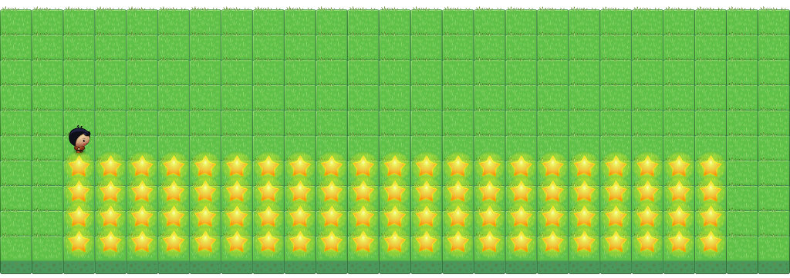
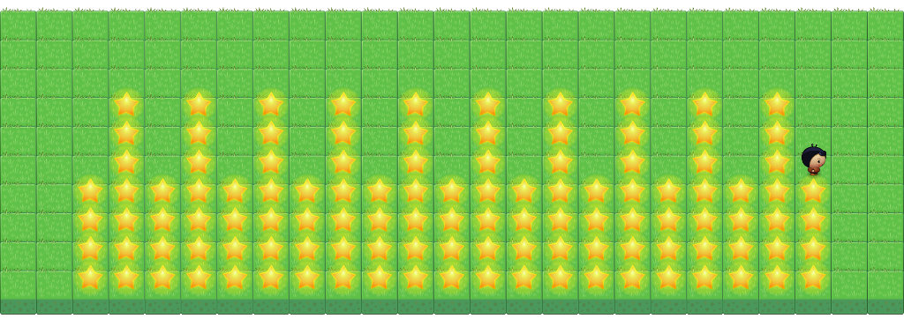
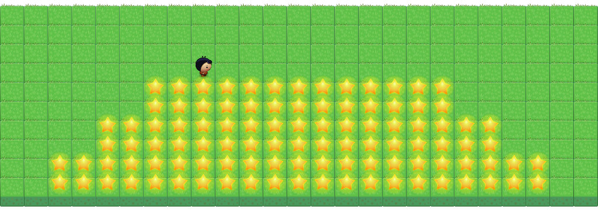

+++
title = "Part 5: Functions"
date = 2015-05-01
description = "We expanding our knowledge about functions and methods in Dart. We will learn about functions with parameters and return values."
image = "layered-cake.jpg"
prettify = true
comments = true

pagingName = "5"
weight = 7

[[sidebars]]
header = "Solutions"
[[sidebars.items]]
text = "<i class=\"fa fa-fw fa-check-square-o\"></i> Solutions Part 5"
link = "/library/hello-dart/part5/solutions/"

[[sidebars]]
header = "Links"
[[sidebars.items]]
text = "<i class=\"fa fa-fw fa-file-word-o\"></i> Page as Word File"
link = "/library/convert-web-page-to-word/"
+++

  

    
  

  

    

      <em>Once upon a time, there was a little girl who always wore a red riding cloak. So everyone called her Little Red Riding Hood. One moning the mother said to the child: "Red Riding Hood, today is your grandmother's birthday. Bake her favorite cake, take a bottle of good old wine from the cellar, put everything in one basket, and go visit her."</em>
    

    
<strong>Help Little Red Riding Hood bake a cake! Doing this you will expand your knowledge about functions.</strong>

  

## Functions with Parameters

With parameters, values can be passed to a function. In the following function you can specify how many steps the player should take:

<pre class="prettyprint lang-java">
multiMove(int steps) {
  int i = 0;

  while (i &lt; steps)     {
    move();

    i = i + 1;
  }
}
</pre>

To go 5 steps just put the number 5 between the parentheses:

<pre class="prettyprint lang-java">
multiMove(5);
</pre>

To invoke a function with multiple parameters, the values are separated by commas.

<pre class="prettyprint lang-java">
drawRectangle(21, 4);
</pre>

#### Explanations

1. In previous programs it was rather cumbersome to always write the parentheses `()` for each function. Now it is clear that the previously used functions were merely cases where no parameter was passed.
2. Inside the parentheses of a function declaration, the parameter (in this case `steps`) is specified with a type (here `int`). Multiple parameters are separated by commas as seen in this example:
<pre class="prettyprint lang-java">
public void drawRectangle(int width, int height)
</pre>
3. When such a function is called, the values are copied into the variables (in this case into `width` and `height`).

  <strong>Importent:</strong> Functions that are defined inside a class (which is usually the case) are also called <strong>Methods</strong>.

### Baking a Cake

We will now use our player to "bake" a birthday cake for the grandmother. The cake will be made of stars.

#### <i class="fa fa-rocket mg-t"></i> TASK 5.01: Baking a Cake

 

In preparation for baking, the following methods should be provided:

1. `turnAround()`   
Rotates the player by 180 degrees.

2. `multiMove(int steps)`   
The player takes the number of steps in the current direction (see example in the theory section above).

3. `putStars(int count)`   
The player puts the specified number of stars. The first one he places at the current position, the other following in his line of sight.

The player is to draw a rectangle with stars symbolizing the cake. 

The player starts in the lower left corner and looks to the right. The player should be able to make a rectangle with variable width and height! The function call `drawRectangle(21, 4)` should therefore create a rectangle with a width of 31 and height of 4.

#### <i class="fa fa-rocket mg-t"></i> TASK 5.02: Candles on Cake

 

To make the cake look like a birthday cake it needs a few candles, of course. Extend your program with an additional method `drawCandles(int count)` which sets the specified number of candles on the cake.

## Function with Return Values

A function can return a value as a result. The following function will multiply the specified `number` by two and return the result:

<pre class="prettyprint lang-java">
int twoTimes(int number) {
  return 2 * number;
}
</pre>

The result can either be stored in a variable or directly be used as follows:

<pre class="prettyprint lang-java">
multiMove(twoTimes(4));
</pre>

#### Explanations

1. The type of the return value (in this case `int`) is specified before the name of the function. If the function does not return a value, we write `void`.
2. To return a value we write `return` followed by the value.

#### <i class="fa fa-rocket mg-t"></i> TASK 5.03: Candles for Age

We want to put on the cake a **candle for every decade** of grandmother's age. As Little Red Riding Hood does not know exactly how old her grandmother is, she must first ask her mother.

Program a function called `howOldIsGrandma()` that returns the age. With the help of this function the rest of the program should place a candle on the cake for every decade.

  <strong>Note:</strong> The division of two numbers in Dart always results in a <code>double</code>. To get an <code>int</code> again, we can use the <code>toInt()</code> or <code>round()</code> functions.   Example: <code>(5 / 3).toInt()</code>

#### <i class="fa fa-rocket mg-t"></i> TASK 5.04 (difficult): Layered Cake

 

Let the player "bake" a layered cake for the grandmother. The player should add a layer for every decade that the grandmother is over 50. Each layer should have two lines and should be indented on both sides by two stars.

***

## What's next?

Learn about the [next steps](/library/hello-dart/next/).

***

*Credits* 
<em class="small">
  [Planet Cute](http://www.lostgarden.com/2007/05/dancs-miraculously-flexible-game.html) images by Daniel Cook (Lostgarden.com), published under [CC BY 3.0](http://creativecommons.org/licenses/by/3.0/us/). 
[Oleg Yadrov](https://www.linkedin.com/in/olegyadrov) improved the "Planet Cute" images and was so kind to let me use them. The images were optimized with the great [TexturePacker](https://www.codeandweb.com/texturepacker). 
Some exercises in `Hello Dart`were inspired by [Kara](http://www.swisseduc.ch/compscience/karatojava/javakara/). Kara was developed by Jürg Nievergelt, Werner Hartmann, Raimond Reichert et. al.
</em>