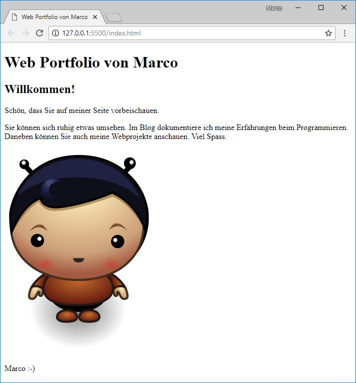

+++
title = "Teil 1: Unsere erste Webseite"
date = 2018-08-10
description = "Erstellen Sie Ihre erste Webseite. Hier lernen Sie die Tools und die Grundlagen von HTML & CSS kennen."
image = "portfolio.de.png"
prettify = true
comments = true
commentsIdentifier = "/library/html-css/de/part1/"
aliases = [ 
  "/library/html-css/de/part1/" 
]
weight = 1

[[sidebars]]
header = "Downloads"
[[sidebars.items]]
text = "<i class=\"fa fa-fw fa-download\"></i> Portfolio Teil 1"
link = "https://github.com/marcojakob/tutorial-html-css/releases/download/v2.0/portfolio-part1.zip"
+++

Wir legen gleich los und erstellen unsere erste Webseite.

## Unsere Tools

Für die Webentwicklung brauchen wir zwei Programme: einen **Editor**, um die Dateien für die Webseite zu erstellen und einen **Browser** (z.B. Edge, Firefox, Safari oder Chrome), um unsere Webseite anzuzeigen und zu testen.

### Editor

Zum Erstellen von Webseiten reicht eigentlich ein ganz normaler Texteditor. Es gibt aber Editoren, die uns die Arbeit beim Programmieren stark vereinfachen. Deshalb empfehle ich, dass Sie gleich mit einem modernen Code-Editor beginnen.

Mein aktueller Favorit unter den zahlreichen Editoren ist [Visual Studio Code](https://code.visualstudio.com/) (kostenlos). Ich werde zwischendurch auf die Bedienung von Visual Studio Code (VS Code) eingehen, was nicht heisst, dass Sie nicht auch einen anderen Editor verwenden können. Gute Alternativen sind zum Beispiel [Atom](https://atom.io/) oder [Brackets](http://brackets.io).

Also, legen Sie los und installieren Sie einen Editor. Wenn Sie nicht wissen welchen, nehmen Sie [VS Code](https://code.visualstudio.com/).

#### Editor Erweiterungen

Weil wir grad am Installieren sind, fügen wir gleich noch eine Erweiterungen zu VS Code hinzu, damit unser Editor Superkräfte hat: [Live Server](https://marketplace.visualstudio.com/items?itemName=ritwickdey.LiveServer).

1. Visual Studio Code öffnen.

2. Öffnen Sie das Menu "Extensions".   

3. Tippen Sie in das Suchfeld "Live Server" und installieren Sie diese Erweiterung.   

4. Laden Sie Visual Studio neu, damit die Erweiterung aktiv wird.   

### Browser

Unsere Webseite sollte natürlich in allen gängigen Browsern (Edge, Firefox, Chrome und Safari) laufen. Für die Webentwicklung ist jedoch [Chrome](https://www.google.com/chrome/) zu empfehlen. Chrome beinhaltet sehr nützliche Tools für Entwickler, die wir oft nutzen werden.

Falls Sie Chrome noch nicht haben, können Sie ihn [hier installieren](https://www.google.com/chrome/).

## Ein HTML Dokument erstellen

Ausgerüstet mit Editor und Browser erstellen wir das erste HTML Dokument für unsere Webseite:

1. Erstellen Sie zuerst einen Ordner auf ihrem Computer für unser erstes Projekt. Nennen Sie den Ordner zum Beispiel `Portfolio`.

2. Öffnen Sie VS Code.

3. Öffnen Sie das Menu *File* und wählen Sie ***Open Folder...***. Suchen Sie dort den vorhin erstellten `Portfolio` Ordner und öffnen Sie diesen.

4. Klicken Sie unterhalb des Ordners *Portfolio* mit der *rechten Maustaste* und wählen Sie *New File*. Geben Sie der Datei den Namen `index.html`.

5. Nun haben wir eine ganz einfache, leere Textdatei namens `index.html`.

### Warum index.html?

Wie Sie wahrscheinlich ahnen konnten hat der Name `index.html` eine spezielle Bedeutung. Wenn nämlich eine Webseitenadresse aufgerufen wird, z.B. `https://www.example.com`, dann wird automatisch zuerst die Datei `index.html` angezeigt, in diesem Fall `https://www.example.com/index.html`. Für uns wird `index.html` also quasi zur Startseite.

### Anzeigen und aktualisieren

Nun wollen wir das Dokument mit Inhalt füllen. Tippen Sie die folgenden Zeilen ab. Als Text können Sie natürlich irgend etwas wählen.

Zum Anzeigen der Seite verwenden wir den oben installierten **Live Server**. Klicken Sie dazu mit der *rechten Maustaste* auf die Datei `index.html` (unterhalb des Portfolio-Ordners, nicht oben wo die offenen Dateien angezeigt werden). Wählen Sie **Open with Live Server**. Nun sollte sich ein Browser-Fenster öffnen mit Ihrer ersten Website. Wann immer Sie Änderungen speichern, sollte die Website automatisch aktualisiert werden.

Falls die Seite <strong>nicht im gewünschten Browser angezeigt wird</strong>: Ändern Sie auf ihrem Computer die Einstellungen so, dass ein anderer Browser der Standard-Browser ist. Alternativ können Sie auch die Adresse (z.B. <code>http://127.0.0.1:5500/index.html</code>) aus dem einen Browser rauskopieren und in einem anderen Browser einfügen.

Falls die Seite <strong>nicht aktualisiert wird</strong> bei Änderungen: Speichern Sie alle Dateien und klicken Sie im Browser die Taste `F5` oder `cmd+r`.

***Gratuliere! Sie haben soeben Ihre erste Webseite erstellt!***

### Richtiges Einrücken

Damit Sie die Übersicht behalten ist es wichtig, dass Sie die Zeilen immer korrekt mit der **Tabulator-Taste** einrücken. Schauen Sie den **Beispielcode immer ganz genau an** und rücken Sie Ihren Code entsprechend ein. Für den Browser spielt das keine Rolle. Aber für uns als Programmierer ist das wichtig, damit wir den Überblick behalten.

<strong>Tipp 1:</strong> Mit <code>Shift+Tab</code> können Sie nach den Code nach links schieben.

<strong>Tipp 2:</strong> Wenn Sie mehrere Zeilen markieren können Sie diese mit <code>Tab</code> oder <code>Shift+Tab</code> gleichzeitig einrücken.

<strong>Tipp 3 (automatisch):</strong> Rechte Maustaste irgendwo im Programmcode und dann <code>Format Document</code>.

## HTML-Elemente

### Tags

Im Beispiel oben haben Sie bereits die für HTML typischen Zeichen mit den spitzen Klammern gesehen. Man nennt diese **Tags**.

**HTML-Elemente** bestehen meist (aber nicht immer) aus zwei Tags, einem öffnenden und einem schliessenden. In unserem Beispiel ist `<html>` ein öffnendes Tag und `</html>` mit dem Schrägstrich ein schliessendes Tag.

Das, was zwischen dem öffnenden und dem schliessenden Tag steht, ist der Inhalt des HTML-Elements. Mit `<html>` und `</html>` sagt wir also dem Browser, dass dazwischen das HTML unserer Webseite steht.

Das zweite Tag, welches wir gesehen haben, ist das `<body>`-Tag. Es besagt, dass alles zwischen dem öffnenden `<body>`-Tag und dem schliessenden `</body>`-Tag im Hauptbereich des Browsers angezeigt werden soll.

### Attribute

Mit Attributen werden zusätzliche Informationen zu einem Element angegeben. Sie stehen im öffnenden Tag des Elements und beinhalten einen Namen und einen Wert.

Als Beispiel schauen wir uns das HTML-Element für einen Link an. Es ist wahrscheinlich eines der wichtigsten Elemente &mdash; ja was wäre das Internet ohne Links?

Das abgebildete `a`-Element enthält ein `href`-Attribut (kurz für "Hypertext Reference") mit dem Wert `https://code.makery.ch`. Der Browser weiss damit, dass er den folgenden Link anzeigen muss: [Meine Webseite](https://code.makery.ch)

## Grundgerüst einer HTML-Seite

Die Elemente `<html>` und `<body>` haben wir bereits kennen gelernt. Die Grundstruktur einer HTML-Seite beinhaltet aber üblicherweise noch ein paar weitere Elemente. Übernehmen Sie für Ihre Webseite den folgenden Code. Anschliessend werden wir ihn besprechen.

##### HTML Grundgerüst

<pre class="prettyprint lang-html">
&lt;!DOCTYPE html>
&lt;html>
  &lt;head>
    &lt;meta charset="utf-8">
    &lt;title>Web Portfolio von Marco&lt;/title>
  &lt;/head>
  &lt;body>
    &lt;h1>Web Portfolio von Marco&lt;/h1>
    &lt;p>Hier kann irgend ein Bla Bla stehen.&lt;/p>
  &lt;/body>
&lt;/html>
</pre>

#### Erklärung

* Setzen Sie `<!DOCTYPE html>` immer an die erste Stelle. Es sagt dem Browser, welcher Dokumententyp verwendet wird.
* Das `<html>`-Tag bezeichnet den Start und `</html>` das Ende des Dokumentes.
* Das `<head>`-Element beinhaltet zusätzliche Informationen über die Seite. Im Gegensatz zum `<body>`-Element werden diese Informationen nicht im Hauptbereich des Browsers angezeigt.
  * Innerhalb vom `<head>` sollte eine Angabe stehen über den Zeichensatz: `<meta charset="utf-8">`. Wenn Sie den Zeichensatz nicht angeben, kann es vorkommen, dass zum Beispiel die Umlaute ä, ö und ü falsch angezeigt werden. Vielleicht haben Sie gemerkt, dass das `<meta>` Element kein schliessendes Tag besitzt. Es gibt ein paar Elemente ohne schliessende Tags (` `, ``, etc.), sie sind aber die Ausnahme.
  * Weiter steht dort meist das Titelelement `<title>`. Der Titel wird in der Titelleiste oben im Browserfenster angezeigt.
* Alles innerhalb des `<body>`-Elements wird im Hauptbereich des Browsers angezeigt.
  * Ein `<h1>`-Element bezeichnet die Hauptüberschrift. Untergeordnete Überschriften können mit `<h2>`, `<h3>`, `<h4>`, `<h5>` und `<h6>` erstellt werden.
  * Alles, was zwischen `
` und `
` steht ist ein Textabsatz (auch **P**aragraph genannt).
* Nach jedem öffnenden Tag wird das nächste Element eingerückt (mit Tabulator oder zwei Leerschlägen) für eine bessere Übersicht. Dies sollten Sie sich unbedingt auch angewöhnen.

<strong>Tipp 1:</strong> Halten Sie das HTML Grundgerüst stets griffbereit. Wir werden es für jede neue HTML-Seite verwenden!

<strong>Tipp 2:</strong> Verwenden Sie die Tastenkombination <code>Ctrl+S</code> zum Speichern.

<strong>Tipp 3:</strong> Verwenden Sie die Tastenkombination <code>Ctrl+Z</code> für Rückgängig.

Mit diesen Grundlegenden HTML-Elementen sind wir nun bestens vorbereitet, um unsere Webseite auf ein neues Level zu bringen. Als erstes fügen wir noch ein Bild ein, damit die Startseite unseres Portfolios etwas interessanter wird.

## Ein Bild einfügen

Um ein Bild einzufügen verwenden wir das ``-Element. Das folgende Beispiel würde ein Bild von mir einfügen:

<pre class="prettyprint lang-html">
&lt;img src="marco.jpg" alt="Foto von mir">
</pre>

Das ``-Element hat nur ein öffnendes aber kein schliessendes Tag. Es enthält ein `src`- und ein `alt`-Attribut. Mit dem `src`-Attribut wird die URL, d.h. der Ort und Name des Bildes angegeben. Das `alt`-Attribut ist ein "alternativer Text", der den Inhalt des Bildes beschreibt. Dieser Text wird von Suchmaschinen verwendet oder wenn aus irgend einem Grund das Bild nicht angezeigt werden kann, z.B. bei einem Screenreader für Blinde.

### Relative und absolute URLs

Für das `src`-Attribut von Bildern, aber auch für das `href`-Attribut von Links, werden URLs verwendet. Mit der URL wird also die "Adresse" einer anderen Datei (z.B. eine andere Webseite oder ein Bild) angegeben. Je nach dem, wo diese Datei liegt, muss entweder eine *relative* oder eine *absolute* URL verwendet werden.

Wenn eine Datei **auf der gleichen Internetseite** liegt, dann wird eine **relative URL** verwendet. Diese besteht, wie wir es oben im Beispiel gesehen haben, nur aus dem Namen der Datei.

Eine *relative URL* ist entweder *relativ* zur aktuellen HTML-Seite oder *relativ* zum Hauptordner unserer Website. Wenn die Zieldatei in einem anderen Ordner liegt, muss dies berücksichtigt werden. Wenn das Bild aus dem Beispiel oben in einem Unterordner namens `bilder` liegt, dann würde die *relative URL* `bilder/marco.jpg` lauten. Falls die Datei in einem übergeordneten Ordner liegt, dann können wir mit `../` in diesen Ordner gelangen. Die URL wäre in diesem Fall `../marco.jpg`.

Anstatt von der aktuellen Datei auszugehen, können wir auch im Hauptordner unserer Website starten indem wir mit einem Slash beginnen wie `/marco.jpg`. Wir können diese URL auf irgendeiner Unterseite oder in einem Unterordner verwenden und es wird immer im Hauptordner nach dieser Datei suchen. Dies ist hilfreich zum Beispiel für Navigationslinks, wie wir in einem späteren Teil sehen werden.

Wenn die Datei **auf einer anderen Internetseite** liegt, dann wird eine **absolute URL** verwendet. Dabei wird der ganze Domainname angegeben. Ein Beispiel wäre `https://code.makery.ch/bilder/marco.jpg`.

  <strong>Merken Sie sich zu URLs:</strong>
  <ul>
    <li>Im gleichen Ordner verwenden wir den direkten Dateinamen, z.B. <code>marco.jpg</code>.</li>
    <li>Zwei Punkte (<code>..</code>) verweist auf das übergeordnete Verzeichnis.</li>
    <li>Wenn wir beim Hauptordner starten möchten, dann setzen wir ein <code>/</code> vorne hin, z.B. <code>/marco.jpg</code>.</li>
  </ul>

### Das Portfolio mit Bild

Wenn Sie es noch nicht gemacht haben, versuchen Sie nun ein Bild in Ihr Portfolio einzufügen. Dazu müssen Sie ein Bild in den *Portfolio*-Ordner auf Ihrem Computer kopieren. Achten Sie darauf, dass Sie den exakten Dateinamen inklusive der Dateiendung angeben.

Der gesamte Code könnte nun etwa so aussehen (ich habe noch eine Unterüberschrift und etwas mehr Text eingefügt):

##### index.html mit fertigem Portfolio-Code

<pre class="prettyprint lang-html">
&lt;!DOCTYPE html>
&lt;html>
  &lt;head>
    &lt;meta charset="utf-8">
    &lt;title>Web Portfolio von Marco&lt;/title>
  &lt;/head>
  &lt;body>
    &lt;h1>Web Portfolio von Marco&lt;/h1>

    &lt;h2>Willkommen!&lt;/h2>

    &lt;p>Schön, dass Sie auf meiner Seite vorbeischauen.&lt;/p>

    &lt;p>Sie können sich ruhig etwas umsehen. Im Blog dokumentiere ich meine Erfahrungen beim Programmieren. Daneben können Sie auch meine Webprojekte anschauen. Viel Spass.&lt;/p>

    &lt;img src="marco.jpg" alt="Foto von mir">

    &lt;p>Marco :-)&lt;/p>
  &lt;/body>
&lt;/html>
</pre>

So sieht im Moment mein Portfolio im Browser aus:

***

&rarr; Im nächsten Teil lernen Sie, wie Sie die Webseite im Internet veröffentlichen können. Weiter geht's mit [Teil 2: Webseite veröffentlichen](/de/library/html-css/part2/)
