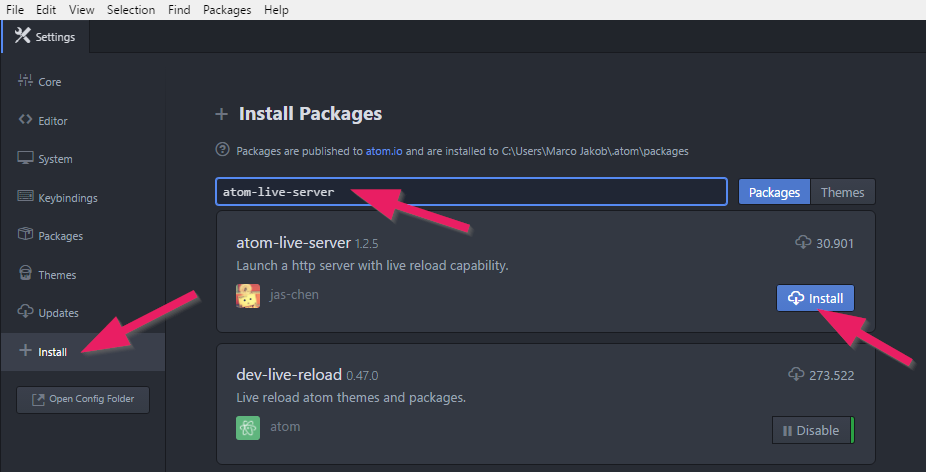
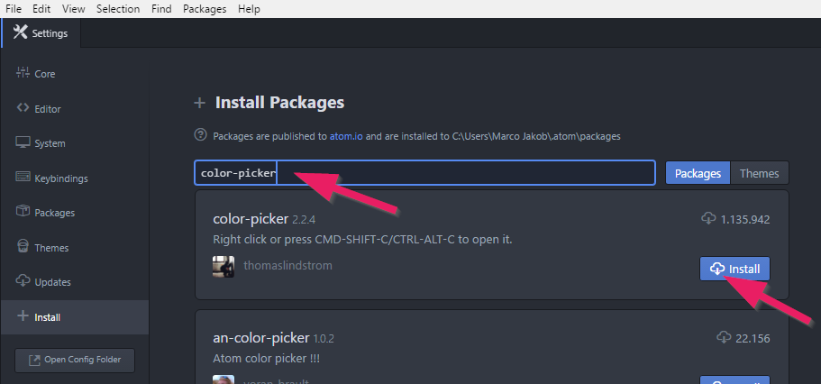

+++
title = "HTML & CSS Tutorial - Part 1: Your First Website"
date = "2015-04-08"
github = "https://github.com/marcojakob/code.makery.ch/edit/master/collections/library/html-css-en-part1.md"
description = "Create your first website. Get to know the programming tools and learn the basics of HTML and CSS."
image = "/assets/library/html-css/portfolio.png"
prettify = true
comments = true
weight = 1
paging = "1"
+++

Let's dive right in and create our first web page.

## Our Tools

For web development, you need two programs: an <abbr data-toggle="tooltip" title="Normal text editor or a code editor">editor</abbr> to create the files for the website and a <abbr data-toggle="tooltip" title="For example, Internet Explorer, Firefox, Safari, or Chrome">browser</abbr> to view and test your website.

### Editor

For creating web pages, a normal text editor would be sufficient. But there are editors that greatly simplify your work as a programmer. Therefore, I recommend that you use a modern code editor.

My current favorite among the many editors is [Atom](https://atom.io/) (free). You may use an editor of your choice but I will occasionally refer to some functions of Atom. Good alternatives to Atom are [Brackets](http://brackets.io) or the slightly older but very good [Notepad++](http://notepad-plus-plus.org/).

Go ahead and install an editor. If you do not know which one, use [Atom](https://atom.io) for now.

#### Atom Editor Packages

While we're at it we'll install two Atom packages that will give superpowers to our editor: [atom-live-server](https://atom.io/packages/atom-live-server) and [color-picker](https://atom.io/packages/color-picker).

1. Open Atom.
2. Open the **File** menu and select **Settings**.

3. Go to **Install**, enter *atom-live-server* in the search bar, hit enter and install the **atom-live-server** package.

4. Now enter *color-picker* in the search bar and also install the **color-picker** package.

### Browser

Our website should, of course, run in all major browsers (Internet Explorer, Firefox, Chrome and Safari). However, for web development I recommend you use [Chrome](https://www.google.com/chrome/browser/). Chrome includes very useful tools for developers which you will use often.

If you do not have Chrome on your computer, you can [install it here](https://www.google.com/chrome/browser/).

## Creating an HTML Document

Equipped with editor and browser, let's create the first HTML document for our website.

1. Create a folder on your computer for your project. Name the folder *Portfolio* (or anything you want).

2. Open Atom (or your code editor of choice).

3. Open the **File** menu and select **Open Folder ...**. Browse for the folder you created and open it.

4. Right-click below the folder and select **New File**. Name the file `index.html`.

5. Now you have a blank text file named `index.html`.

### Why index.html?

You could probably assume, the name `index.html` does have special meaning. If a website address is called, for example `http://code.makery.ch`, the `index.html` file is automatically displayed first, which in this case is `http://code.makery.ch/index.html`. For us, our first `index.html` will become our home page.

### Viewing and Refreshing

Now you can fill the document with content. Type the following lines in your HTML.

To view the page, we'll use the **live-server** package that we installed above. Open the **Packages** menu, choose **Live Server** and click on one of the ports. A browser window should open up and show your first website. Now, whenever you save any changes they are automatically updated by the live server.

If the page is **not updated automatically**: Save all files and click `F5` or `cmd+R` in the browser.

**Congratulations! You have just created your first website!**

### Indentation

In order to keep your code clean, it is important that you correctly indent the lines with the **tab key**. Pay close attention to the example code and indent accordingly. It is important that you develop clean programming habits from the very beginning!

  
**Tip 1:** Use `Shift+Tab` keys to move indentation to the left.

  
**Tip 2:** You can indent multiple lines at once if you select them and click `Tab` or `Shift+Tab`.

## HTML Elements

### Tags

In the above example you have already seen the typical HTML characters with angle brackets. These are called **tags**.

**HTML elements** consist usually (but not always) of two tags, one opening and one closing. In our example, `<html>` is an opening tag and `</html>` with the slash is a closing tag.

The text between the opening and the closing tag is the content of the HTML element. With `<html>` and `</html>` we tell the browser about the beginning and end of the HTML of our web page.

The second tag we have seen is the `<body>` tag. It states that all content between the opening `<body>` and the closing `</body>` tags are to be shown in the main area of the browser.

### Attributes

Attributes declare additional information for an item. Attributes are part of the opening tag of an element and always have a **name** and a **value**.

As an example, let's look at the HTML element for a link. It is probably one of the most important elements &mdash; what would the internet be without links?

The `<a>` element above includes an `href` attribute (short for "hypertext reference") with the value `http://code.makery.ch`. The browser knows that it must show the link as [My Website](http://code.makery.ch).

## Basic Structure of an HTML Page

We have already seen the two elements `<html>` and `<body>`. But the basic structure of an HTML page usually contains a few more. Adjust your website to the following code. Afterwards, we will discuss each element it.

##### HTML Structure

<pre class="prettyprint lang-html">
&lt;!DOCTYPE html>
&lt;html>
  &lt;head>
    &lt;meta charset="utf-8">
    &lt;title>Web Portfolio of Marco&lt;/title>
  &lt;/head>
  &lt;body>
    &lt;h1>Web Portfolio of Marco&lt;/h1>
    &lt;p>Write anything you want to tell the world.&lt;/p>
  &lt;/body>
&lt;/html>
</pre>

#### Explanations

* Always put `<!DOCTYPE html>` on the first line. It tells the browser about the type of the document.
* The `<html>` tag indicates the start and `</html>` the end of the document.
* The `<head>` element contains additional information about the page. In contrast to the `<body>` element, this information does not appear in the main area of the browser.
  * Within the `<head>`, there should be an indication about the character set: `<meta charset="utf-8">`. If you do not specify the character set some special characters may not get displayed correctly. You might have noticed that the `<meta>` element has no closing tag. There are a few <abbr data-toggle="tooltip" title="Important elements without closing tags:  , , <meta>, 
, <link>, <input>">elements without closing tags</abbr>, but they are the exception.
  * Next you'll see the `<title>` element. The title is displayed in the title bar at the top of your browser window.
* Everything inside the `<body>` element is displayed in the main area of the browser.
  * A `<h1>` defines the main heading. Sub headings can be created with `<h2>`, `<h3>`, `<h4>`, `<h5>`, and `<h6>`.
  * Text between `
` and`
` is a paragraph.
* After each opening tag, the next element should be indented (with a tab or two spaces) for better overview. Make sure you follow this habit.

  
**Tip 1:** Keep this basic HTML structure handy. You can use it for any new HTML page! 

  
**Tip 2:** Use the keyboard shortcut `Ctrl+S` to save the current file.

  
**Tip 3:** Use the keyboard shortcut `Ctrl+Z` for undo.

With these basic HTML elements we are well prepared to bring our website to a new level. First, let's add an image so that the home page of our portfolio looks a bit more interesting.

## Inserting an Image

To insert an image we use the `` element. The following example will insert my picture:

<pre class="prettyprint lang-html">
&lt;img src="marco.jpg" alt="Picture of me">
</pre>

The `` element only has one opening but no closing tag. It contains a `src` and an `alt` attribute. The `src` attribute specifies the <abbr data-toggle="tooltip" title="Uniform Resource Locator">URL</abbr>, that is the location and file name of the image. The `alt` attribute is an "alternative text", which describes the content of the image. This text is used by search engines and if for some reason the image can not be displayed, for example on a screen reader for the blind.

### Relative and Absolute URLs

URLs are used for the `src` attribute of images and also for the` href` attribute of links. The URL specifies the "address" of a file (for example another web page or an image). Depending on the location of the file, either a *relative* or *absolute* URL must be used.

If a file **is part of the same web site**, then a ***relative URL*** can be used. As we have seen in the example above, this is only the name of the file.

A *relative URL* is always *relative* to the current HTML page. If the target file is located in another folder, this must be taken into account. If the image from the example above were in a subfolder called `images`, the *relative URL* would be `images/marco.jpg`. If the file is in a parent folder you can reach it with `../`. The URL for the image in this case would be `../marco.jpg`.

If the file is located **on another website**, an ***absolut URL*** must be used. Absolute URLs contain the entire domain name and path. An example would be `http://code.makery.ch/images/marco.jpg`.

  **Remember the following about URLs:**
  <ul>
    <li>An URL that starts with `http://` is an absolute URL.</li>
    <li>An URL without `http://` is an URL relative to the current web page.</li>
    <li>A dot (`.`) refers to the current directory.</li>
    <li>Two dots (`..`) refer to the parent directory.</li>
  </ul>

##### Examples of Relative and Absolute URLs

<pre class="prettyprint lang-html">
&lt;!-- Relative URLs -->
&lt;a href="image-gallery.html">Image Gallery&lt;/a>
&lt;a href="blog/first-blog-entry.html">My First Blog Entry&lt;/a>
&lt;a href="../image-gallery.html">Back to Image Gallery&lt;/a>

&lt;!-- Absolute URLs -->
&lt;a href="http://www.my-colleague.com/blog.html">Blog of a Colleague&lt;/a>
</pre>

### Portfolio with an Image

If you have not already done so, try and insert an image in your portfolio. You must copy an image to your *Portfolio* folder on your computer. Make sure that you specify the exact file name, including the file extension.

All of your code could now look something like this (I've added a subheading and some more text):

##### index.html with Finished Portfolio Code

<pre class="prettyprint lang-html">
&lt;!DOCTYPE html>
&lt;html>
  &lt;head>
    &lt;meta charset="utf-8">
    &lt;title>Web Portfolio of Marco&lt;/title>
  &lt;/head>
  &lt;body>
    &lt;h1>Web Portfolio of Marco&lt;/h1>

    &lt;h2>Welcome!&lt;/h2>

    &lt;p>Thanks for stopping by.&lt;/p>

    &lt;p>Please have a look around. In the blog section I document my experiences in programming. You may also look at my web projects. Have Fun.&lt;/p>

    &lt;img src="marco.jpg" alt="Picture of me">

    &lt;p>Marco :-)&lt;/p>
  &lt;/body>
&lt;/html>
</pre>

That's how the portfolio currently looks like in the browser:

## What's next?

&rarr; In the next section you will learn how to publish your website on the internet. Continue with [Part 2: Publishing Your Website](/library/html-css/part2/)
