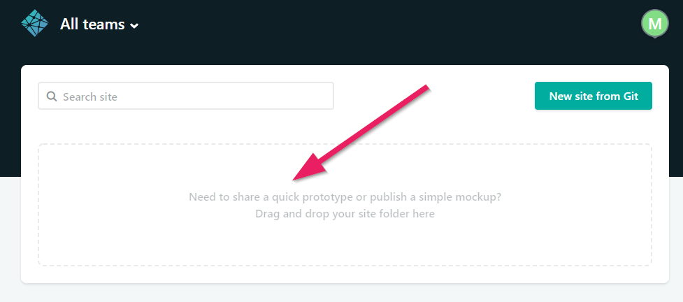
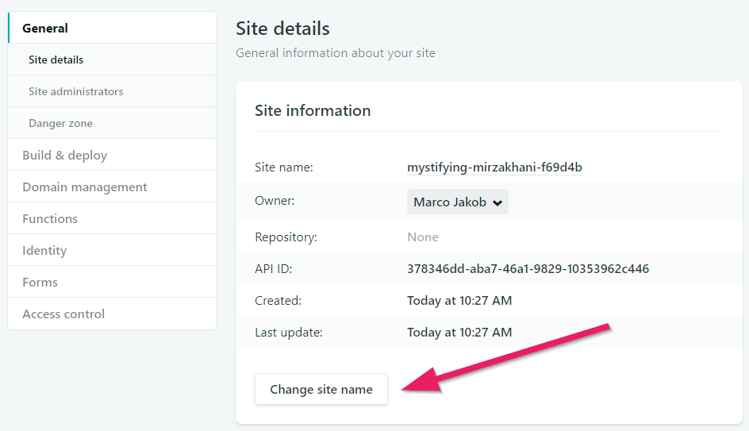
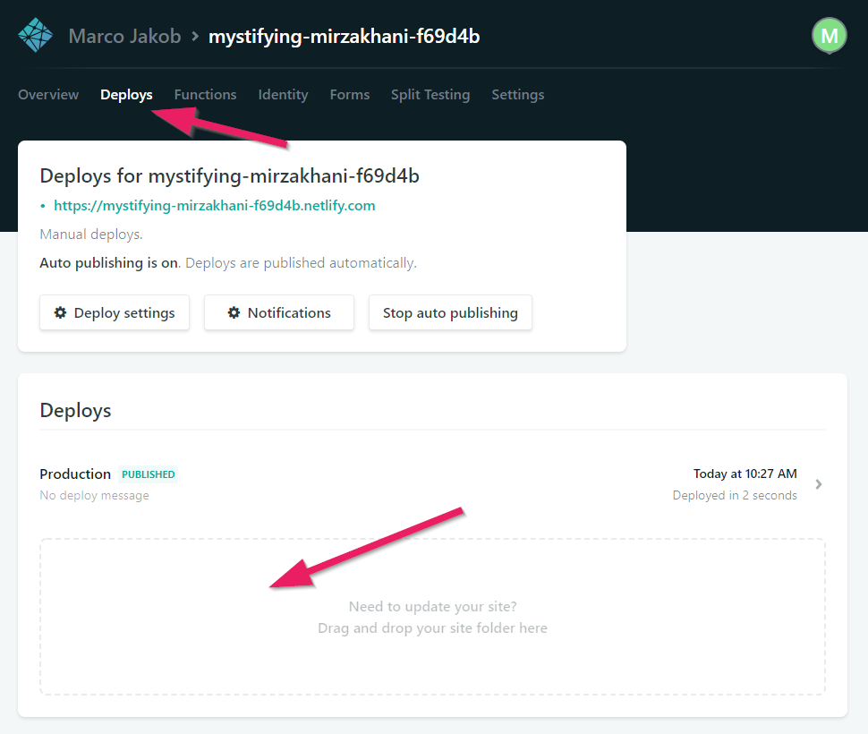

+++
title = "Part 2: Publishing Your Website"
date = 2018-08-10
description = "Learn to publish a website live in the internet. Compare different hosting possibilities like BitBalloon, Dropbox, Google Drive, and GitHub Pages."
image = "portfolio.png"
prettify = true
comments = true
weight = 2
+++

In the previous part you have created your first web site. It would be a pity if this website only stays on your computer and could never be looked at by anyone else. Therefore, we will now learn how to publish our website live on the internet.

<strong>Note:</strong> There will not be many visitors on your website right from the start. Unless you tell people about the address of your site they will probably not find it.

## Hosting

What do we need that our website can be viewed on the Internet? We need a **server** where our website is stored and an **address** (URL) so that our website can be found on the server.

There are numerous services where you can rent server space. Such a service is called [Webhosting](http://en.wikipedia.org/wiki/Web_hosting_service). We will look at a few options for (free) hosting. My current favorite is **Netlify**.

### Hosting on Netlify

[Netlify](https://www.netlify.com/) is a wonderfully simple service which I highly recommend. Here's how you can use it.

1. Sign up on the [Netlify website](https://www.netlify.com/). Click on *Sign Up* and then choose *Email*. Enter your email address and a password.

2. Once you are logged in, you can simply drag your entire web folder (your Portfolio folder) in the provided space.

3. Hard to believe, but that's it. Once the page has been uploaded a URL is generated for you which points to your site. Click this URL and check whether the page is displayed correctly.

4. To shorten your URL you can open **Site settings** click on **Change site name** and enter an arbitrary name.

5. **For Updates:** When you want to release a new version of your website open the **Deploys** menu and simply drag the folder into the box with the text **Drag and Drop your site folder here**.

#### Your Own Domain Name

There will come a time when you'll want your very own domain name such as `http://www.my-super-website.com`. The only thing you will need to pay is the registration of a domain name (at an arbitrary domain registrar). This costs about 10$ per year. The hosting on Netlify is free.

When you have your own address, you can connect it with Netlify. To do this go to **Domains**, **Add custom domain** in your Netlify settings.

### Hosting on GitHub

If you already have some experience with programming then [GitHub](https://github.com) is a great way for web site hosting. GitHub is a platform to facilitate collaboration among programmers. 

If you store your website on GitHub you can either connect GitHub and Netlify to publish the website or you can use [GitHub Pages](https://pages.github.com/) which is the GitHub's own hosting service.

***

## What's next?

In the next part we will upgrade our site with some styling.

&rarr; Continue with [Part 3: Introduction to CSS](/library/html-css/part3/).
