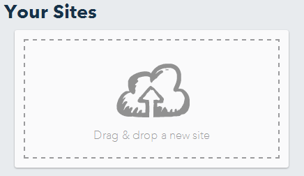

+++
title = "Part 2: Publishing Your Website"
date = 2018-08-10
description = "Learn to publish a website live in the internet. Compare different hosting possibilities like BitBalloon, Dropbox, Google Drive, and GitHub Pages."
image = "portfolio.png"
prettify = true
comments = true
weight = 2
+++

In the previous part you have created your first web site. It would be a pity if this website only stays on your computer and could never be looked at by anyone else. Therefore, we will now learn how to publish our website live on the internet.

**Note:** There will not be many visitors on your website right from the start. Unless you tell people about the address of your site they will probably not find it.

## Hosting

What do we need that our website can be viewed on the Internet? We need a **server** where our website is stored and an **address** (URL) so that our website can be found on the server.

There are numerous services where you can rent server space. Such a service is called [Webhosting](http://en.wikipedia.org/wiki/Web_hosting_service). We will look at a few options for (free) hosting. If this is your first website, I recommend that you start with **BitBalloon**.

### Hosting on BitBalloon

[BitBalloon](https://www.bitballoon.com/) is a wonderfully simple service which I highly recommend. Here's how you can use it.

1. Subscribe on the [Bitballoon website](https://www.bitballoon.com/). Click on *Sign Up* and then choose *Sign in Using Persona*. Then enter your email address and a password.

2. Once you are logged in, you can simply drag your entire web folder (your Portfolio folder) in the provided space.

3. Hard to believe, but that's it. Once the page has been uploaded a URL is generated for you which points to your site. Click this URL and check whether the page is displayed correctly.

4. To shorten your URL you can click on **Edit name** and enter an arbitrary name.

5. For Updates: When you want to release a new version of your website, simply drag the folder into the box with the text **Drag & Drop to Update your Site**.

### Hosting on GitHub

If you already have some experience with programming then GitHub is a great way for web site hosting. GitHub is a platform to facilitate collaboration among programmers and also offers free hosting for web pages on [GitHub Pages](https://pages.github.com/). GitHub Pages provides more options (for example, you can use your custom domain), but it requires skills in working with [Git](http://de.wikipedia.org/wiki/Git).

***

## Your Own Domain Name

There will come a time when you'll want your very own domain name such as `http://www.my-super-website.com`. In some cases you can register a domain name right at your hosting provider (for example at BitBalloon).

Otherwise, there are numerous web hosting and registrar services. It's worth it to compare a few services. If you want personal support, you can also contact a provider in your area.

## What's next?

In the next part we will upgrade our site with some styling.

&rarr; Continue with [Part 3: Introduction to CSS](/library/html-css/part3/).
