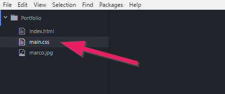
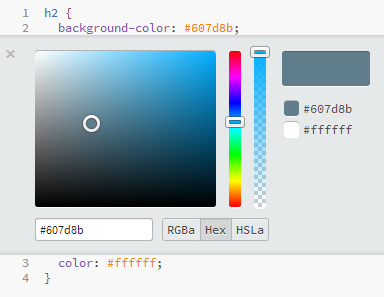

+++
title = "Teil 3: Einführung in CSS"
date = 2018-08-10
description = "Lernen Sie, wie Sie mit CSS eine Webseite gestalten können."
image = "portfolio.de.png"
prettify = true
comments = true
aliases = [
  "/library/html-css/de/part3/"
]
weight = 3

[[sidebars]]
header = "Downloads"
[[sidebars.items]]
text = "<i class=\"fa fa-fw fa-download\"></i> Portfolio Teil 3"
link = "https://github.com/marcojakob/tutorial-html-css/releases/download/v2.0/portfolio-part3.zip"
+++

Vorhin haben Sie eine erste Webseite erstellt und veröffentlicht. Zugegeben, die Webseite hat noch wenig Inhalt und sieht nicht besonders ansprechend aus. Das wollen wir jetzt ändern. In diesem Teil lernen Sie, wie Sie mit CSS die Seite gestalten können. In einem späteren Teil werden wir mit Hilfe vom Bootstrap Framework noch mehr Style in die Webseite bringen.

## Struktur und Style

Nochmals zur Erinnerung: **HTML** beschreibt die Struktur einer Webseite während **CSS** die visuelle Erscheinung definiert.

Die Aufteilung von Struktur und Style hat viele Vorteile, wie wir noch sehen werden. Es ist nicht zwingend, aber meistens schreibt man HTML und CSS auch in separate Dateien.

## Eine CSS-Datei einbinden

Eine CSS-Datei ist eine ganz normale Textdatei mit der Endung `.css`, die wir mit der HTML-Datei verknüpfen werden.

Erstellen Sie also in Ihrem *Portfolio*-Ordner eine **neue Datei**. Wir geben der Datei den Namen `main.css`.

Nun wechseln wir zur `index.html`-Datei und fügen innerhalb des `<head>`-Elements ein `<link>`-Element hinzu. Mit dem `<link>`-Element können wir der HTML-Seite mitteilen, dass sie die CSS-Datei laden soll:

##### Link von HTML zur CSS-Datei

<pre class="prettyprint lang-html">
&lt;link rel="stylesheet" href="/main.css">
</pre>

Fügen Sie dieses Element im `<head>`-Bereich ein. Dann sollte Ihr Code etwa so aussehen:

<pre class="prettyprint lang-html">
&lt;!DOCTYPE html>

&lt;html>
  &lt;head>
    &lt;meta charset="utf-8">
    <mark>&lt;link rel="stylesheet" href="/main.css"></mark>
    &lt;title>Web Portfolio von Marco&lt;/title>
  &lt;/head>
  &lt;body>
    &lt;h1>Web Portfolio von Marco&lt;/h1>

    &lt;h2>Willkommen!&lt;/h2>

    &lt;p>Schön, dass Sie auf meiner Seite vorbeischauen.&lt;/p>

    &lt;p>Sie können sich ruhig etwas umsehen. Im Blog dokumentiere ich meine Erfahrungen beim Programmieren. Daneben können Sie auch meine Webprojekte anschauen. Viel Spass.&lt;/p>

    &lt;img src="marco.jpg" alt="Foto von mir">

    &lt;p>Marco :-)&lt;/p>
  &lt;/body>
&lt;/html>
</pre>

<strong>Wichtig:</strong> Damit das CSS gefunden wird, muss das <code>href</code>-Attribut genau auf die Datei verweisen. Wir haben nur eine <code>main.css</code> und diese liegt in unserem Hauptordner. Mit dem führenden <code>/</code> gelangen wir von überall her, auch von Unterordnern, zum Hauptordner und erreichen so unter <code>href="/main.css"</code> immer unsere CSS-Datei. Mehr dazu siehe unter <a class="alert-link" href="/de/library/html-css/part1/#relative-und-absolute-urls">relative und absolute URLs</a>.

## Farben

Bis hierhin war die CSS-Datei natürlich noch leer. Nun wollen wir unsere ersten Zeilen CSS schreiben. Im CSS schreibt man sogenannte *CSS-Regeln*. Mit einer *CSS-Regel* können wir angeben, was mit einem bestimmten Teil im HTML geschehen soll.

Als Beispiel werden wir die Hintergrundfarbe und die Textfarbe der zweiten Überschrift verändern. Schreiben Sie folgende Zeilen in Ihre CSS-Datei.

##### main.css

<pre class="prettyprint lang-css">
h2 {
  background-color: #607d8b;
  color: #ffffff;
}
</pre>

Das Resultat sollte etwa so aussehen:

## Farbcodes

Farben werden auf einem Coumputerbilschirm durch eine Mischung verschiedener Anteile von Rot, Grün und Blau (RGB) erzeugt. Die Kombination aus Rot, Grün und Blau kann in CSS auf zwei Arten ausgedrückt werden: Als *RGB-Werte* oder als *Hex-Codes* (Hexadezimalzahlen). Die Notation mit *Hex-Codes* ist die gängiste.

Schauen wir uns das Beispiel mit der blau-grauen Hintergrundfarbe von oben an:

* Als Hex-Code: `#607d8b`
* Als RGB-Werte: `rgb(96, 125, 139)`

Bei den *Hex-Codes* stehen die ersten beiden Ziffern für den Rotanteil, die mittleren für den Grünanteil und die letzten beiden Ziffern für den Blauanteil.

### Mit Farbcodes arbeiten

Das Ausdrücken von Farben mit Hexadezimalzahlen ist sehr beliebt, da man damit sehr viele Farbkombinationen dartsellen kann (über 16.7 Millionen). Es ist aber etwas schwierig mit ihnen zu arbeiten. Meistens braucht man deshalb einen Farbwähler.

Falls Sie als Editor [Visual Studio Code](https://code.visualstudio.com/) verwenden, können Sie den Farbwähler gleich in der CSS-Datei aufrufen. Fahren Sie dazu mit der Maus über den Farbcode und wählen Sie eine neue Farbe.

### Online Farbwähler

Falls Sie einen anderen Farbwähler ausprobieren möchten, so gibt es auch zahlreiche Online-Farbwähler:

* [HTML Color Codes](http://html-color-codes.info/)
* [ColorPicker](http://www.colorpicker.com/)
* Und zahlreiche mehr...

### Online Farbpaletten

Meistens braucht man für eine Webseite mehr als nur eine Farbe, eine sogenannte Farbpalette. Nur mit einem einfachen Farbwähler ist es aber recht schwierig, Farben auszuwählen, die gut zueinander passen.

Dazu gibt es verschiedene Hilfen, die das finden einer Farbpalette erleichtern. Hier ein paar Beispiele:

##### Fertige Farbpaletten

* [Coolors](https://coolors.co/)
* [Colormind](http://colormind.io/)
* [Google Color Palette](http://www.google.com/design/spec/style/color.html)

##### Generatoren zum Erstellen von Farbpaletten

* [Kuler](https://kuler.adobe.com) - eine Farbregel definieren, am Regler mit dem kleinen Pfeil ziehen und schon hat man fünf Farben, die zusammen passen.
* [Paletton](http://www.paletton.com) - ein ausgeklügelter Regler zum Finden von Farbpaletten.
* [Colourco.de](http://colourco.de/) - ein weiterer, praktischer Paletten-Generator

## CSS-Regeln

Sie haben nun bereits gesehen, wie CSS-Regeln die Farbe eines HTML-Elementes verändern können. Nun schauen wir uns etwas genauer an, wie CSS-Regeln aufgebaut sind werden.

Eine CSS-Regel besteht aus drei Elementen, einem *Selektor*, einer *Eigenschaft* und einem *Wert*.

Diese Regel besagt, dass alle `<h2>`-Elemente eine Hintergrundfarbe von `#607d8b` erhalten sollen.

## CSS-Selektoren

Selektoren geben an, auf welches HTML-Element eine CSS-Regel angewandt werden soll.

<strong>Hinweis:</strong> Wir werden hier nur die wichtigsten Selektoren kennen lernen. Damit kommt man schon sehr weit. Für eine ausführlichere Übersicht suchen Sie im Internet nach "CSS Selektoren".

### Typselektor

Der Typselektor wird angewandt auf alle Elemente mit dem entsprechenden Tag.
Wenn wir als Beispiel alle `p`-Elemente ansprechen wollten, würde dies so aussehen.

##### CSS

<pre class="prettyprint lang-css">
p {
  ...
}
</pre>

##### HTML

<pre class="prettyprint lang-html">
&lt;p>...&lt;/p>
&lt;p>...&lt;/p>
</pre>

### Klassenselektor

Klassenselektoren werden sehr häufig verwendet. Dazu fügt man dem HTML-Element ein Attribut `class` hinzu und gibt ihm einen beliebigen Wert. In CSS kann man nun alle Elemente ansprechen, die das gleiche `class`-Attribut haben. Man macht dies mit einem **Punkt**, gefolgt vom `class`-Attribut.

Im folgenden Beispiel gilt der Klassenselektor für alle Elemente, welche ein `class`-Attribut mit dem Wert `highlight` haben.

##### CSS

<pre class="prettyprint lang-css">
.highlight {
  ...
}
</pre>

##### HTML

<pre class="prettyprint lang-html">
&lt;p class="highlight">...&lt;/p>
&lt;p>...&lt;/p>
&lt;p class="highlight new">...&lt;/p>
</pre>

In diesem HTML würde die CSS-Regel auf das erste und das dritte `p`-Element angewandt werden. Wie sie sehen, ist es auch möglich, dass ein Element mehrere Klassen besitzt (`highlight` und `new`).

### ID-Selektor

Der ID-Selektor ist sehr ähnlich wie der Klassenselektor. Er wird auf alle HTML-Elemente angewandt, die ein Attribut `id` mit einem entsprechenden Wert haben. Anstelle des Punktes verwendet man für ID-Selektoren ein **Rautezeichen** (`#`).

Der wichtige Unterschied zum Klassenselektor besteht darin, dass ID-Selektoren **nur einmal** pro HTML-Seite vorkommen sollten, während eine Klasse für beliebig viele Elemente verwendet werden kann.

Im folgenden Beispiel gilt der ID-Selektor für das Element, welches ein `id`-Attribut mit dem Wert `navigation` besitzt.

##### CSS

<pre class="prettyprint lang-css">
#navigation {
  ...
}
</pre>

##### HTML

<pre class="prettyprint lang-html">
&lt;p id="navigation">...&lt;/p>
&lt;p>...&lt;/p>
</pre>

### Weitere Selektoren

Es gibt noch ein paar weitere Selektoren (Google is your friend). Die wichtigsten sind jedoch die oben beschriebenen drei Selektoren. 

## CSS-Eigenschaften

Durch CSS-Regeln wird festgelegt, wie HTML-Elemente angezeigt werden sollen. Es gibt zahlreiche Eigenschaften, die in CSS definiert werden können. Zwei davon haben wir bereits kennen gelernt, `background-color` und `color`.

Ich verzichte darauf, hier weitere der vielen CSS-Eigenschaften zu erklären. Aber ich möchte Ihnen aufzeigen, wie Sie sich Schritt für Schritt mehr CSS-Wissen aneignen können. Es macht mehr Sinn, wenn Sie in dem Moment etwas lernen, wenn Sie auch wirklich ein konkretes Bedürfnis haben. Es gibt zwei Szenarien, wie sie später vorgehen können:

#### Wenn Sie eine CSS-Eigenschaft sehen, die Sie nicht kennen...

... dann **suchen Sie im Internet nach der Eigenschaft** und zwar zusammen mit dem Stichwort `CSS`. Versuchen Sie es gleich einmal, indem Sie versuchen herauszufinden, was die folgende CSS-Regel bewirkt:

<pre class="prettyprint lang-css">
padding: 5px;
</pre>

Verwenden Sie als Suchbegriff `CSS padding`. Geben Sie sich nicht mit dem ersten Resultat zufrieden, sondern öffnen Sie ungefähr die ersten 5 oder mehr der gefundenen Seiten. Entscheiden Sie dann, welche Seite Sie genauer lesen wollen.

Versuchen Sie auch mal diese Regel auf das `h2`-Element in Ihrem Portfolio-Projekt anzuwenden.

#### Wenn Sie etwas verändern wollen, aber die CSS-Eigenschaft dazu nicht kennen...

... dann **suchen Sie im Internet nach dem, was Sie tun wollen** zusammen mit dem Stichwort `CSS`. Evtl. werden Sie mehrere Versuche brauchen, bis Sie das gefunden haben, wonach Sie gesucht haben.

Ein Beispiel: Angenommen, Sie wollen die Textgrösse verändern. Geben Sie in diesem Fall `Textgrössse CSS` als Suchbegriffe ein. Auch hier wieder darauf achten, dass Sie nicht nur das erste Suchresultat in Betracht ziehen.

## CSS-Werte

Wir haben bereits ein paar Werte von CSS-Eigenschaften kennen gelernt: Zum Beispiel Hexadezimalwerte wie `#ffffff` oder Grössenangaben wie `5px`. Je nach CSS-Eigenschaft muss man manchmal klar definierte Wörter angeben wie zum Beispiel `left` oder `right` für die Ausrichtung von Text.

Eine der wichtigsten CSS-Werte sind Grössenangaben. Deshalb schauen wir die etwas genauer an:

Die häufigste Form ist die Angabe in **Pixel**. Pixel werden als `px` abgekürzt:

<pre class="prettyprint lang-css">
p {
  font-size: 16px;
}
</pre>

Eine andere Möglichkeit ist die Angabe in **Prozent**. Prozentangaben stehen immer im Verhältnis zu einem übergeordneten Element. Wenn also im folgenden Beispiel das übergeordnete Element von `p` die ganze Bildschirmbreite umfasst, dann bedeutet das, dass `p` nun 60% davon breit sein wird.

<pre class="prettyprint lang-css">
p {
  width: 60%;
}
</pre>

Eine weitere beliebte Art für die Grössenangabe sind `em`. Ein `em` ist immer relativ zur Schriftgrösse. Das heisst, wenn man die Schriftgrösse verändert, dann verändert sich ein `em` mit.

Als Beispiel: Wenn ein Element eine Schriftgrösse von `20px` hat und eine Breite von `5em`, dann wäre die Breite des Elementes `100px`.

<pre class="prettyprint lang-css">
p {
  font-size: 20px;
  width: 5em;
}
</pre>

## Beispiel Klassenselektor im Portfolio

Nehmen wir mal an, wir möchten die Hauptüberschrift "Web Portfolio von Marco" etwas vergrössern. Das wäre natürlich möglich, indem wir eine CSS-Regel für das Element `h1` definieren würden. Etwa so:

<pre class="prettyprint lang-css">
h1 {
  font-size: 65px;
}
</pre>

Das Problem dabei ist, dass nun **alle** `h1`-Elemente eine grössere Schrift haben werden. Wir möchten jedoch nur diese erste Überschrift vergrössern. Dies können wir erreichen mit einem **Klassenselektor**.

Dazu fügen wir zuerst dem `h1`-Element im HTML eine Klasse hinzu. Wir können irgend einen Wert für die Klasse vergeben, ich wähle hier `title`.

<pre class="prettyprint lang-html">
&lt;h1 class="title">Web Portfolio von Marco&lt;/h1>
</pre>

Dann können wir diesen einen Titel im CSS ansprechen mit `.title`. Die CSS-Regel ist jetzt:

<pre class="prettyprint lang-css">
.title {
  font-size: 65px;
}
</pre>

Wenn alles geklappt hat, dann sieht das Portfolio nun etwa so aus:

***

&rarr; Weiter geht's mit [Teil 4: Entwicklertools im Browser](/de/library/html-css/part4/).
