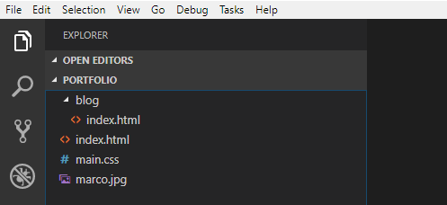
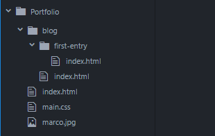
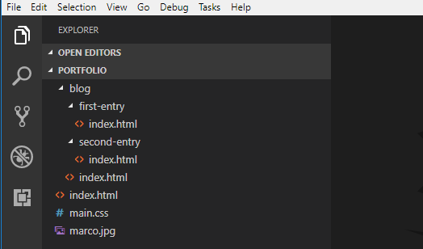
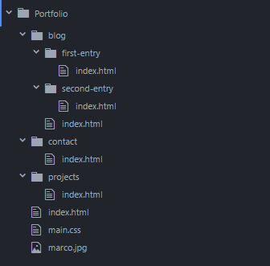

+++
title = "Blog and Other Pages"
date = 2018-08-10
description = "Create a file structure with multiple web pages, including a structure for writing blog posts."
image = "portfolio.png"
prettify = true
comments = true
weight = 5

[[sidebars]]
header = "Downloads"
[[sidebars.items]]
text = "<i class=\"fa fa-fw fa-download\"></i> Portfolio Part 5"
link = "https://github.com/marcojakob/tutorial-html-css/releases/download/v2.0/portfolio-part5.zip"
+++

Our portfolio thus far only has a home page. Most websites have more than one page, of course. In this part we will add additional pages.

## Creating a New Page

We'll create three new pages: One page for our own **blog**, one for **projects**, and one for **contact information**.

These three sites represent our "main pages". We must keep in mind that we might later want to add additional sub-pages. For example, there will be a sub-page for every blog entry. To have a nice structure it makes sense to create **subfolders for each page**.

Every subfolder will get its own `index.html` file that is automatically displayed when the folder is opened in the browser.

To create a new page is easy. It is best to copy the previous `index.html` so you already have the basic structure. Then, of course, we must make a few adjustments to each new page.

  <strong>Important:</strong> Make sure that you don't use any special characters or spaces when naming sub-folders and files. As a best practice you should only use standard, lowercase letters. You may separate multiple words with a dash (`-`).

## Blog Page

Create a subfolder in your *portfolio* folder named `blog`. Copy the `index.html` file into the new subfolder. Now your file structure should look like this:

Open the copied file `blog/index.html` in your browser. You will notice that two things do not work:

1. The image is not displayed.
2. The colors defined in the CSS are not applied.

Since we are in a subfolder, the path to the files are not correct. For the image to appear we would need to use `../marco.jpg` or `/marco.jpg` instead of `marco.jpg` in the `src` attribute. But probably you will not want the same image on the blog page. So you can remove the entire `img` element.

In **CSS** it is common to define CSS rules **for the entire project**. Thus it is important that we reference the same CSS file in the blog page. We achieve this by changing the URL from `main.css` to `/main.css`. The leading `/` searches for the file in the root folder. The following shows the entire `link` element:

##### blog/index.html

<pre class="prettyprint lang-html">
&lt;link rel="stylesheet" href="/main.css">
</pre>

This change should cause the styling from our CSS to also be applied to the blog page.

Next we change the title and content.

##### blog/index.html - Blog Overview

<pre class="prettyprint lang-html">
&lt;!DOCTYPE html>

&lt;html>
  &lt;head>
    &lt;meta charset="utf-8">
    &lt;link rel="stylesheet" href="/main.css">
    &lt;title>Blog - Web Portfolio of Marco&lt;/title>
  &lt;/head>
  &lt;body>
    &lt;h1 class="title">Blog&lt;/h1>

    &lt;p>I write about things I encounter while learning web programming.&lt;/p>

    &lt;h2>Blog Entries&lt;/h2>

    &lt;!-- Here will be a list of all the blog entries. -->

  &lt;/body>
&lt;/html>
</pre>

In the HTML code above you can see some special tags: `<!--` and `-->`. Between these tags we can write a **comment** in HTML. Comments are intended to be read only for us programmers and are ignored by the browser.

### Blog Entry as Sub-Page

Our blog needs some entries. We create a separate HTML page for each blog entry. Create a subfolder within the `blog` folder with the name `first-entry`. Use your file explorer to copy the file `blog/index.html` into the new subfolder.

Open the blog entry and change the content as follows:

##### blog/first-entry/index.html

<pre class="prettyprint lang-html">
&lt;!DOCTYPE html>

&lt;html>
  &lt;head>
    &lt;meta charset="utf-8">
    &lt;link rel="stylesheet" href="/main.css">
    &lt;title>First Entry - Web Portfolio of Marco&lt;/title>
  &lt;/head>
  &lt;body>
    &lt;h1 class="title">First Entry&lt;/h1>
    &lt;p>April 7, 2015&lt;/p>

    &lt;hr>

    &lt;p>This is my very first blog entry.&lt;/p>

  &lt;/body>
&lt;/html>
</pre>

Here I've included a new HTML element (`hr`). You will easily find out what it does by experimenting with it or by doing a quick internet search.

### Get started with your blog entries!

I recommend that you immediately start to write your own blog entries. You could write a short entry every time you learned something new about programming. For inspiration I list a few things that you could write about:

* What did I learn today?
  * Insert screenshots
  * Links to helpful websites
* What are the problems I have encountered?
* How did I solve these problems?
* What should I work on the next time?

With such blog entries you will advance much faster in mastering programming. This is why:

1. You will be aware of what you have learned &rarr; higher motivation!
2. You can look up things in your personal documentation, for example links to helpful sites.
3. You will practice HTML and CSS while writing the entries.
4. If you publish your website online you can make your blog accessible to others. This enables you to share your knowledge or to ask someone to help you with a problem.
5. If you publish your portfolio, I would be very interested in having a look at it! Please share your link somewhere in the comments below.

*Do not wait too lang and get started right away. It is worth it!*

#### Second Blog Entry

  <strong>Hint:</strong> Create a subfolder for each blog post (with an <code>index.html</code> page). This will give you a nice order where you can put pictures and other files for blog entries into separate subfolders.

## Projects Page

If we later design various websites or web applications, it would be nice to have a separate page to showcase our projects. We will prepare such a projects page, albeit with no content yet.

Proceed as we did for the blog page above and create a subfolder `projects` with a file `index.html`.

##### projects/index.html

<pre class="prettyprint lang-html">
&lt;!DOCTYPE html>

&lt;html>
  &lt;head>
    &lt;meta charset="utf-8">
    &lt;link rel="stylesheet" href="/main.css">
    &lt;title>Projects - Web Portfolio of Marco&lt;/title>
  &lt;/head>
  &lt;body>
    &lt;h1 class="title">Projects&lt;/h1>

    &lt;p>Here you will soon find my web projects.&lt;/p>

  &lt;/body>
&lt;/html>
</pre>

## Contact Page

The last of our main pages is a contact page. Create a subfolder `contact` with a file` index.html`.

  <strong>Important:</strong> Carefully consider what information you want to make public! For example, <strong>do not publish your primary email address</strong>, because you might receive some spam messages.

##### contact/index.html

<pre class="prettyprint lang-html">
&lt;!DOCTYPE html>

&lt;html>
  &lt;head>
    &lt;meta charset="utf-8">
    &lt;link rel="stylesheet" href="/main.css">
    &lt;title>Contact - Web Portfolio of Marco&lt;/title>
  &lt;/head>
  &lt;body>
    &lt;h1 class="title">Contact&lt;/h1>

    &lt;p>
      You can contact me by email: &lt;a href="mailto:spammails@gmx.ch">spammails@gmx.ch&lt;/a>
    &lt;/p>

    &lt;p>
      Marco Jakob&lt;br>
      Switzerland
    &lt;/p>
  &lt;/body>
&lt;/html>
</pre>

In the address you'll find a new item: ` `. It causes a line break. Also note the special link with `mailto:` and the email address. This link opens the standard email program and creates a new email with prefilled address.

Now we already have five HTML pages.

## What's next?

What's missing is a navigation so we can easily switch between our pages.

&rarr; That's what we'll takle in [Part 6: Navigation](/library/html-css/part6/).
