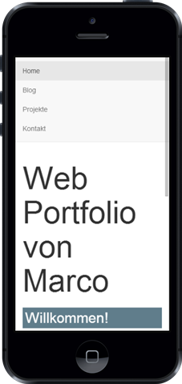

+++
title = "Teil 7: Bootstrap Framework verwenden"
date = 2018-08-10
description = "Lernen Sie das Bootstrap-Framework für Ihre Webseite einzusetzen."
image = "portfolio.de.png"
prettify = true
# comments = true
commentsIdentifier = "/library/html-css/de/part7/"
aliases = [
  "/library/html-css/de/part7/"
]
weight = 7

[[sidebars]]
header = "Downloads"
[[sidebars.items]]
text = "<i class=\"fa fa-fw fa-download\"></i> Portfolio Teil 7"
link = "https://github.com/marcojakob/tutorial-html-css/releases/download/v2.0/portfolio-part7.zip"
+++

Bis hierhin haben wir alles HTML und CSS von Grund auf selber programmiert. Unser Projekt, das *Web Portfolio*, hat bereits einige HTML-Seiten mit etwas Inhalt, eine noch unfertige Navigation und etwas Styling.

Ganz von Hand unser Projekt zu einem kompletten und modernen Webauftritt weiter zu entwickeln wäre **eine riesige Menge Arbeit**! Hier ist eine Liste mit den paar wichtigsten Aufgaben, die wir noch bewältigen müssten (keine Angst, es gibt eine Lösung!):

* Schriftart und Textgrösse für alle Überschriften und Abschnitte anpassen.
* Knöpfe, Textfelder, etc. schön gestalten (sehen standardmässig recht veraltet aus).
* Abstände definieren und Elemente auf der Seite positionieren (ist sehr schwierig).
* Einen einheitlichen Stil definieren, damit alle verschiedenen Browser in etwa das Gleiche anzeigen.
* Die Webseiten optimieren für verschiedene Bildschirmgrössen (Mobile, Tablet und Desktop)
* Und Einiges mehr...

Zum Glück sind wir nicht alleine mit diesen Aufgaben - dies betrifft mehr oder weniger alle Webdesigner. Da es kaum sinnvoll ist, wenn alle immer wieder die gleichen Aufgaben lösen, sind sogenannte *Frameworks* entstanden, die diese Arbeit viel einfacher machen.

Das bekannteste dieser *Frameworks* heisst **Bootstrap** und wurde von Twitter entwickelt. Das *Bootstrap-Framework* ist eine enorme erleichtert für uns als Webentwickler. Wir werden Schritt-für-Schritt entdecken, was wir mit *Bootstrap* tun können. Hier aber schon mal eine Kostprobe, welche Auswirkungen *Bootstrap* auf unser Projekt haben kann:

Mit *Bootstrap* sehen die Elemente nicht nur besser aus, sondern sie werden auch in allen Browsern praktisch gleich dargestellt.

## Bootstrap einsetzen

### Dokumentation

Die offizielle Dokumentation von [Bootstrap](https://getbootstrap.com/) ist der beste Ort, um zu sehen, was man alles mit Bootstrap machen kann. Sie sollten sich diese Webseiten irgendwo speichern, denn Sie werden dort immer wieder etwas nachschlagen müssen.

### Bootstrap-CSS einbinden

Der wichtigste Teil von Bootstrap besteht aus einem grossen CSS. Für etwas komplexere Elemente gibt es auch noch eine JavaScript-Datei. Wir werden aber für den Moment nur die CSS-Datei verwenden.

Nun wollen wir das Bootstrap-CSS in unsere HTML-Seiten einbinden:

1. Öffnen Sie die [Bootstrap-Webseite](https://getbootstrap.com/). Sie sehen dort, dass es mehrere Möglichkeiten gibt, Bootstrap herunterzuladen. Wir wählen die Variante über das *BootstrapCDN*. Damit müssen wir eigentlich gar nichts herunterladen, sondern nur im HTML angeben, wo die zusätzliche CSS-Datei liegt. Sie wird dann bei jedem Aufruf unserer Webseite direkt von den *CDN*-Servern heruntergeladen. *CDN*-Server sind Server, die über die ganze Welt verteilt sind, damit sie eine Datei sehr schnell ausliefern können.

2. Kopieren Sie also vom Abschnitt *BootstrapCDN* die erste Zeile mit dem `link`-Element.

3. Fügen Sie das `link`-Element in ihre HTML-Seiten ein. Wichtig ist, dass Sie es oberhalb von unserem `link`-Element für die `main.css`-Datei einfügen. Dadurch hat unser `main.css` eine höhere Wichtigkeit. Das bedeutet, dass wir CSS-Regeln aus dem Bootstrap-CSS mit unseren eigenen Regeln überschreiben können.

4. Kopieren Sie die drei Zeilen für JS, Popper.js und jQuery.

5. Fügen Sie diese JavaScript-Dateien zuunterst in den Body-Bereich ihrer HTML-Seite ein.

So sollte Ihre HTML-Dateien nun etwa aussehen (evtl. mit einer neueren Versionsnummer und ein paar "integrity"-Zahlen von Bootstrap):

##### index.html

<pre class="prettyprint lang-html">
&lt;html>
  &lt;head>
    &lt;meta charset="utf-8">
    <mark>&lt;link rel="stylesheet" href="https://stackpath.bootstrapcdn.com/bootstrap/4.1.3/css/bootstrap.min.css">
  </mark>
    &lt;link rel="stylesheet" href="/main.css">
    &lt;title>Web Portfolio von Marco&lt;/title>
  &lt;/head>
    &lt;body>
      &lt;!-- Hier steht irgend ein Inhalt -->
      <mark>
      &lt;script src="https://code.jquery.com/jquery-3.3.1.slim.min.js">&lt;/script>
      &lt;script src="https://cdnjs.cloudflare.com/ajax/libs/popper.js/1.14.3/umd/popper.min.js">&lt;/script>
      &lt;script src="https://stackpath.bootstrapcdn.com/bootstrap/4.1.3/js/bootstrap.min.js">&lt;/script></mark>
    &lt;/body>
&lt;/html>
</pre>

### Wie funktioniert Bootstrap?

Manche *Styles* aus dem Bootstrap-CSS werden direkt auf HTML-Elemente angewandt. Schauen wir uns zum Beispiel einen Link in *Chrome DevTools* an, sehen wir, wie im Bootstrap-CSS die Link-Farbe geändert wird und mit `text-decoration` der Unterstrich entfernt wird:

Viele Bootstrap-Styles werden aber erst aktiviert, wenn man eine entsprechende **CSS-Klasse** hinzufügt.

### Bootstrap Klassen verwenden

Als Beispiel schauen wir uns an, wie mit Bootstrap die Textausrichtung geändert werden kann. In der Bootstrap-Dokumentation unter [Ausrichtungsklassen](https://getbootstrap.com/docs/4.1/utilities/text/) finden Sie eine kurze Anleitung zur Textausrichtung.

Wenn wir also zum Beispiel den `h2`-Titel zentrieren möchten, müssten wir die Klasse `text-center` hinzufügen:

<pre class="prettyprint lang-html">
&lt;h2 class="text-center">Willkommen!&lt;/h2>
</pre>

Unser `h1`-Titel hat bereits ein `class`-Attribut. Wenn wir auch diesen Titel zentrieren möchten, können wir das `text-center` als zweite Klasse hinzufügen. **Mehrere CSS-Klassen werden immer durch Leerschläge getrennt**:

<pre class="prettyprint lang-html">
&lt;h1 class="title text-center">Web Portfolio von Marco&lt;/h1>
</pre>

Was aber, wenn wir einen grösseren Teil unserer Webseite zentrieren möchten? Da wäre es recht mühsam, wenn wir bei jedem Element einzeln ein `text-center` hinzufügen müssten. Es ist deshalb möglich, dass man auf einem übergeordneten Element eine Klasse hinzufügt. Viele CSS-Regeln können so auf alle Unterelemente weitervererbt werden.

Wir könnten sogar auf dem `body`-Element eine `text-center`-Klasse hinzufügen. Damit wird gleich alles zentriert. Wenn man aber nur einen Teil zentrieren möchte, verwendet man oft sogenannte `div`-Elemente.

## div-Elemente

Mit dem `
`-Element werden Elemente zu einem Block gruppiert. Für Bootstrap werden wir `div`-Elemente recht oft verwenden, um Styles auf einen ganzen Abschnitt der Seite anzuwenden.

Eine zentrale CSS-Klasse in Bootstrap ist `container`. Der `container` passt den Inhalt automatisch an die Seitenbreite an und sorgt für einen sinnvollen Abstand zum Rand. Sie sollten auf Ihrer Bootstrap-Seite immer ein `div`-Element mit der `container`-Klasse haben. Lesen Sie die [Beschreibung von Container](https://getbootstrap.com/docs/4.1/layout/overview/#containers) auf der Bootstrap-Webseite.

Wir packen nun den Hauptinhalt unserer Startseite zwischen ein `
` und `
`. (Um die Navigation werden wir uns weiter unten noch speziell kümmern.)

Der `body`-Teil Ihrer Hauptseite sollte nun wie folgt aussehen (achten Sie auf sauberes Einrücken der Elemente, damit der Code übersichtlich bleibt):

##### index.html

<pre class="prettyprint lang-html">
&lt;body>
  &lt;ul>
    &lt;li>&lt;a href="/">Home&lt;/a>&lt;/li>
    &lt;li>&lt;a href="/blog/">Blog&lt;/a>&lt;/li>
    &lt;li>&lt;a href="/projekte/">Projekte&lt;/a>&lt;/li>
    &lt;li>&lt;a href="/kontakt/">Kontakt&lt;/a>&lt;/li>
  &lt;/ul>

  <mark>&lt;div class="container"></mark>
    &lt;h1 class="title">Web Portfolio von Marco&lt;/h1>

    &lt;h2>Willkommen!&lt;/h2>

    &lt;p>Schön, dass Sie auf meiner Seite vorbeischauen.&lt;/p>

    &lt;p>Sie können sich ruhig etwas umsehen. Im Blog dokumentiere ich meine Erfahrungen beim Programmieren. Daneben können Sie auch meine Webprojekte anschauen. Viel Spass.&lt;/p>

    &lt;img src="marco.jpg" alt="Foto von mir">

    &lt;p>Marco :-)&lt;/p>
  <mark>&lt;/div></mark>
&lt;/body>
</pre>

Im Browser beginnen die `div`-Elemente **immer auf einer neuen Zeile**. Weil sie die ganze verfügbare Breite in Anspruch nehmen nennt man solche Elemente auch [Block-Elemente](https://developer.mozilla.org/de/docs/Web/HTML/Block-level_elemente).

## span-Elemente

Im Gegensatz zu `
`-Elementen beginnt ein ``-Element nicht auf einer neuen Zeile. Ein `span`-Element ist nur so breit wie sein Inhalt. Man nennt solche Elemente auch [Inline-Elemente](https://developer.mozilla.org/de/docs/Web/HTML/Inline_elemente), weil sie sich innerhalb einer Zeile einbetten.

Hier ein Beispiel, wie man ein `span`-Element einsetzen könnte:

<pre class="prettyprint lang-html">
Ich möchte &lt;span class="text-warning">diese Worte&lt;/span> besonders hervorheben.
</pre>

## Navigation mit Bootstrap

Nun wollen wir endlich die Navigation schöner gestalten mit der Hilfe von Bootstrap. In der Bootstrap-Dokumentation wird eine [Navbar](https://getbootstrap.com/docs/4.1/components/navbar/) beschrieben. Das Beispiel dort ist jedoch sehr komplex und beinhaltet Menus, Textfelder und Knöpfe. Wir wählen eine etwas einfachere Variante.

Kopieren Sie den folgenden Code für die Navigation:

##### index.html

<pre class="prettyprint lang-html">
&lt;nav class="navbar navbar-expand-lg navbar-light bg-light">
  &lt;div class="container">
    &lt;button class="navbar-toggler" type="button" data-toggle="collapse" data-target="#navbarMenu">
      &lt;span class="navbar-toggler-icon">&lt;/span>
    &lt;/button>
    &lt;div class="collapse navbar-collapse" id="navbarMenu">
      &lt;ul class="navbar-nav">
        &lt;li>&lt;a class="nav-link active" href="/">Home&lt;/a>&lt;/li>
        &lt;li>&lt;a class="nav-link" href="/blog/">Blog&lt;/a>&lt;/li>
        &lt;li>&lt;a class="nav-link" href="/projects/">Projekte&lt;/a>&lt;/li>
        &lt;li>&lt;a class="nav-link" href="/contact/">Kontakt&lt;/a>&lt;/li>
      &lt;/ul>
    &lt;/div>
  &lt;/div>
&lt;/nav>
</pre>

#### Erklärung

1. Das äusserste `nav`-Element mit `navbar` als Klasse bewirkt, dass ein Balken oben am Rand dargestellt wird. Ein `nav` is eigentlich das genau Gleiche wie ein `div`, ausser dass man an Suchmaschinen einen kleinen Hinweis gibt, dass da eine Navigation kommt.

2. Das nächste `div` mit der Klasse `container` bewirkt, dass die Abstände vom Rand gleich sind wie bei unserem Hauptinhalt. Beachten Sie jeweils das schliessende Tag `
`, welches dazugehört.

3. Das `button`-Element mit Klasse `navbar-toggler` ist der Knopf in der mobilen Ansicht, um das Menu auszuklappen. Verkleinern Sie mal das Browser-Fenster in der Breite. Dann sollte der Knopf erscheinen.

4. Im Gegensatz zur vorherigen Variante, haben wir bei jedem Link eine Klasse `nav-link` hinzugefügt. Diese bewirkt, dass der Link in der Navigation den entsprechenden Stil erhält.

5. Beachte: Das **aktive** Navigationselement ist jeweils mit der zusätzlichen Klasse `active` markiert. Dieses erscheint dann hervorgehoben.

So ungefähr sollte es jetzt aussehen:

### Dunkle Variante

Es gibt weitere Varianten der Bootstrap-Navigation:

Um diese zu aktivieren, ändern Sie die Klasse `navbar-light` in `navbar-dark` und `bg-light` in `bg-dark` um.

## Optimieren für Mobile

Mit Bootstrap und der Navigation sieht die Webseite in einem Desktop-Browser schon recht ansprechend aus. Versuchen Sie mal, die Webseite auf einem Mobiltelefon aufzurufen (dazu müssen Sie die Seite [veröffentlichen](/de/library/html-css/part2/)).

Sie werden feststellen, dass die Seite entweder abgeschnitten oder die Navigation viel zu klein dargestellt wird:

Mit einer `meta`-Information im `head`-Bereich können wir den mobilen Browsern mitteilen, dass sie die Seite vernünftig anzeigen sollen:

<pre class="prettyprint lang-html">
&lt;head>
  &lt;meta charset="utf-8">
  <mark>&lt;meta name="viewport" content="width=device-width, initial-scale=1"></mark>
  &lt;link rel="stylesheet" href="https://stackpath.bootstrapcdn.com/bootstrap/4.1.3/css/bootstrap.min.css">
  &lt;link rel="stylesheet" href="main.css">
  &lt;title>Web Portfolio von Marco&lt;/title>
&lt;/head>
</pre>

Nun sollte es etwa so aussehen:

Bootstrap wurde so entworfen, dass es auf mobilen Bilschirmen gut funktioniert. Im Screenshot oben sehen Sie, wie die Navigation automatisch untereinander angezeigt wird, sobald die Bildschirmbreite zu klein wird. Dies können Sie auch ausprobieren, indem Sie einfach das Browserfenster verkleinern.

Ein Webdesign, welches auf die Bildschirmgrösse reagiert, nennt man [Responsive Webdesign](http://de.wikipedia.org/wiki/Responsive_Webdesign).

  <strong>Hinweis:</strong> Bootstrap klappt die Navigation auch automatisch zusammen in der mobilen Ansicht. Dafür sind die JavaScript-Dateien zuständig, welche wir jeweils vor das schliessende <code>&lt;/body&gt;</code>-Tag kopiert haben.

## Bootstrap und Navigation auf allen Seiten

Bis jetzt haben wir Bootstrap und die Navigation nur auf unserer Startseite eingefügt. Das Ziel ist natürlich, dass diese auf allen Seiten eingebunden sind.

Mit kleinen Anpassung können wir den Code aus der Startseite in alle anderen Seiten (Blog, Blogeinträge, Kontakt, etc.) kopieren:

#### 1. Viewport und Bootstrap-CSS einfügen

Kopieren Sie aus dem `head`-Bereich der Startseite die Zeile mit dem `viewport` und die Zeile mit dem Bootstrap CSS und fügen Sie diese in alle anderen Seiten ein:

<pre class="prettyprint lang-html">
&lt;meta name="viewport" content="width=device-width, initial-scale=1">
&lt;link rel="stylesheet" href="https://stackpath.bootstrapcdn.com/bootstrap/4.1.3/css/bootstrap.min.css">
</pre>

#### 2. JavaScript einfügen

Kopieren Sie aus vom Schluss vom `body`-Bereich der Startseite die Links auf die JavaScript-Dateien und fügen Sie diese in alle anderen Seiten ein:

<pre class="prettyprint lang-html">
&lt;body>
  &lt;!-- Hier steht irgend ein Inhalt -->
  <mark>
  &lt;script src="https://code.jquery.com/jquery-3.3.1.slim.min.js">&lt;/script>
  &lt;script src="https://cdnjs.cloudflare.com/ajax/libs/popper.js/1.14.3/umd/popper.min.js">&lt;/script>
  &lt;script src="https://stackpath.bootstrapcdn.com/bootstrap/4.1.3/js/bootstrap.min.js">&lt;/script></mark>
&lt;/body>
</pre>

#### 3. Navigation einfügen

Kopieren Sie den gesamten Navigationsbereich aus der Startseite und fügen Sie diese in alle anderen Seiten ein. Achten Sie darauf, dass Sie jeweils beim aktuellen Link  die `active`-Klasse hinzufügen:

<pre class="prettyprint lang-html">
&lt;nav class="navbar navbar-expand-lg navbar-light bg-light">
  &lt;div class="container">
    &lt;button class="navbar-toggler" type="button" data-toggle="collapse" data-target="#navbarMenu">
      &lt;span class="navbar-toggler-icon">&lt;/span>
    &lt;/button>
    &lt;div class="collapse navbar-collapse" id="navbarMenu">
      &lt;ul class="navbar-nav">
        &lt;li>&lt;a class="nav-link" href="/">Home&lt;/a>&lt;/li>
        &lt;li>&lt;a class="nav-link active" href="/blog/">Blog&lt;/a>&lt;/li>
        &lt;li>&lt;a class="nav-link" href="/projects/">Projekte&lt;/a>&lt;/li>
        &lt;li>&lt;a class="nav-link" href="/contact/">Kontakt&lt;/a>&lt;/li>
      &lt;/ul>
    &lt;/div>
  &lt;/div>
&lt;/nav>
</pre>

#### 4. Container-div einfügen

Wenn Sie die Unterseiten im Browser öffnen, werden Sie merken, dass die Seitenränder noch nicht korrekt sind. Um das zu korrigieren, müssen wir den gesamten Inhalt (alles unterhalb der Navigation) mit einem `div` umgeben. Dieses `div` muss die Klasse `container` haben. Korrigieren Sie das in allen Unterseiten:

<pre class="prettyprint lang-html">
[... Navigation ...]

<mark>&lt;div class="container"></mark>
  [... Seiteninhalt ...]
<mark>&lt;/div></mark>
</pre>

#### 5. Testen

Nun ist es wichtig, dass Sie alle Seiten aufrufen und die **Links sorgfältig testen**!

Schauen Sie als nächstes Ihren Code an und stellen Sie sicher, dass das **HTML schön aufgeräumt** ist. Immer, wenn ein HTML-Tag geöffnet wird, dann sollte die nächste Zeile eingerückt werden. Das schliessende Tag wird dann wieder nach links gerückt.

## Wie weiter?

&rarr; Erfahren Sie die [nächsten Schritte](/de/library/html-css/next/).
