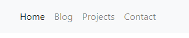

+++
title = "Part 7: Bootstrap Framework"
date = 2018-08-10
description = "Learn to use the Bootstrap Framework in your website."
image = "portfolio.png"
prettify = true
comments = true
weight = 7

[[sidebars]]
header = "Downloads"
[[sidebars.items]]
text = "<i class=\"fa fa-fw fa-download\"></i> Portfolio Teil 7"
link = "https://github.com/marcojakob/tutorial-html-css/releases/download/v2.0/portfolio-part7.zip"
+++

So far we have programmed all HTML and CSS from scratch. Our *web portfolio* project already has a few HTML pages with some content, a navigation and some styling.

To manually evolve our project to a complete and modern web presence would mean a **large amount of work**! Here is a list of some important tasks that we would have to deal with (do not worry, there is a solution!):

* Customize font and font sizes for all headings and sections.
* Beautifully design buttons, text boxes, etc. (the browser defaults look a bit outdated).
* Define margins and position elements on the page (very difficult).
* Define a consistent style for all different browsers so they show about the same thing.
* Optimize the web pages for different screen sizes (mobile, tablet and desktop).
* And more...

Fortunately, we are not alone with these tasks &ndash; this applies more or less to all web designers. Since it hardly makes sense for all to solve the same tasks over and over again, so-called *frameworks* were developed that make this job a lot easier.

The best known of these frameworks is **Bootstrap**, developed by Twitter. The *Bootstrap framework* is a tremendous help for us as web developers. Step-by-step we will discover what we can do with *Bootstrap*. Here is some taste of the effect *Bootstrap* could have on the styling of our project:

With *Bootstrap* the elements don't only look better, they are also  consistent across different browsers.

## Using Bootstrap

### Documentation

The official [Bootstrap documentation](https://getbootstrap.com/) is the best place to learn what's possible. It contains a lot of examples that you can copy and paste into your website. You should have this website open very frequently!

### Linking to the Bootstrap CSS

The most important part of Bootstrap consists of a large CSS file. For more complex elements there is also a JavaScript file. However, for the moment we will only use the CSS file.

Now let's integrate the Bootstrap CSS in our HTML pages.

1. Open the [Bootstrap website](https://getbootstrap.com/). You will find that there are several ways to download Bootstrap. Instead of downloading Bootstrap we will use the **Bootstrap CDN**. We only need to specify the location of the CSS file in our HTML. It will then be downloaded directly from the *CDN* servers every time our website is accessed. *CDN* servers are servers that are located all over the world so that they can deliver a file very quickly.

2. From the *BootstrapCDN* section copy the first line with the `link` element.

3. Insert the `link` element into your HTML pages. It is important that you place the reference to the Bootstrap CSS **above** the `link` element of the `main.css` file. This enables us to override CSS rules from the Bootstrap CSS in our own CSS.

4. Copy the three rows for JavaScript: JS, Popper.js, and jQuery.

5. Insert the JavaScript references at the end of the body section in your HTML.

That's how your HTML files should look like (maybe with a newer version and a few "integrity" numbers:

##### index.html

<pre class="prettyprint lang-html">
&lt;html>
  &lt;head>
    &lt;meta charset="utf-8">
    <mark>&lt;link rel="stylesheet" href="https://stackpath.bootstrapcdn.com/bootstrap/4.1.3/css/bootstrap.min.css">
  </mark>
    &lt;link rel="stylesheet" href="/main.css">
    &lt;title>Web Portfolio von Marco&lt;/title>
  &lt;/head>
    &lt;body>
      &lt;!-- Here is some website content -->
      <mark>
      &lt;script src="https://code.jquery.com/jquery-3.3.1.slim.min.js">&lt;/script>
      &lt;script src="https://cdnjs.cloudflare.com/ajax/libs/popper.js/1.14.3/umd/popper.min.js">&lt;/script>
      &lt;script src="https://stackpath.bootstrapcdn.com/bootstrap/4.1.3/js/bootstrap.min.js">&lt;/script></mark>
    &lt;/body>
&lt;/html>
</pre>

### How does Bootstrap Work?

Some styles from the Bootstrap CSS are applied directly to HTML elements. If we look, for example, at a link in *Chrome DevTools*, we see how through the Bootstrap CSS the link color was changed and the underscore was removed with `text-decoration`.

Such styling is automatically applied. But a lot of Bootstrap styles require that we add specific **CSS classes** to elements, as we will see next.

### Using Bootstrap Classes

As an example, let's look at how the text alignment can be changed using Bootstrap. In the Bootstrap documentation under [Alignment classes](https://getbootstrap.com/docs/4.1/utilities/text/) you can find instructions on text alignment.

Let's say we want to center the `h2` title. We can do this by adding the `text-center` class as follows:

<pre class="prettyprint lang-html">
&lt;h2 class="text-center">Welcome!&lt;/h2>
</pre>

Our `h1` title already has a `class` attribute. If we want to center this item, we can add `text-center` as a second class. **Multiple CSS classes are always separated by blank spaces**.

<pre class="prettyprint lang-html">
&lt;h1 class="title text-center">Web Portfolio of Marco&lt;/h1>
</pre>

But what if we want to center a bigger part of our website? It would be tedious if we had to add a `text-center` for each element. It is thus possible that we can add it to a parent element. Many CSS rules are automatically passed on to all sub-elements.

We could even add a `text-center` class to the `body` element. This would center everything on our page. If you just want to center a part of the page, it is common to use a `
` element.

## div Elements

With the `
` element other elements are grouped into a block. With Bootstrap `
` elements are used quite often to apply styles to an entire section of the page.

An essential CSS class in Bootstrap is `container`. The `container` automatically adjusts its content to the width of the page and guarantees a reasonable margin to the edges. You should always have a `
` element with the` container` class in your page. Read the Bootstrap documentation for a [description of containers](https://getbootstrap.com/docs/4.1/layout/overview/#containers).

We will now pack the main content of our home page between a `
` and the closing `
`. (We will deal with the navigation separately below.)

The `<body>` part of your page should look like this (pay attention to indentation of elements so that your code stays readable):

##### index.html

<pre class="prettyprint lang-html">
&lt;body>
  &lt;ul>
    &lt;li>&lt;a href="/">Home&lt;/a>&lt;/li>
    &lt;li>&lt;a href="/blog/">Blog&lt;/a>&lt;/li>
    &lt;li>&lt;a href="/projekte/">Projekte&lt;/a>&lt;/li>
    &lt;li>&lt;a href="/kontakt/">Kontakt&lt;/a>&lt;/li>
  &lt;/ul>

  <mark>&lt;div class="container"></mark>
    &lt;h1 class="title">Web Portfolio of Marco&lt;/h1>

    &lt;h2>Welcome!&lt;/h2>

    &lt;p>Thanks for stopping by.&lt;/p>

    &lt;p>Please have a look around. In the blog section I document my experiences in programming. You may also look at my web projects. Have Fun.&lt;/p>

    &lt;img src="marco.jpg" alt="Picture of me">

    &lt;p>Marco :-)&lt;/p>
  <mark>&lt;/div></mark>
&lt;/body>
</pre>

The browser always displays `
` elements **on a new line**. Such elements, because they claim all available width, are called [block elements](https://developer.mozilla.org/en-US/docs/Web/HTML/Block-level_elements).

## span Elements

In contrast to `
` elements, a `` element does not start on a new line. A `` element is only as wide as its content. Such elements are called [inline elements](https://developer.mozilla.org/en-US/docs/Web/HTML/Inline_elemente).

Here is an example of how we could use a `span` element:

<pre class="prettyprint lang-html">
I would like to &lt;span class="text-warning">highlight those words&lt;/span>.
</pre>

## Navigation with Bootstrap

Finally, we want to make the navigation more beautiful with the help of Bootstrap. In the Bootstrap documentation a [Navbar](https://getbootstrap.com/docs/4.1/components/navbar/) is described. However, the example is very complex and includes menus, text boxes and buttons. We'll implement a simpler version.

Copy the following code for your navigation:

##### index.html

<pre class="prettyprint lang-html">
&lt;nav class="navbar navbar-expand-lg navbar-light bg-light">
  &lt;div class="container">
    &lt;button class="navbar-toggler" type="button" data-toggle="collapse" data-target="#navbarMenu">
      &lt;span class="navbar-toggler-icon">&lt;/span>
    &lt;/button>
    &lt;div class="collapse navbar-collapse" id="navbarMenu">
      &lt;ul class="navbar-nav">
        &lt;li>&lt;a class="nav-link active" href="/">Home&lt;/a>&lt;/li>
        &lt;li>&lt;a class="nav-link" href="/blog/">Blog&lt;/a>&lt;/li>
        &lt;li>&lt;a class="nav-link" href="/projects/">Projects&lt;/a>&lt;/li>
        &lt;li>&lt;a class="nav-link" href="/contact/">Contact&lt;/a>&lt;/li>
      &lt;/ul>
    &lt;/div>
  &lt;/div>
&lt;/nav>
</pre>

#### Explanations

1. The outer `nav` element with `navbar` as class creates the bar at the top of the page. A `nav` element is the same as a `div` except that we give a hint to seach engines that this is a navigation.

2. The next `div` with the class `container` is responsible for the left and right margins to  aligns the navigation in the same way as the content of our website. Note always the corresponding closing `
` tag. 

3. The `button` element with the class `navbar-toggler` is the button on the mobile view to expand the menu. To test this make the browser window small.

4. Compared to our simple first navigation we have added a `nav-link` class to each link. This applies the correct styling to the links.

5. Note: The **active** navigation element has an additional `active` class. This makes the active element stick out.

And this is how it looks like:

### Dark Version

There is a dark alternative for the navigation:

To activate the alternative style, replace the `navbar-light` with `navbar-dark` and `bg-light` with `bg-dark`.

## Optimizing for Mobile

With Bootstrap and the new navigation the website looks already quite appealing in a desktop browser. Try opening it on a mobile phone (you will need to [publish it online](/library/html-css/part2/) to do this).

You will notice that the page either doesn't fit the screen or the navigation is displayed too small.

With a `meta` info inside `head` we can tell the mobile browsers to properly scale the page.

<pre class="prettyprint lang-html">
&lt;head>
  &lt;meta charset="utf-8">
  <mark>&lt;meta name="viewport" content="width=device-width, initial-scale=1"></mark>
  &lt;link rel="stylesheet" href="https://stackpath.bootstrapcdn.com/bootstrap/4.1.3/css/bootstrap.min.css">
  &lt;link rel="stylesheet" href="main.css">
  &lt;title>Web Portfolio von Marco&lt;/title>
&lt;/head>
</pre>

It should now look something like this:

Bootstrap was designed so that it works well on mobile screens. In the screenshot above you can see how the navigation is automatically displayed vertically when the width of the screen is too small. If you're not using a mobile phone you can also simulate this by simply resizing your browser window.

Web design that is optimized for different screen sizes is called [responsive web design](http://en.wikipedia.org/wiki/Responsive_web_design).

  <strong>Note:</strong> Bootstrap is capable of automatically collapsing the menu into a menu button. This functionality is provided by the JavaScript files that we always insert just before the closing <code></body></code> tag.

## Bootstrap and Navigation in all Pages

So far, we have inserted Bootstrap and the navigation only in our home page. The goal, of course, is that they are included in all pages.

With small adjustments we can copy the code from the home page to all other pages (blog, blog entries, contact, etc.).

#### 1. Insert Viewport and Bootstrap CSS

Copy the line with the `viewport` and the line with the Bootstrap CSS from the `head` area of the home page and paste it in all other sites.

<pre class="prettyprint lang-html">
&lt;meta name="viewport" content="width=device-width, initial-scale=1">
&lt;link rel="stylesheet" href="https://stackpath.bootstrapcdn.com/bootstrap/4.1.3/css/bootstrap.min.css">
</pre>

#### 2. Insert JavaScript

Copy the three JavaScript references from the end of the `body` section into every other page:

<pre class="prettyprint lang-html">
&lt;body>
  &lt;!-- Hier steht irgend ein Inhalt -->
  <mark>
  &lt;script src="https://code.jquery.com/jquery-3.3.1.slim.min.js">&lt;/script>
  &lt;script src="https://cdnjs.cloudflare.com/ajax/libs/popper.js/1.14.3/umd/popper.min.js">&lt;/script>
  &lt;script src="https://stackpath.bootstrapcdn.com/bootstrap/4.1.3/js/bootstrap.min.js">&lt;/script></mark>
&lt;/body>
</pre>

#### 3. Insert Navigation

Copy the entire navigation of the home page and paste it into all the other pages. Make sure that you add the `active` class to the current `li` element.

<pre class="prettyprint lang-html">
&lt;nav class="navbar navbar-expand-lg navbar-light bg-light">
  &lt;div class="container">
    &lt;button class="navbar-toggler" type="button" data-toggle="collapse" data-target="#navbarMenu">
      &lt;span class="navbar-toggler-icon">&lt;/span>
    &lt;/button>
    &lt;div class="collapse navbar-collapse" id="navbarMenu">
      &lt;ul class="navbar-nav">
        &lt;li>&lt;a class="nav-link" href="/">Home&lt;/a>&lt;/li>
        &lt;li>&lt;a class="nav-link active" href="/blog/">Blog&lt;/a>&lt;/li>
        &lt;li>&lt;a class="nav-link" href="/projects/">Projects&lt;/a>&lt;/li>
        &lt;li>&lt;a class="nav-link" href="/contact/">Contact&lt;/a>&lt;/li>
      &lt;/ul>
    &lt;/div>
  &lt;/div>
&lt;/nav>
</pre>

#### 4. Insert Container div

When you open some pages in the browser you will notice that the margins are not correct. To fix this we need the entire content (everything below the navigation) to be surrounded by a `
`. This `
` must have the `container` class. Put containers in all the pages that don't have it yet.

<pre class="prettyprint lang-html">
[... navigation ...]

<mark>&lt;div class="container"></mark>
  [... content ...]
<mark>&lt;/div></mark>
</pre>

#### 4. Testing and Cleanup

It's very important that you navigate through all pages and carefully **test all the links**!

Then look at your code and make sure that the HTML is **clean**. Each time an HTML tag is opened the next line should be indented. The closing tag is then moved to the left again.

## What's next?

&rarr; Read about the [Next Steps](/library/html-css/next/).
