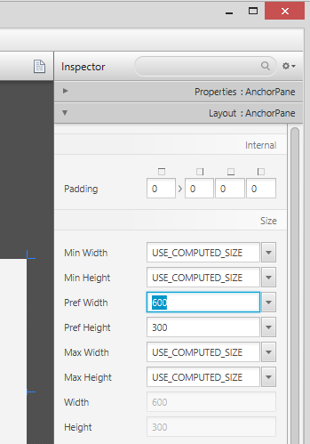
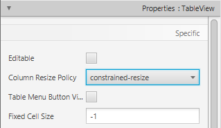
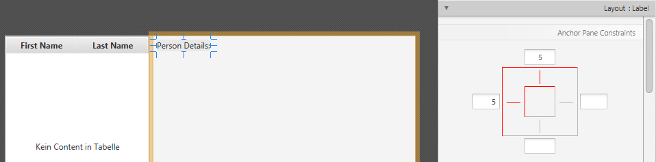

+++
title = "Parte 1: Scene Builder"
date = 2014-09-10
updated = 2014-11-06
description = "Este tutorial de sete partes aborda os processos de design, programação e immplantação de uma aplicação de cadastro de endereços feita com JavaFX."
image = "addressapp-part1.png"
prettify = true
comments = true 
commentsIdentifier = "/library/javafx-8-tutorial/pt/part1/"
aliases = [ 
  "/library/javafx-8-tutorial/pt/part1/"
]
weight = 1

[[sidebars]]
header = "Download de Códigos Fonte"
[[sidebars.items]]
text = "<i class=\"fa fa-fw fa-download\"></i> Parte 1 como um projeto Eclipse <em>(versão mínima requirida: JDK 8u40)</em>"
link = "https://github.com/marcojakob/tutorial-javafx-8/releases/download/v1.1/addressapp-jfx8u40-part-1.zip"
+++

### Tópicos na Parte 1

* Conhecendo o JavaFX
* Criando e inicializando um projeto JavaFX
* Utilizando o Scene Builder para modelar a interce com o usuário
* Estrutura básica da aplicação utilizando o padrão Model-View-Controller (MVC)

*****

### Pré-requisitos

* Ultima versão [Java JDK 8](http://www.oracle.com/technetwork/java/javase/downloads/index.html) (Que inclua o **JavaFX 8**).
* Eclipse 4.3ou posterior  com o plugin  e(fx)clipse . A modo mais fácil é efetuar o download da distro pré-configurada da fonte: [e(fx)clipse website](http://efxclipse.bestsolution.at/install.html#all-in-one). Como alternativa você pode usar o: [update site](http://www.eclipse.org/efxclipse/install.html) para sua insalação do Eclipse.
* [Scene Builder 2.0](http://www.oracle.com/technetwork/java/javase/downloads/javafxscenebuilder-info-2157684.html) ou posterior.

### Configurações do Eclipse

Nós precisamos configurar o Eclipse para usar o JDK 8, bem como onde ele ira encontrar o Scene Builder:

1. Abra a aba Preferences do Eclipse  e navegue até *Java | Installed JREs*.

2. Clique em *Add...*, selecione  *Standard VM* e a informe a *Pasta* onde se encontra o JDK 8.

3. Remova os outros JREs ou JDKs então o  **JDK 8 torna-se o padrão**.   

4. Navegue até *Java | Compiler*. Altere o **Compiler compliance level para 1.8**.   

5. Naviegue até preferences na aba *JavaFX* . Especifique o caminho até o executável do Scene Builder.   

### Links Úteis

Você pode querer colocar os links seguintes nos favoritos (em inglês):

* [Java 8 API](http://docs.oracle.com/javase/8/docs/api/) - JavaDoc para classes Java padrão
* [JavaFX 8 API](http://docs.oracle.com/javase/8/javafx/api/) - JavaDoc para classes JavaFX
* [ControlsFX API](https://controlsfx.bitbucket.io/) - JavaDoc para o [Projeto ControlsFX](http://fxexperience.com/controlsfx/) para controles JavaFX adicionais
* [Oracle's JavaFX Tutorials](http://docs.oracle.com/javase/8/javafx/get-started-tutorial/get_start_apps.htm) - Tutoriais Oficiais JavaFX da Oracle

Agora vamos começar!

*****

## Criar um novo Projeto JavaFX

No Eclipse (com o plugin e(fx)clipse instalado) vá em *File | New | Other...* e escolha *JavaFX Project*.   
Especifique o nome do projeto (ex.: *AddressApp*) e clique em *Finish*.

Remova o pacote o conteúdo da *aplicação* se foi gerado automaticamente.

### Criar os Pacotes

Bem no começo, nós seguiremos os Design Patterns (Padrões de Design) para desenvolvermos um bom software. Uma boa prática muito importante é usar o Design Pattern [**Model-View-Controller** (MVC)](http://en.wikipedia.org/wiki/Model_View_Controller). De acordo com este Pattern (Padrão) nós dividimos nosso  código em 3 unidades e criamos um pacote para cada (Clique com botão direito na pasta src, *New... | Package*):

* `ch.makery.address` - contém a *maioria* das classes controller(regras de negócio)
* `ch.makery.address.model` - contém classes de modelo
* `ch.makery.address.view` - contém views

**Nota:** Nosso pacote view também terá alguns controladores que estão diretamente ligados a uma única view. Vamos chamá-los de **view-controllers**.

*****

## Criar o Arquivo de Layout FXML

Existem duas maneiras de criar a interface de usuário. Usando um arquivo XML ou programando tudo em Java. Pesquisando na internet você encontrará ambas formas. Nós usaremos XML (terminando em .fxml) para a maioria das partes. Eu acho que esta é uma maneira mais clara de manter o controller e a view separados entre si. Além disso, nós podemos usar o editor gráfico Scene Builder para editar nosso XML. Isso significa que nós não temos que trabalhar diretamente com XML.

Clique com o botão direito no pacote view e crie um novo *FXML Document* chamado `PersonOverview`.

*****

## Design com Scene Builder

  <strong>Note:</strong> Se você não poder obtê-lo para trabalhar, baixe o código fonte desta parte do tutorial e use o arquivo FXML pronto.

Clique com o botão direito em `PersonOverview.fxml` e escolha *Open with Scene Builder*. Agora você deve ver o Scene Builder com apenas um *AnchorPane* (visível na Hierarquia (Hierarchy) a esquerda).

1. Selecione o *Anchor Pane* na sua Hierarchy e ajuste o tamanho em Layout (lado direito):   

2. Adicione um *Split Pane (Horizontal Flow)* arrastando ele da Biblioteca (Library) até a área principal. Clique com o botão direito no *Split Pane* na parte *Hierarchy* e selecione *Fit to Parent*.   

3.  Arraste uma *TableView* (em *Controls*) para dentro do lado esquerdo do *SplitPane*. Selecione a TableView (não uma Column) e defina a seguinte restrição de layout (layout constraints) à TableView. Dentro de um *AnchorPane* você pode sempre definir âncoras (anchors) para as quatro bordas ([mais informação sobre Layouts (em inglês)](http://docs.oracle.com/javase/8/javafx/layout-tutorial/builtin_layouts.htm)).   

4. Vá ao menu *Preview | Show Preview in Window* para ver, se ele se comporta coretamente. Tente redimensionar a janela. A TableView deve redimensionar junto com a janela como ela foi ancorada às bordas.

5. Mude o texto da coluna (em Properties) para "First Name" e "Last Name".   

6. Selecione a *TableView*, escolha *constrained-resize* para a *Column Resize Policy* (em Properties). Isso certifica que a coluna sempre toma todo o espaço disponível.  

7. Adicione uma *Label* no lado direito com o texto "Person Details" (dica: use  a pesquisa para encontrar a *Label*). Ajuste seu layout usando anchors.   

8. Adicione um *GridPane* no lado direito, selecione-o e ajuste seu layout usando âncoras (top, right and left).

9. Adicione as seguintes Labels às celulas.   
*Nota: Para adicionar uma linha ao GridPane selecione um número de linha existente(ficará amarelo), clique com o botão direito em um número de linha e escolha "Add Row".*   

10. Adicione três botões na parte de baixo. Dica: Selecione todos eles, clique com o botão direito e clique em  *Wrap In > HBox*. Este agrupa os botões juntos. Você pode precisar de especificar a *spacing (espaçamento)* dentro do HBox. Então, definir as âncoras (direita e em baixo) então eles ficam no lugar certo.

11. Agora você deve ver algo como o seguinte. Use o menu *Preview* para testar o comportamento do redimensionamento.   

*****

## Criar a Aplicação Principal

Nós precisamos de outro FXML para nosso layout base que conterá uma barra de menu e envolve a `PersonOverview.fxml` criada.

1. Crie outro *FXML Document* dentro do pacote view chamado `RootLayout.fxml`. Desta vez, escolha *BorderPane* como o elemento base (root element).   

2. Abra o `RootLayout.fxml` no Scene Builder.

3. Redimensione o *BorderPane* com *Pref Width* definida em 600 e *Pref Height* definida em 400.   

4. Adicione uma *MenuBar* no slot TOP. Nós não implementaremos a funcionalidade do menu agora.   

### A Classe Principal JavaFX

Agora, nós precisamos criar a **main java class (classe principal java)** que inicia nossa aplicação com o `RootLayout.fxml` e adiciona o `PersonOverview.fxml` no centro. 

1. Clique com o botão direito em nosso projeto e escola *New | Other...* e escolha *JavaFX Main Class*.   

2. Nós chamaremos a classe de `MainApp` e colocaremos no pacote de controller `ch.makery.address` (nota: este é o pacote pai dos subpacotes `view` e `model`).   

A classe `MainApp.java` gerada estende de `Application` e contém dois métodos. Esta é a estrutura básica que nós precisamos para iniciar uma aplicação JavaFX. A parte mais importante para nós é o método `start(Stage primaryStage)`. Ele é chamado automaticamente quando a aplicação quando a aplicação é `launched` (lançada) do método `main`.

Como você vê, o método `start(...)` recebe um `Stage` como parâmetro. O gráfico seguinte ilustra a estrutura de cada aplicação JavaFX:

   
*Image Source: http://www.oracle.com*

**É como uma peça de teatro**: O `Stage` (palco) é o container principal que é geralmente uma `Window` (janela) com uma borda e os botões típicos minimizar, maximizar e fechar. Dentro do `Stage` (palco) você adiciona uma `Scene` (cena) que pode, é claro, ser trocada por outra `Scene` (cena). Dentro da `Scene` (cena) os nodos do JavaFX como `AnchorPane`, `TextBox`, etc. são adicionados.

Para mais informações sobre como [Trabalhando com JavaFX Scene Graph (inglês)](http://docs.oracle.com/javase/8/javafx/scene-graph-tutorial/scenegraph.htm).

*****

Abra `MainApp.java` e troque o código com o seguinte:

<pre class="prettyprint lang-java">
package ch.makery.address;

import java.io.IOException;

import javafx.application.Application;
import javafx.fxml.FXMLLoader;
import javafx.scene.Scene;
import javafx.scene.layout.AnchorPane;
import javafx.scene.layout.BorderPane;
import javafx.stage.Stage;

public class MainApp extends Application {

    private Stage primaryStage;
    private BorderPane rootLayout;

    @Override
    public void start(Stage primaryStage) {
        this.primaryStage = primaryStage;
        this.primaryStage.setTitle("AddressApp");

        initRootLayout();

        showPersonOverview();
    }
    
    /**
     * Inicializa o root layout (layout base).
     */
    public void initRootLayout() {
        try {
            // Carrega o root layout do arquivo fxml.
            FXMLLoader loader = new FXMLLoader();
            loader.setLocation(MainApp.class.getResource("view/RootLayout.fxml"));
            rootLayout = (BorderPane) loader.load();
            
            // Mostra a scene (cena) contendo o root layout.
            Scene scene = new Scene(rootLayout);
            primaryStage.setScene(scene);
            primaryStage.show();
        } catch (IOException e) {
            e.printStackTrace();
        }
    }

    /**
     * Mostra o person overview dentro do root layout.
     */
    public void showPersonOverview() {
        try {
            // Carrega o person overview.
            FXMLLoader loader = new FXMLLoader();
            loader.setLocation(MainApp.class.getResource("view/PersonOverview.fxml"));
            AnchorPane personOverview = (AnchorPane) loader.load();
            
            // Define o person overview dentro do root layout.
            rootLayout.setCenter(personOverview);
        } catch (IOException e) {
            e.printStackTrace();
        }
    }
    
	/**
	 * Retorna o palco principal.
	 * @return
	 */
	public Stage getPrimaryStage() {
		return primaryStage;
	}

    public static void main(String[] args) {
        launch(args);
    }
}
</pre>

Os vários comentários devem te dar uma idéia do que está acontecendo.

Se você rodar a sua aplicação agora, você deve ver algo como o screenshot no começo deste post.

### Problemas Frequentes

Se o JavaFX não puder encontrar o arquivo `fxml` que você especificou, você deve ver a seguinte mensagem de erro:

`java.lang.IllegalStateException: Location is not set.`

Para resolver isso, verifique novamente se você escreveu o nome dos seus arquivos `fxml` corretamente!

  Se isso ainda não funcionar, baixe o código fonte desta parte do tutorial e tente com o arquivo fxml incluso.

*****

### O Que Vem Depois?

No [Tutorial Parte 2](/pt/library/javafx-tutorial/part2/)  nós adicionaremos algumas funcionalidades de dados à nossa AddressApp.

##### Alguns outros artigos que você deve achar interessante (inglês)

* [JavaFX Dialogs](/blog/javafx-8-dialogs/)
* [JavaFX Date Picker](/blog/javafx-8-date-picker/)
* [JavaFX Exemplo de Manipulação de Eventos](/blog/javafx-8-event-handling-examples/)
* [JavaFX Ordenamento e Filtragem de TableView](/blog/javafx-8-tableview-sorting-filtering/)
* [JavaFX Renderizador de Células da TableView](/blog/javafx-8-tableview-cell-renderer/)
