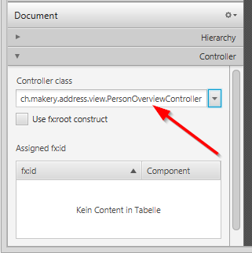

+++
title = "Bagian 2: Model dan TableView"
date = 2014-04-23
updated = 2015-03-12
description = "Gunakan TableView JavaFXUse untuk menampilkan ObservableList dari Persons."
image = "addressapp-part2.png"
prettify = true
comments = true 
commentsIdentifier = "/library/javafx-8-tutorial/id/part2/"
aliases = [ 
  "/library/javafx-8-tutorial/id/part2/"
]
weight = 2

[[sidebars]]
header = "Unduh kode sumber"
[[sidebars.items]]
text = "<i class=\"fa fa-fw fa-download\"></i> Bagian 2 - Proyek dari Eclise <em>(Diperlukan setidaknya JDK 8u40)</em>"
link = "https://github.com/marcojakob/tutorial-javafx-8/releases/download/v1.1/addressapp-jfx8u40-part-2.zip"
+++

## Pembahasan di bagian 2

* Membuat kelas **model**
* Menggunakan kelas model didalam **ObservableList**
* Menampilkan data di **TableView** menggunakan **Controllers**

*****

## Membuat kelas model

Kita perlu membuat sebuah kelas model untuk menampung informasi mengenai orang di buku alamat kita. Tambah sebuah kelas ke paket model  (`ch.makery.address.model`) bernama `Person`. Kelas `Person` akan mempunyai beberapa variable instansi untuk name, address, dan birthday. Tambah kode berikut ke kelas.

##### Person.java

<pre class="prettyprint lang-java">
package ch.makery.address.model;

import java.time.LocalDate;

import javafx.beans.property.IntegerProperty;
import javafx.beans.property.ObjectProperty;
import javafx.beans.property.SimpleIntegerProperty;
import javafx.beans.property.SimpleObjectProperty;
import javafx.beans.property.SimpleStringProperty;
import javafx.beans.property.StringProperty;

/**
 * Model class for a Person.
 *
 * @author Marco Jakob
 */
public class Person {

	private final StringProperty firstName;
	private final StringProperty lastName;
	private final StringProperty street;
	private final IntegerProperty postalCode;
	private final StringProperty city;
	private final ObjectProperty&lt;LocalDate&gt; birthday;

	/**
	 * Default constructor.
	 */
	public Person() {
		this(null, null);
	}
	
	/**
	 * Constructor with some initial data.
	 * 
	 * @param firstName
	 * @param lastName
	 */
	public Person(String firstName, String lastName) {
		this.firstName = new SimpleStringProperty(firstName);
		this.lastName = new SimpleStringProperty(lastName);
		
		// Some initial dummy data, just for convenient testing.
		this.street = new SimpleStringProperty("some street");
		this.postalCode = new SimpleIntegerProperty(1234);
		this.city = new SimpleStringProperty("some city");
		this.birthday = new SimpleObjectProperty&lt;LocalDate&gt;(LocalDate.of(1999, 2, 21));
	}
	
	public String getFirstName() {
		return firstName.get();
	}

	public void setFirstName(String firstName) {
		this.firstName.set(firstName);
	}
	
	public StringProperty firstNameProperty() {
		return firstName;
	}

	public String getLastName() {
		return lastName.get();
	}

	public void setLastName(String lastName) {
		this.lastName.set(lastName);
	}
	
	public StringProperty lastNameProperty() {
		return lastName;
	}

	public String getStreet() {
		return street.get();
	}

	public void setStreet(String street) {
		this.street.set(street);
	}
	
	public StringProperty streetProperty() {
		return street;
	}

	public int getPostalCode() {
		return postalCode.get();
	}

	public void setPostalCode(int postalCode) {
		this.postalCode.set(postalCode);
	}
	
	public IntegerProperty postalCodeProperty() {
		return postalCode;
	}

	public String getCity() {
		return city.get();
	}

	public void setCity(String city) {
		this.city.set(city);
	}
	
	public StringProperty cityProperty() {
		return city;
	}

	public LocalDate getBirthday() {
		return birthday.get();
	}

	public void setBirthday(LocalDate birthday) {
		this.birthday.set(birthday);
	}
	
	public ObjectProperty&lt;LocalDate&gt; birthdayProperty() {
		return birthday;
	}
}
</pre>

### Penjelasan

* Dengan JavaFX sangat lazim untuk menggunakan [`Properties`](http://docs.oracle.com/javase/8/javafx/api/javafx/beans/property/Property.html) untuk semua bidang kelas model. Sebuah `Property` memungkinkan kita, sebagai contoh, otomatis di beritau ketika`lastName` atau variabel lainnya berubah. Ini membantu untuk menjaga tampilan sinkron dengan data. Untuk mempelajari lebih lanjut mengenai `Properties` baca [Using JavaFX Properties and Binding](http://docs.oracle.com/javase/8/javafx/properties-binding-tutorial/binding.htm).
* [`LocalDate`](http://docs.oracle.com/javase/8/docs/api/java/time/LocalDate.html), tipe yang telah kita gunakan untuk `birthday`, adalah bagian dari [Date and Time API for JDK 8](http://docs.oracle.com/javase/tutorial/datetime/iso/).

*****

## Daftar dari Persons

Data utama yang dikelola aplikasi kta adalah orang. Mari buat daftar untuk object `Person` didalam kelas `MainApp`. Semua kelas kontrol akan dapat mengakses daftar utama didalam `MainApp`. 

### ObservableList

Kita berkerja dengan kelas tampilan JavaFx yang perlu di beritahukan tentang perubahan yang telah dibuat kepada daftar orang. Hal ini penting, jika tidak tampilan tidak akan sinkron dengan data. Untuk tujuan ini, JavaFX mengenalkan beberapa [Collection classes](http://docs.oracle.com/javase/8/javafx/collections-tutorial/collections.htm). 

Dari koleksi-koleksi tersebut, kita memerlukan `ObservableList`. Untuk membuat `ObservableList`baru, tambah kan kode berikut pada awal kelas `MainApp`. Kita juga akan menambah pembangun yang membuat beberapa contoh data dan metode pengambil umum (public, getter).

##### MainApp.java

<pre class="prettyprint lang-java">

    // ... AFTER THE OTHER VARIABLES ...

	/**
	 * The data as an observable list of Persons.
	 */
	private ObservableList&lt;Person&gt; personData = FXCollections.observableArrayList();

	/**
	 * Constructor
	 */
	public MainApp() {
		// Add some sample data
		personData.add(new Person("Hans", "Muster"));
		personData.add(new Person("Ruth", "Mueller"));
		personData.add(new Person("Heinz", "Kurz"));
		personData.add(new Person("Cornelia", "Meier"));
		personData.add(new Person("Werner", "Meyer"));
		personData.add(new Person("Lydia", "Kunz"));
		personData.add(new Person("Anna", "Best"));
		personData.add(new Person("Stefan", "Meier"));
		personData.add(new Person("Martin", "Mueller"));
	}
  
	/**
	 * Returns the data as an observable list of Persons. 
	 * @return
	 */
	public ObservableList&lt;Person&gt; getPersonData() {
		return personData;
	}
  
    // ... THE REST OF THE CLASS ...
</pre>

*****

## PersonOverviewController ##

Sekarang mari kita memberi data pada table. Kita perlu pengendali untuk `PersonOverview.fxml`.

1. Buat kelas didalam paket **view** bernama `PersonOverviewController.java`. (Kita harus menaruh dipaket yang sama `PersonOverview.fxml`,jika tidak Scene Builder tidak akan bisa menemukannya).
2. Kita akan menambah beberapa variable instansi yang memberikan akses ke pada table dan label didalam tampilan Bidang dan beberpa metode memiliki keterangan `@FXML` khusus. Hal ini diperlukan oleh berkas fxml  untuk dapat mengakses bidang pribadi dan metode pribadi. Setelah kita mengatur semuanya di berkas fxml, aplikasi akan secara otomatis mengisi variabel variabel ketika fxml telah dimuat. Jadi tambahkan kode berikut :

  

    Kita hanya menggunakan nilai <code>StringProperty</code> untuk tabel kolom didalam contoh ini. Ketika anda ingin menggunakan <code>IntegerProperty</code> atau <code>DoubleProperty</code>, <code>setCellValueFactory(...)</code> harus mempunyai tambahan <code>asObject()</code>:
  

  

  <pre>myIntegerColumn.setCellValueFactory(cellData -> 
      cellData.getValue().myIntegerProperty().<mark>asObject()</mark>);</pre>
  

  

    Ini sangat diperlukan karena keputusan desain buruk dari JavaFX (lihat <a href="https://community.oracle.com/thread/2575601">diskusi</a>).
  

##### PersonOverviewController.java

<pre class="prettyprint lang-java">
package ch.makery.address.view;

import javafx.fxml.FXML;
import javafx.scene.control.Label;
import javafx.scene.control.TableColumn;
import javafx.scene.control.TableView;
import ch.makery.address.MainApp;
import ch.makery.address.model.Person;

public class PersonOverviewController {
    @FXML
    private TableView&lt;Person&gt; personTable;
    @FXML
    private TableColumn&lt;Person, String&gt; firstNameColumn;
    @FXML
    private TableColumn&lt;Person, String&gt; lastNameColumn;

    @FXML
    private Label firstNameLabel;
    @FXML
    private Label lastNameLabel;
    @FXML
    private Label streetLabel;
    @FXML
    private Label postalCodeLabel;
    @FXML
    private Label cityLabel;
    @FXML
    private Label birthdayLabel;

    // Reference to the main application.
    private MainApp mainApp;

    /**
     * The constructor.
     * The constructor is called before the initialize() method.
     */
    public PersonOverviewController() {
    }

    /**
     * Initializes the controller class. This method is automatically called
     * after the fxml file has been loaded.
     */
    @FXML
    private void initialize() {
    	// Initialize the person table with the two columns.
        firstNameColumn.setCellValueFactory(cellData -> cellData.getValue().firstNameProperty());
        lastNameColumn.setCellValueFactory(cellData -> cellData.getValue().lastNameProperty());
    }

    /**
     * Is called by the main application to give a reference back to itself.
     * 
     * @param mainApp
     */
    public void setMainApp(MainApp mainApp) {
        this.mainApp = mainApp;

        // Add observable list data to the table
        personTable.setItems(mainApp.getPersonData());
    }
}
</pre>

Penjelasan:

* Semua bidang dan metode dimana berkas fxml perlu akses, harus dikasi keterangan `@FXML`. Sebenarnya hanya jika mereka bersifat  pribadi (private), tetapi akan lebih baik jika mereka bersifat pribadi (private) dan tanda mereka dengan keterangan.
* metode `initialize()` secara otomatis dipanggil setelah berkas fxml telah dimuat. Pada saat ini bidang-bidang FXML seharusnya sudah terinisialisasi.
* metoda `setCellValueFactory(...)` yang telah kita atur pada kolom tabel digunakan untuk menjelaskan bidang didalam objek `Person` yang digunakan sebagai kolom. Tanda panah -> menunjukan bahwa kita menggunakan fitur Java * yang dinamakan *Lambdas*. (Pilihan lain dengan menggunakan [PropertyValueFactory](http://docs.oracle.com/javase/8/javafx/api/), tetapi ini bukan tipe aman).

### Menghubungkan MainApp dengan PersonOverviewController

Metode `setMainApp(...)` harus dipanggil oleh kelas `MainApp`. Ini memberi kita cara untuk mengakses objek `MainApp` dan mendapat daftar dari `Persons` dan hal lainya. Ganti metode `showPersonOverview()` dengan :

##### MainApp.java - new showPersonOverview() method

<pre class="prettyprint lang-java">
/**
 * Shows the person overview inside the root layout.
 */
public void showPersonOverview() {
    try {
        // Load person overview.
        FXMLLoader loader = new FXMLLoader();
        loader.setLocation(MainApp.class.getResource("view/PersonOverview.fxml"));
        AnchorPane personOverview = (AnchorPane) loader.load();

        // Set person overview into the center of root layout.
        rootLayout.setCenter(personOverview);

        <mark> // Give the controller access to the main app.
        PersonOverviewController controller = loader.getController();
        controller.setMainApp(this);</mark>

    } catch (IOException e) {
        e.printStackTrace();
    }
}
</pre>

*****

## Kaitkan Tampilan Ke Pengendali

Kita hampir selesai, tapi satu hal terlewat, kita belum meberitahu `PersonOverview.fxml` kontroller mana yang digunakan dan elemen mana yang cocok dengan bidang didalam pengendali.

1. Buka `PersonOverview.fxml` dengan *SceneBuilder*.

2. Buka kelompok *Controller* pada sisi kiri dan pilih `PersonOverviewController` sebagai**controller class**.   

3. Pilih `TableView` di kelompok *Hierarchy* dan pilih *Code*, kelompokan bidang `personTable` sebagai **fx:id**.   

4.Lakukan hal yang sama untuk kolom-kolom dan pilih `firstNameColumn` dan `lastNameColumn` sebagai masing-masing **fx:id**.

5. Untuk tiap label **each label** di kolom kedua, pilih **fx:id** yang sesuai.   

6.  Penting: Pada Eclipse  **segarkan (F5) keseluruhan proyek AddressApp**. Ini diperlukan karena Eclipse terkadang tidak mengetahuiu adanya perubahan yang dibuat oleh Scene Builder.

*****

## Memulai Aplikasi

Ketika kamu memulai aplikasi saat ini, kamu seharusnya melihat tampilan tepat seperti hasil tangkapan layar di awal artikel ini.   

Selamat!

### Berikutnya?

Di [Tutorial bagian 3](/id/library/javafx-tutorial/part3/) kita akan menambah lebih banyak fungsi seperti penambahan, menghapus, memperbaharui Persons.

##### Beberapa artikel menarik lainnya

* [JavaFX Dialogs (official)](/blog/javafx-dialogs-official/)
* [JavaFX Date Picker](/blog/javafx-8-date-picker/)
* [JavaFX Event Handling Examples](/blog/javafx-8-event-handling-examples/)
* [JavaFX TableView Sorting and Filtering](/blog/javafx-8-tableview-sorting-filtering/)
* [JavaFX TableView Cell Renderer](/blog/javafx-8-tableview-cell-renderer/)
