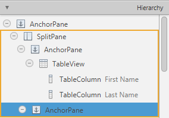
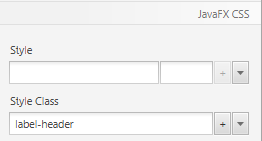
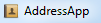

+++
title = "Parte 4: Estilos usando CSS"
date = 2014-09-10
updated = 2014-11-10
description = "No JavaFX você pode estilizar sua interface de usuário usando CSS. Nós também adicionaremos um ícone de aplicação nesta parte do tutorial."
image = "addressapp-part4.png"
prettify = true
# comments = true 
commentsIdentifier = "/library/javafx-8-tutorial/pt/part4/"
aliases = [ 
  "/library/javafx-8-tutorial/pt/part4/"
]
weight = 4

[[sidebars]]
header = "Download de Códigos Fonte"
[[sidebars.items]]
text = "<i class=\"fa fa-fw fa-download\"></i> Parte 4 como um projeto Eclipse <em>(versão mínima requirida: JDK 8u40)</em>"
link = "https://github.com/marcojakob/tutorial-javafx-8/releases/download/v1.1/addressapp-jfx8u40-part-4.zip"
+++

## Tópicos na Parte 4

* **Estilização CSS**
* Adicionando um **ìcone de Aplicação**

*****

## Estilização CSS 

No JavaFX você pode estilizar sua interface de usuário usando Cascading Style Sheets (CSS). Isso é ótimo! Nunca foi tão fácil customizar a aparência de uma aplicação Java.

Neste tutorial nós criaremos um *DarkTheme* inspirado pelo design Windows 8 Metro. O css para os botões é baseado no post do blog (em inglês) [JMetro - Windows 8 Metro controls on Java](http://pixelduke.wordpress.com/2012/10/23/jmetro-windows-8-controls-on-java/) por Pedro Duque Vieira.

### Familiarizando-se com CSS

Se você quer estilziar sua aplicação JavaFX você deve ter um endetendimento básico de CSS em geral. Um bom lugar para começar é este (em inglês) [CSS tutorial](http://www.csstutorial.net/).

Para mais informações sobre CSS específico para JavaFX (em inglês):

* [Skinning JavaFX Applications with CSS](http://docs.oracle.com/javase/8/javafx/user-interface-tutorial/css_tutorial.htm) - Tutorial by Oracle
* [JavaFX CSS Reference](http://docs.oracle.com/javase/8/javafx/api/javafx/scene/doc-files/cssref.html) - Official Reference

### CSS Padrão do JavaFX

A fonte padrão de estilos CSS no JavaFX 8 é um arquivo chamado **`modena.css`**. Este arquivo css pode ser encontrado no arquivo jar do JavaFX `jfxrt.jar` localizado na sua pasta Java em `/jdk1.8.x/jre/lib/ext/jfxrt.jar`.

Descompacte o `jfxrt.jar`. Você deve encontrar o `modena.css` em `com/sun/javafx/scene/control/skin/modena/`

Este padrão de folha de estilo é sempre aplicado a uma aplicação JavaFX. Adicionando uma folha de estilho customizada nós podemos sobrescrever os estilos padrões do `modena.css`.   

<strong>Dica:</strong> Ajuda olhar o arquivo CSS padrão para ver quais estilos você deve sobrepor.

### Anexando Folhas de Estilo CSS

Adicione o arquivo CSS seguinte chamado `DarkTheme.css` ao pacote *view*.

##### DarkTheme.css

<pre class="prettyprint lang-css pre-scrollable">
.background {
    -fx-background-color: #1d1d1d;
}

.label {
    -fx-font-size: 11pt;
    -fx-font-family: "Segoe UI Semibold";
    -fx-text-fill: white;
    -fx-opacity: 0.6;
}

.label-bright {
    -fx-font-size: 11pt;
    -fx-font-family: "Segoe UI Semibold";
    -fx-text-fill: white;
    -fx-opacity: 1;
}

.label-header {
    -fx-font-size: 32pt;
    -fx-font-family: "Segoe UI Light";
    -fx-text-fill: white;
    -fx-opacity: 1;
}

.table-view {
    -fx-base: #1d1d1d;
    -fx-control-inner-background: #1d1d1d;
    -fx-background-color: #1d1d1d;
    -fx-table-cell-border-color: transparent;
    -fx-table-header-border-color: transparent;
    -fx-padding: 5;
}

.table-view .column-header-background {
    -fx-background-color: transparent;
}

.table-view .column-header, .table-view .filler {
    -fx-size: 35;
    -fx-border-width: 0 0 1 0;
    -fx-background-color: transparent;
    -fx-border-color: 
        transparent
        transparent
        derive(-fx-base, 80%) 
        transparent;
    -fx-border-insets: 0 10 1 0;
}

.table-view .column-header .label {
    -fx-font-size: 20pt;
    -fx-font-family: "Segoe UI Light";
    -fx-text-fill: white;
    -fx-alignment: center-left;
    -fx-opacity: 1;
}

.table-view:focused .table-row-cell:filled:focused:selected {
    -fx-background-color: -fx-focus-color;
}

.split-pane:horizontal > .split-pane-divider {
    -fx-border-color: transparent #1d1d1d transparent #1d1d1d;
    -fx-background-color: transparent, derive(#1d1d1d,20%);
}

.split-pane {
    -fx-padding: 1 0 0 0;
}

.menu-bar {
    -fx-background-color: derive(#1d1d1d,20%);
}

.context-menu {
    -fx-background-color: derive(#1d1d1d,50%);
}

.menu-bar .label {
    -fx-font-size: 14pt;
    -fx-font-family: "Segoe UI Light";
    -fx-text-fill: white;
    -fx-opacity: 0.9;
}

.menu .left-container {
	-fx-background-color: black;
}

.text-field {
    -fx-font-size: 12pt;
    -fx-font-family: "Segoe UI Semibold";
}

/* 
 * Metro style Push Button
 * Author: Pedro Duque Vieira
 * http://pixelduke.wordpress.com/2012/10/23/jmetro-windows-8-controls-on-java/
 */
.button {
    -fx-padding: 5 22 5 22;   
    -fx-border-color: #e2e2e2;
    -fx-border-width: 2;
    -fx-background-radius: 0;
    -fx-background-color: #1d1d1d;
    -fx-font-family: "Segoe UI", Helvetica, Arial, sans-serif;
    -fx-font-size: 11pt;
    -fx-text-fill: #d8d8d8;
    -fx-background-insets: 0 0 0 0, 0, 1, 2;
}

.button:hover {
    -fx-background-color: #3a3a3a;
}

.button:pressed, .button:default:hover:pressed {
  -fx-background-color: white;
  -fx-text-fill: #1d1d1d;
}

.button:focused {
    -fx-border-color: white, white;
    -fx-border-width: 1, 1;
    -fx-border-style: solid, segments(1, 1);
    -fx-border-radius: 0, 0;
    -fx-border-insets: 1 1 1 1, 0;
}

.button:disabled, .button:default:disabled {
    -fx-opacity: 0.4;
    -fx-background-color: #1d1d1d;
    -fx-text-fill: white;
}

.button:default {
    -fx-background-color: -fx-focus-color;
    -fx-text-fill: #ffffff;
}

.button:default:hover {
    -fx-background-color: derive(-fx-focus-color,30%);
}
</pre>

Agora, nós precisamos anexar o CSS à nossa Cena (Scene). Nós poderíamos fazer isso via programação em codigo Java, más nós usaremos o Scene Builder para adicioná-lo aos nossos arquivos fxml: 

#### Anexar o CSS ao RootLayout.fxml

1. Abra o arquivo `RootLayout.fxml` no Scene Builder. 

2. Selecione o `BorderPane` principal na na view Hierarchy. No grupo *Properties* adicione o arquivo `DarkTheme.css` como stylesheet (folha de estilo).   

#### Anexar o CSS ao PersonEditDialog.fxml

1. Abra o arquivo `PersonEditDialog.fxml` no Scene Builder. Selecione o `AnchorPane` principal e escolha `DarkTheme.css` no grupo *Properties* como stylesheet (folha de estilo).

2. O fundo ainda está branco, então adicione a Style Class (classe de estilo) `background` ao `AnchorPane` principal.   

3. Selecione o botão OK e escolha *Default Button* na View Properties. Isso vai mudar sua cor e fazer o botão padrão quando a tecla *enter* for pressionada pelo usuário.

#### Anexar o CSS ao PersonOverview.fxml

1. Abra o arquivo `PersonOverview.fxml` no Scene Builder. Selecione o `AnchorPane` principal no grupo *Hierarchy*. Em  properties adicione o arquivo `DarkTheme.css` como stylesheet (folha de estilo).

2. Você já deve ver as mudanças agora: A abela es os botões estão pretos. Todas as classes de estilos `.table-view` e `.button` do `modena.css` aplicam-se à tabela e aos botões. Desde que nós redefinimos (e assim sobreescrevemos) alguns daqueles estilos em nosso CSS customizado, os novos estilos são aplicados automaticamente.

3. Você deve precisar ajustar o tamanho dos botões em todo o texto é exibido.

4. Selecione o `AnchorPane` da direita que está dentro do `SplitPane`.   
   

5. Vá ao grupo *Properties* e selecione `background` como style class (classe de estilo). O fundo deve ficar preto agora.   

#### Labels com Estilos Diferentes

Agora, todas as labels no lado direito tem o mesmo tamanho. Já existem alguns estilos definidos no arquivo css chamados `.label-header` e `.label-bright` que nós usaremos para estilizar mais as labels.

1. Selecione a label *Person Details* e adicione `label-header` como uma Style Class (classe de estilo).   

2. Para cada label na coluna da direita (onde os detalhes da pessoa atual são mostrados), adicione a Style Class (classe de estilo) css `label-bright`.   

*****

## Adicionando um Ícone de Aplicação

Agora sua aplicação tem um ícone padrão na barra de título e barra de tarefas:

PArece muito mais legar com um ícone customizado:

### O Arquivo de Ícone

Um possível lugar para obter ícones grátis é (em inglês) [Icon Finder](http://www.iconfinder.com). Eu baixei um pequeno [address book icon](http://www.iconfinder.com/icondetails/86957/32/).

Crie uma pasta (normal) dentro do seu projeto AddressApp chamado **resources** e uma subpasta chamada **images** nela. Coloque o ícone de sua escolha dentro da pasta images. Sua estrutura de pastas deve estar assim agora:

### Definir o Ícone na Scene (Cena)

Para definir o ícone para nossa scene (cena) adicione o código seguinte ao método `start(...)` na `MainApp.java`

##### MainApp.java

<pre class="prettyprint lang-java">
this.primaryStage.getIcons().add(new Image("file:resources/images/address_book_32.png"));
</pre>

O método `start(...)` inteiro deve estar assim agora:

<pre class="prettyprint lang-java">
public void start(Stage primaryStage) {
    this.primaryStage = primaryStage;
    this.primaryStage.setTitle("AddressApp");

    // Set the application icon.
    this.primaryStage.getIcons().add(new Image("file:resources/images/address_book_32.png"));

    initRootLayout();

    showPersonOverview();
}
</pre>

Você pode também adicionar um ícone ao stage (palco) da janela de edição de pessoa, é claro.

### O Que Vem Depois?

No [Tutorial Parte 5](/pt/library/javafx-tutorial/part5/) nós adicionaremos armazenamento XML para nossos dados.

##### Alguns outros artigos que você deve achar interessante (em inglês)

* [JavaFX Dialogs](/blog/javafx-8-dialogs/)
* [JavaFX Date Picker](/blog/javafx-8-date-picker/)
* [JavaFX Exemplos de Manipulação de Eventos](/blog/javafx-8-event-handling-examples/)
* [JavaFX Filtrar e Ordenar TableView](/blog/javafx-8-tableview-sorting-filtering/)
* [JavaFX Renderizador de Células TableView](/blog/javafx-8-tableview-cell-renderer/)
