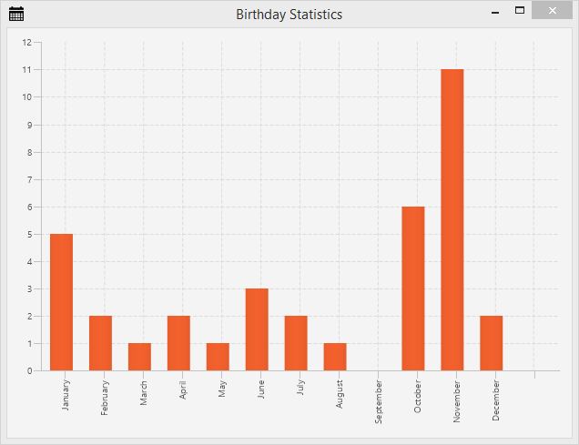

+++
title = "Частина 6: Статистична діаграма"
date = 2014-05-09
updated = 2015-06-25
description = "Вчимося створювати стовпчикову діаграму в JavaFX"
image = "addressapp-part6.png"
prettify = true
comments = true 
commentsIdentifier = "/library/javafx-8-tutorial/uk/part6/"
aliases = [ 
  "/library/javafx-8-tutorial/uk/part6/"
]
weight = 6

[[sidebars]]
header = "Скачати вихідний код"
[[sidebars.items]]
text = "<i class=\"fa fa-fw fa-download\"></i> Частина 6 як проект Eclipse <em>(Необхідно хоча б JDK 8u40)</em>"
link = "https://github.com/marcojakob/tutorial-javafx-8/releases/download/v1.1/addressapp-jfx8u40-part-6.zip"
+++

## Частина 6: Зміст

* Створення статистичної діаграми для відображення розподілу днів народжень.

*****

## Статистика днів народжень

Усі записи в нашому додатку мають значення дня народження. Було б непогано мати деяку статистику про те, коли наші люди святкують свої дні народження.

Ми будемо використовувати **стовпчикову діаграму**, яка містить стовпець для кожного місяця. Кожен із стовпців буде показувати скільки людей мають свій день народження в конкретному місяці.

## FXML-представлення статистики

1. Почнемо зі створення файлу `BirthdayStatistics.fxml` всередині пакету `ch.makery.address.view` *(правий клік на пакеті | New | other... | New FXML Document)*.  

2. Відкрийте файл `BirthdayStatistics.fxml` в додатку Scene Builder.

3. Виберіть кореневий компонент `AnchorPane`. У вкладці *Layout* встановіть значення *Pref Width* на 620, а *Pref Height* на 450.

4. Додайте компонент `BarChart` в наш кореневий `AnchorPane`.

5. Клацніть правою кнопкою мишки на доданому `BarChart` і виберіть *Fit to Parent*.

6. Збережіть fxml файл, перейдіть в Eclipse і оновіть проект.

Перед тим, як повернуться в додаток Scene Builder, давайте створимо контролер і зв'яжемо між собою все в класі `MainApp`.

## Клас-контролер статистики

В пакеті `ch.makery.address.view` створіть клас `BirthdayStatisticsController.java`.

Перед тим, як я почну пояснювати, що до чого, погляньте на вміст цього класу:

##### BirthdayStatisticsController.java

<pre class="prettyprint lang-java">
package ch.makery.address.view;

import java.text.DateFormatSymbols;
import java.util.Arrays;
import java.util.List;
import java.util.Locale;

import javafx.collections.FXCollections;
import javafx.collections.ObservableList;
import javafx.fxml.FXML;
import javafx.scene.chart.BarChart;
import javafx.scene.chart.CategoryAxis;
import javafx.scene.chart.XYChart;
import ch.makery.address.model.Person;

/**
 * The controller for the birthday statistics view.
 * 
 * @author Marco Jakob
 */
public class BirthdayStatisticsController {

    @FXML
    private BarChart&lt;String, Integer> barChart;

    @FXML
    private CategoryAxis xAxis;

    private ObservableList&lt;String> monthNames = FXCollections.observableArrayList();

    /**
     * Initializes the controller class. This method is automatically called
     * after the fxml file has been loaded.
     */
    @FXML
    private void initialize() {
        // Get an array with the English month names.
        String[] months = DateFormatSymbols.getInstance(Locale.ENGLISH).getMonths();
        // Convert it to a list and add it to our ObservableList of months.
        monthNames.addAll(Arrays.asList(months));
        
        // Assign the month names as categories for the horizontal axis.
        xAxis.setCategories(monthNames);
    }

    /**
     * Sets the persons to show the statistics for.
     * 
     * @param persons
     */
    public void setPersonData(List&lt;Person> persons) {
    	// Count the number of people having their birthday in a specific month.
        int[] monthCounter = new int[12];
        for (Person p : persons) {
            int month = p.getBirthday().getMonthValue() - 1;
            monthCounter[month]++;
        }

        XYChart.Series&lt;String, Integer> series = new XYChart.Series&lt;>();
        
        // Create a XYChart.Data object for each month. Add it to the series.
        for (int i = 0; i &lt; monthCounter.length; i++) {
        	series.getData().add(new XYChart.Data&lt;>(monthNames.get(i), monthCounter[i]));
        }
        
        barChart.getData().add(series);
    }
}
</pre>

#### Як працює цей контролер

1. Контролеру необхідний доступ до двох елементів з нашого fxml файлу:
    * Поле `barChart` має типи даних `String` та `Integer`. Тип даних `String` використовується для відображення місяців на осі X, а тип даних `Integer` - для відображення кількості записів у конкретному місяці.
    * Вісь `xAxis` ми використовуємо для додавання назв місяців.

2. Метод `initialize()` заповнює вісь X строковими значеннями назв всіх місяців.

3. Метод `setPersonData(...)` буде доступний з класу `MainApp` для передачі даних записів. Він проходиться по всіх записах та підраховує кількість днів народжень в кожному місяці. Потім він додає `XYChart.Data` для кожного місяця в серію даних `XYChart.Series`. Кожен об'єкт `XYChart.Data` представлятиме один стовпець на діаграмі.

*****

## Поєднуємо представлення та контролер

1. Відкрийте файл `BirthdayStatistics.fxml` в додатку Scene Builder.

2. На вкладці *Controller* встановіть в якості контролера `BirthdayStatisticsController`.

3. Виберіть компонент `BarChart` та встановіть значення `barChart` у властивості *fx:id* (на вкладці **Code**).

4. Виберіть `CategoryAxis` та встановіть значення `xAxis` у властивості *fx:id*.

5. Для майбутньої стилізації, у вкладці *Properties*, ви можете додати назву вашої діаграми.

*****

## З'єднуємо клас-контролер з основним класом MainApp

Для відображення вікна діаграми ми будемо використовувати той же механізм, що ми використовували для відображення вікна редагування запису, а саме - діалогове вікно користувача.

Додайте наступний метод в клас `MainApp`:

<pre class="prettyprint lang-java">
/**
 * Opens a dialog to show birthday statistics.
 */
public void showBirthdayStatistics() {
    try {
        // Load the fxml file and create a new stage for the popup.
        FXMLLoader loader = new FXMLLoader();
        loader.setLocation(MainApp.class.getResource("view/BirthdayStatistics.fxml"));
        AnchorPane page = (AnchorPane) loader.load();
        Stage dialogStage = new Stage();
        dialogStage.setTitle("Birthday Statistics");
        dialogStage.initModality(Modality.WINDOW_MODAL);
        dialogStage.initOwner(primaryStage);
        Scene scene = new Scene(page);
        dialogStage.setScene(scene);

        // Set the persons into the controller.
        BirthdayStatisticsController controller = loader.getController();
        controller.setPersonData(personData);

        dialogStage.show();

    } catch (IOException e) {
        e.printStackTrace();
    }
}
</pre>

Все готове. Але поки що наш метод `showBirthdayStatistics()` ніким не викликається. На щастя, в розмітці `RootLayout.fxml` ми маємо меню, яке може бути використане для цих цілей.

### Відображаємо меню статистики

Додайте наступний метод в клас `RootLayoutController`, який буде обробляти натискання на пункті меню *Show Statistics*:

<pre class="prettyprint lang-java">
/**
 * Opens the birthday statistics.
 */
@FXML
private void handleShowBirthdayStatistics() {
  mainApp.showBirthdayStatistics();
}
</pre>

Тепер відкрийте файл `RootLayout.fxml` в додатку Scene Builder та створіть меню *Statistics* з пунктом меню *Show Statistics*:

Виберіть пункт меню *Show Statistics* та як значення властивості `On Action` встановіть метод `handleShowBirthdayStatistics` (на вкладці *Code*).

Перейдіть в середовище розробки Eclipse, оновіть проект та **протестуйте ваш додаток**.

*****

## Більше інформації про діаграми в JavaFX

Гарне місце для отримання додаткової інформації про діаграми в JavaFX - це офіційний підручник від Oracle [Робота з діаграмами в JavaFX](http://docs.oracle.com/javase/8/javafx/user-interface-tutorial/charts.htm)

### Що далі?

В останній, [7 частині підручника](/uk/library/javafx-tutorial/part7/) ми, нарешті, розгорнемо наш додаток (тобто упакуємо та доставимо його нашим користувачам).

##### Вам можуть бути цікаві також деякі інші статті

* [JavaFX Dialogs (official)](/blog/javafx-dialogs-official/)
* [JavaFX Date Picker](/blog/javafx-8-date-picker/)
* [JavaFX Event Handling Examples](/blog/javafx-8-event-handling-examples/)
* [JavaFX TableView Sorting and Filtering](/blog/javafx-8-tableview-sorting-filtering/)
* [JavaFX TableView Cell Renderer](/blog/javafx-8-tableview-cell-renderer/)