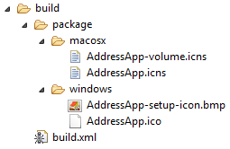

+++
title = "Parte 7: Despliegue"
date = 2014-09-17
description = "Cómo desplegar una aplicación JavaFX como un paquete nativo. Crea un instalador para Windows, MacOS, o Linux."
image = "addressapp-macos.png"
prettify = true
# comments = true 
commentsIdentifier = "/library/javafx-8-tutorial/es/part7/"
aliases = [ 
  "/library/javafx-8-tutorial/es/part7/"
]
weight = 7

[[sidebars]]
header = "Código fuente"
[[sidebars.items]]
text = "<i class=\"fa fa-fw fa-download\"></i> Parte 7 proyecto Eclipse <em>(requiere al menos JDK 8u20)</em>"
link = "https://github.com/marcojakob/tutorial-javafx-8/releases/download/v1.1/addressapp-jfx8u40-part-7.zip"
+++

He pensado escribir una última parte de este tutorial para mostrar como desplegar (es decir empaquetar y publicar) la aplicación de libreta de direcciones.

*****

## Contenidos en Parte 7

* Desplegando nuestra aplicación JavaFX como un **Paquete nativo** con e(fx)clipse

*****

## Qué es el despliegue

El despliegue es el proceso de empaquetar y distribuir o hacer llegar una aplicación al usuario. Es una fase crucial del desarrollo porque es el primer contacto del usuario final con nuestro software.

Java se anuncia con el slogan **Escribe una vez, ejecuta donde sea** para ilustar sobre los beneficios *multi-plataforma* del lenguaje Java. Idealmente, esto significa que nuestra aplicación Java puede ser ejecutada en cualquier dispositivo equipado con una *Máquina Virtual Java* (JVM).

En el pasado, la experiencia de usuario instalando una aplicación Java no ha sido siempre agradable. Si el usuario no tenía en su sistema la versión requerida de Java Runtime (JRE), debía ser guíado para su instalaci´no previa. Esto originaba ciertas dificultades, como problemas de privilegios (había que ser administrador) o problemas de compatibilidad.

Afortunadamente, JavaFX ofrece una nueva opción para el despliegue de una aplicación denominada **Native Packaging** (también llamada Self-Contained Application Package). Un paquete nativo es un lote que contiene tanto la aplicación como la JRE específica requerida. 

Orable en su documentación oficial sobre JavaFX ofrece una guía extensiva de todas las opciones de despliegue en su [JavaFX deployment options](http://docs.oracle.com/javafx/2/deployment/jfxpub-deployment.htm). 

En esta parte del tutorial mostraré como crear un **paquete nativo** con Eclipse y el [**plugin e(fx)clipse**](http://www.eclipse.org/efxclipse/).

*****

## Crea una paquete nativo

El objetivo es crear una aplicación auto-contenida en una carpeta. Esta es la apariencia que tendrá la aplicación de libreta de direcciones (en Windows):

La carpeta `app` contiene los datos de nuestar aplicación y el `runtime` de Java específico de la plataforma.

Para hacérselo incluso más fácil al usuario, vamos a proporcionar un instalador:

* Un archivo de instalación `.exe` para Windows.
* Un archivo de instalación `.dmg` (drag & drop) para MacOS.

El plugin e(fx)clipse nos ayudará a generar el paquete nativo y el instalador.

### Paso 1 - Edita build.fxbuild

El archivo `build.fxbuild` es utilizado por e(fx)clipse parar generar otro archivo 
que a su vez será usado por la herramienta Ant. (Si no tuvieras el archivo `build.fxbuild`, crea un nuevo proyecto JavaFX  en Eclipse y copia el archivo generado)

1. Abre `build.fxbuild` desde la raíz de tu proyecto.

2. Rellena todos los campos que contengan una estrella. *Para usuarios de MacOS: no uses espacios en el título de la aplicación porque puede ocasionar un problema.*    

3. Como **Packaging Format** elige entre `exe` para Windows, `dmg` para MacOS, o `rpm` para Linux.

4. Pincha en el enlace `Generate ant build.xml only` (se encuentra en el lado derecho).   

5. Verifica que se ha creado una nueva carpeta denominada `build` así como un archivo `build.xml`.

### Paso 2 - Añade iconos de instalación

Nos gustaría tener algunos iconos para nuestro instalador:

* [AddressApp.ico](AddressApp.ico) para el icono de la aplicación una vez instalada
* [AddressApp-setup-icon.bmp](AddressApp-setup-icon.bmp) para la pantalla  del programa de instalación
* [AddressApp.icns](AddressApp.icns) para el instalador de Mac

1. Crea las siguientes subcarpetas en la carpeta `build`:
  * `build/package/windows` (sólo para Windows)
  * `build/package/macos` (sólo para MacOS)
2. Copia los iconos indicados arriba en las subcarpetas que correspondan. Debería tener esta apariencia ahora:   

3. **Importante**: El nombre de los iconos debe coincidir exactamente con el título de la aplicación tal y como ha sido especificada en la propiedad **Application title** del archivo `build.fxbuild`:
  * `YourAppTitle.ico`
  * `YourAppTitle-setup-icon.bmp`
  * `YourAppTitle.icns`

### Paso 3 - Añade recursos

Nuestra carpeta `resources` no se copia automáticamente, debemos añadirla nosotros a la carpeta `build`:

1. Crea una subcarpeta denominada `dist` dentro de la carpeta `build`.
2. Copia la carpeta `resources` (conteniendo las imágenes de nuestra aplicación) dentro de `build/dist`.    

### Paso 4 - Edita build.xml para incluir iconos

E(fx)clipse ha generado un archivo `build/build.xml` que está listo para ser ejecutado por **Ant**. Sin embargo los iconos y las imágenes que tenemos en la carpeta `resources` no se incluirán en el paquete nativo.

Como todavía no se le puede indicar a e(fx)clipse que incluya recursos adicionales como nuestra carpeta `resources` y los iconos anteriores, tenemos que editar el archivo `build.xml` manualmente:

Abre para edición el archivo `build.xml` y encuentra la ruta `fxant`. Añade una línea para indicar el directorio base `${basedir}` (esto hará que nuestros iconos estén disponibles):

##### build.xml - añade "basedir"

<pre class="prettyprint lang-xml">
&lt;path id="fxant"&gt;
  &lt;filelist&gt;
    &lt;file name="${java.home}\..\lib\ant-javafx.jar"/&gt;
    &lt;file name="${java.home}\lib\jfxrt.jar"/&gt;
    <mark>&lt;file name="${basedir}"/&gt;</mark>
  &lt;/filelist&gt;
&lt;/path&gt;
</pre>    

Encuentra el bloque `fx:resources id="appRes"` más abajo en el archivo y añade una línea para nuestros `resources`:

##### build.xml - añade "resources"

<pre class="prettyprint lang-xml">
&lt;fx:resources id="appRes"&gt;
    &lt;fx:fileset dir="dist" includes="AddressApp.jar"/&gt;
    &lt;fx:fileset dir="dist" includes="libs/*"/&gt;
    <mark>&lt;fx:fileset dir="dist" includes="resources/**"/&gt;</mark>
&lt;/fx:resources&gt; 
</pre>

Por alguna razón el número de versión se añade a la aplicación  (propiedad `fx:application`) lo que hace que el instalador adopte siempre el valor por defecto`1.0` (tal y como han indicado varios comentarios). Para corregir esto, hay que añadir el número de versión de forma manual  (gracias a Marc por [descubrir como hacerlo](http://code.makery.ch/library/javafx-tutorial/part7/#comment-1566725959)):

##### build.xml - añade número de "version"

<pre class="prettyprint lang-xml">
&lt;fx:application id="fxApplication"
    name="AddressApp"
    mainClass="ch.makery.address.MainApp"
    <mark>version="1.0"</mark>
/>
</pre>

Ya podemos ejecutar `build.xml` con *Ant*. Esto generará un jar ejecutable del proyecto. Pero queremos ir un paso más allá y crear un práctico instalador.

### Paso 5 (WINDOWS) - Instalador de Windows (exe)

Con el programa **Inno Setup** podemos crear un instalador Windows de nuestra aplicación como un único archivo `.exe`. El archivo resultante realizará una instalación a nivel de usuario (no se requieren permisos de administrador). Además se creará un enlace (menú de inicio o escritorio).

1. Descarga [Inno Setup 5 o posterior](http://www.jrsoftware.org/isdl.php). Instala Inno Setup en tu computadora. Nuestro script Ant lo usará automáticamente para generar el instalador.

2. Publica la ruta donde está instalado Inno Setup (e.g. `C:\Program Files (x86)\Inno Setup 5`). Para hacerlo, añade esa ruta a la variable `Path` en tus variables de entorno de Windows. Si no sabes donde encontrarlas, lee[How to set the path and environment variables in Windows](http://www.computerhope.com/issues/ch000549.htm).

3. Reinicia Eclipse y continúa con el Paso 5.

### Paso 5 (MAC) - Instalador de MacOS (dmg)

Para crear un instalador de Mac OS (`dmg`) no se requiere ninguna herramienta adicional.

Nota: Para que la imagen del instalador funcione debe tener exactamente el mismo nombre que la aplicación.

### Paso 5 (LINUX etc.) - Instalador de Linux (rpm)

Para otras opciones de instalación (ej. `msi` para Windows o `rpm` para Linux)  consulta [este artículo](https://blogs.oracle.com/talkingjavadeployment/entry/native_packaging_for_javafx) o la [documentación de Oracle](http://docs.oracle.com/javafx/2/deployment/self-contained-packaging.htm#A1324980).

### Paso 6 - Ejecuta build.xml

Como último paso, tenemos que ejecutar `build.xml` con Ant: *Clic derecho sobre `build.xml`* | *Run As* | *Ant Build*.

La ejecución de `build.xml` **puede tardar un poco** (dependiendo de la máquina que lo ejecute).

Si el proceso concluye con éxito, deberías encontrar un lote de instaladores nativos en la carpeta `build/deploy/bundles`. Este el aspecto que tiene la versión de Windows:

El archivo `AddressApp-1.0.exe` puede ser como arhivo de instalación independiente. Este instalador copiará el lote en `C:/Users/[yourname]/AppData/Local/AddressApp`.

### ¿Qué es lo siguiente?

Espero que este tutorial te haya resultado de ayuda iniciarte en JavaFX y a partir de aquí seas capaz de desarrollar tu propio proyecto.

Cualquier feedback es bienvenido. No dudes en comentar si tienes sugerencias que hacer o algo no te ha quedado claro.

##### Otros artículos que podrían resultarte de interés

* [JavaFX Dialogs](/blog/javafx-8-dialogs/)
* [JavaFX Date Picker](/blog/javafx-8-date-picker/)
* [JavaFX Event Handling Examples](/blog/javafx-8-event-handling-examples/)
* [JavaFX TableView Sorting and Filtering](/blog/javafx-8-tableview-sorting-filtering/)
* [JavaFX TableView Cell Renderer](/blog/javafx-8-tableview-cell-renderer/)

