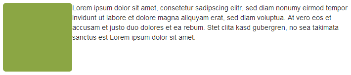
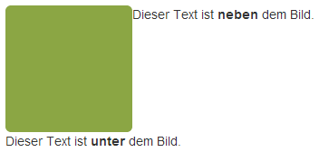
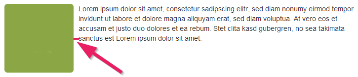

+++
title = "Bilder mit Bootstrap verwenden"
date = 2015-04-09
updated = 2018-08-28
description = "Lernen Sie wie Bilder mit Bootstrap verwendet werden können. Bilder automatisch auf die Bildschirmgrösse anpassen, Bilder ausrichten, etc."
prettify = true
comments = true
commentsIdentifier = "/library/more-html-css/de/image-bootstrap/"
aliases = [ 
  "/library/more-html-css/de/image-bootstrap/" 
]
weight = 3

sidebarName = "<i class=\"fa fa-fw fa-image\"></i> Bilder mit Bootstrap verwenden"

# Custom Sidebars
[[sidebars]]
header = "Links"
[[sidebars.items]]
text = "<i class=\"fa fa-fw fa-external-link\"></i> HTML & CSS Tutorial"
link = "/de/library/html-css/"
+++

Diese Seite wurde aktualisiert für <a href="https://getbootstrap.com/" class="alert-link">Bootstrap 4</a>. 

In diesem Teil lernen Sie ein paar Tricks mit Bildern:

- [Responsive Bilder](#responsive-bilder) - passen sich auf Bildschirmgrösse an
- [Bilder ausrichten](#bilder-ausrichten) - zentrieren, links, rechts
- [Bilder mit Konturen](#bilder-mit-konturen) - Ecken abrunden, etc.

Falls Sie Bootstrap in Ihrem Projekt noch nicht integriert haben, lesen Sie zuerst den Teil über <a href="/de/library/html-css/part7/" class="alert-link">Bootstrap Framework verwenden</a> aus dem HTML &lt; CSS Tutorial.

Bilder in eine Webseite einbinden gelingt am einfachsten wie folgt:

##### Bild einfügen

<pre class="prettyprint lang-html">
&lt;img src="mein-bild.png" alt="Mein Bild">
</pre>

## Responsive Bilder

Wenn eine Webseite auf unterschiedlichen Bildschirmen angezeigt wird, dann kommt man nicht darum herum, diese auf kleinen Bildschirmen zu verkleinern.

Bootstrap bietet hierzu eine CSS-Klasse `img-fluid`, welche Bilder automatisch auf die Containergrösse anpasst (lesen Sie über [Responsive Bilder in der Bootstrap Dokumentation](https://getbootstrap.com/docs/4.1/content/images/#responsive-images)).

##### Responsive Bild einfügen

<pre class="prettyprint lang-html">
&lt;img src="mein-bild.png" alt="Mein Bild" class="img-fluid" >
</pre>

## Bildergrössen

Man kann das Bild zwar verkleinern oder vergrössern mit einer CSS-Regel wie `width: 200px;`, aber das ist oft nicht sinnvoll. Man versucht nämlich immer die Downloadgrösse der Webseite zu optimieren. Wenn man also ein Bild mit 400px-Breite herunterlädt und es dann immer auf 200px verkleinert, dann ist das nicht optimal. Deshalb sollte man schauen, dass das Bild immer die optimale Grösse hat.

### Resolution Switching

Wenn Sie weiter optimieren möchten, können Sie kleine Bilder für kleine Screens und grosse Bilder für grosse Screens.

## Bilder ausrichten

### Zentrieren

Mit der CSS-Klasse `mx-auto` können Sie mit Bootstrap Bilder zentrieren. Bilder sind standardmässig Inline-Elemente. Sie können nur zentriert werden, wenn wir sie mit der zusätzlichen Klasse `d-block` zu Blockelementen machen.

##### Bild zentrieren

<pre class="prettyprint lang-html">
&lt;img src="..." alt="..." class="mx-auto d-block">
</pre>

<strong>Hinweis:</strong> Die Klasse <code>mx-auto</code> kann auch zum Zentrieren von anderen HTML-Elementen gebraucht werden. Für Text und andere Inline-Elemente muss aber <code>mx-auto</code> verwendet werden (siehe <a href="https://getbootstrap.com/docs/4.1/utilities/spacing/#horizontal-centering" class="alert-link">horizontal Zentrieren</a> und <a class="alert-link" href="https://getbootstrap.com/docs/4.1/utilities/text/#text-alignment">Text ausrichten</a>).

### Links und rechts ausrichten

Bilder können nach links und nach rechts ausgerichtet werden. Der Text fliesst dabei um die Bilder herum. Dazu werden sogenannte _Floats_ verwendet (lesen Sie über [Floats](https://getbootstrap.com/docs/4.1/utilities/float/) in der Bootstrap Dokumentation).

##### Links ausrichten

<pre class="prettyprint lang-html">
&lt;img src="..." alt="..." class="float-left">
</pre>

##### Rechts ausrichten

<pre class="prettyprint lang-html">
&lt;img src="..." alt="..." class="float-right">
</pre>

#### Neue Zeile (Clearfix)

Beim Ausrichten nach links oder rechts werden alle nachfolgenden Elemente neben dem Bild dargestellt. Falls man in einer neuen Zeile beginnen möchte, muss man die `clearfix`-Klasse verwenden. Diese Klasse wird meistens auf ein übergeordnetes `
`-Element angewendet (mehr Infos zu [clearfix](https://getbootstrap.com/docs/4.1/utilities/clearfix/) in der Bootstrap Dokumentation):

<pre class="prettyprint lang-html">
&lt;div class="clearfix">
  &lt;img src="..." alt="..." class="float-left">
  &lt;p>Dieser Text ist neben dem Bild.&lt;/p>
&lt;/div>
&lt;p>Dieser Text ist unter dem Bild.&lt;/p>
</pre>

#### Abstand neben dem Bild

Meist möchte man neben dem Bild einen Abstand zum Text oder zu einem anderen Inhalt. Dies erreicht man am einfachsten mit Hilfe der [Bootstrap Abstandsklassen](https://getbootstrap.com/docs/4.1/utilities/spacing/) wie `mr-2`. Aber man kann auch ein `margin` definieren im CSS.

##### HTML für Abstand rechts

<pre class="prettyprint lang-html">
&lt;img src="..." alt="..." class="pull-left mr-2">
</pre>

## Bilder mit Konturen

Bootstrap bietet Möglichkeiten, um Bilder ganz einfach auf einer Webseite zu gestalten. Sie können die [Ecken abrunden](https://getbootstrap.com/docs/4.1/utilities/borders/#border-radius), einen [Kreis ausschneiden](https://getbootstrap.com/docs/4.1/utilities/borders/#border-radius) oder einen [dezenten Rahmen](https://getbootstrap.com/docs/4.1/content/images/#image-thumbnails) hinzufügen:

Mit den folgenden drei CSS-Klassen können Sie Ihren Bildern solche Konturen hinzufügen:

##### Konturen mit Bootstrap

<pre class="prettyprint lang-html">
&lt;img src="..." alt="..." class="rounded">
&lt;img src="..." alt="..." class="rounded-circle">
&lt;img src="..." alt="..." class="img-thumbnail">
</pre>

## Andere Artikel zu Bilder

Folgende Artikel zu Bilder könnte Sie auch interessieren:

- [Bilder gestalten](/de/library/more-html-css/image-editing/)
- [Kostenlose Bilder](/de/library/more-html-css/image-sources/)
