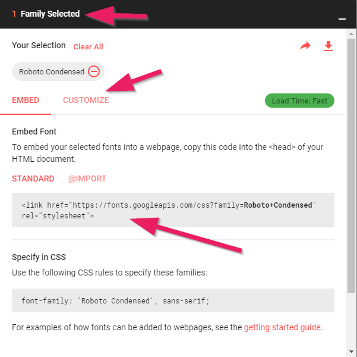

+++
title = "Formatting Text"
date = 2015-04-09
updated = 2018-08-28
description = "Learn about the typographic capabilities of HTML and CSS. Contains examples of how texts can be formatted with bootstrap."
prettify = true
# comments = true
weight = 6

sidebarName = "<i class=\"fa fa-fw fa-font\"></i> Formatting Text"

# Custom Sidebars
[[sidebars]]
header = "Links"
[[sidebars.items]]
text = "<i class=\"fa fa-fw fa-external-link\"></i> HTML & CSS Tutorial"
link = "/library/html-css/"
+++

This page has been updated to cover <a href="https://getbootstrap.com/" class="alert-link">Bootstrap 4</a>. 

In this part you will learn about the typographic capabilities of HTML and CSS.

[Bootstrap](https://getbootstrap.com/) (or other CSS frameworks) make formatting texts much simpler. Bootstrap ensures that the texts and text margins are typographically correct and consistent.

  If you haven't yet integrated Bootstrap in your project, please read <a href="/library/html-css/part7/" class="alert-link">how to use the Bootstrap Framework</a> in the HTML &amp; CSS Tutorial.

Most instructions can be found under [typography](https://getbootstrap.com/docs/4.1/content/typography/) in the Bootstrap documentation. I will mention only the most important text formatting. In the second part I will show you how to change the default font of Bootstrap.

## Headings

Headings are defined with the HTML elements `<h1>` through `<h6>`:

<pre class="prettyprint lang-html">
<mark>&lt;h1></mark>Heading 1<mark>&lt;/h1></mark>
<mark>&lt;h2></mark>Heading 2<mark>&lt;/h2></mark>
<mark>&lt;h3></mark>Heading 3<mark>&lt;/h3></mark>
<mark>&lt;h4></mark>Heading 4<mark>&lt;/h4></mark>
<mark>&lt;h5></mark>Heading 5<mark>&lt;/h5></mark>
<mark>&lt;h6></mark>Heading 6<mark>&lt;/h6></mark>
</pre>

See [Headings](https://getbootstrap.com/docs/4.1/content/typography/#headings) in the Bootstrap documentation.

## Bold

To make text **bold**, use the HTML element `<strong>`:

<pre class="prettyprint lang-html">
&lt;p>That's how you can emphasize <mark>&lt;strong></mark>the most important part<mark>&lt;/strong></mark>.&lt;/p>
</pre>

See [inline text elements](https://getbootstrap.com/docs/4.1/content/typography/#inline-text-elements) in the Bootstrap documentation.

## Italics

To emphasize a text with *italics*, use the HTML element `<em>`:

<pre class="prettyprint lang-html">
&lt;p>That's how you can emphasize with <mark>&lt;em></mark>italics<mark>&lt;/em></mark>.&lt;/p>
</pre>

See [inline text elements](https://getbootstrap.com/docs/4.1/content/typography/#inline-text-elements) in the Bootstrap documentation.

## Changing the Font

With the CSS property `font-family` you can change the font. In most cases, several fonts are defined as fallbacks. When a specific font isn't available on a particular system, the next font in the list is used.

By default, Bootstrap uses the following fonts:

##### Default Bootstrap Fonts

<pre class="prettyprint lang-css">
font-family: -apple-system,BlinkMacSystemFont,"Segoe UI",Roboto,"Helvetica Neue",Arial,sans-serif,"Apple Color Emoji","Segoe UI Emoji","Segoe UI Symbol","Noto Color Emoji";
</pre>

These fonts are defined on the `<body>` element and are thus applied on the entire website.

If you want to change the font, you may **override Bootstrap's CSS rule**. As an example, we could switch to a [serif font](http://en.wikipedia.org/wiki/Serif):

##### Using alternative fonts

<pre class="prettyprint lang-css">
body {
  font-family: Georgia, "Times New Roman", Times, serif;
}
</pre>

### Available Fonts in the Browser

By default, there are only few fonts available on all systems (Windows, Mac, Linux, tablets, smartphones, etc.).

Such fonts are called *Web Safe Fonts*. [CSS Font Stack](https://www.cssfontstack.com/) is one of the many websites that lists these fonts. If you use such a font, remember that you should always specify multiple fonts as fallbacks. [CSS Font Stack](https://www.cssfontstack.com/) always provides a recommended list of similar fonts, called a *font stack*, with every font you choose.

### Embedding a Custom Font

It is also possible to include custom fonts with the website. So we have countless fonts at our disposal. The only disadvantage is that additional fonts extend the loading time of our website a little bit.

#### Google Fonts

The easiest way to embed fonts is with the help of [Google Fonts](https://www.google.com/fonts). Google Fonts are freely available fonts that can be downloaded directly from Google as needed. Here's how:

1. Open the [Google Fonts](https://www.google.com/fonts) website and choose a font. Once you have selected a font, click on the **Plus-Sign** to select this font.   

2. Open the bottom where you should find your selected fonts. Now you can *customize* to select which version of the font you want (for example, light, bold, extra-bold, etc.).   

3. Copy the generated code in the `<head>` section of your website. As an example, I chose the font *Roboto Condensed*:
<pre class="prettyprint lang-html">
&lt;link href="https://fonts.googleapis.com/css?family=Roboto+Condensed" rel="stylesheet" type="text/css">
</pre>

4. Google Fonts will automatically provide the CSS code for the selected font. Now we can use the font in our CSS file:   
<pre class="prettyprint lang-css">
   body {
     font-family: 'Roboto Condensed', sans-serif;
   }
</pre>

#### Recommended Font Combinations 

Choosing an appropriate font is very important and gives your website a personal touch. Often two fonts are used in combination, one font for the headings and one font for the text.

Have a look at recommended font combinations of Google Fonts on the following pages:

* [Theme Armada](http://blog.themearmada.com/8-amazing-google-font-combinations/)
* [Brian Gardner](http://briangardner.com/google-font-combinations/)
* [Caleb McGuire](http://www.mrmcguire.com/10-useful-google-font-combinations-for-your-next-site/)
* [Beautiful Web Type](http://hellohappy.org/beautiful-web-type/)
* and more...

#### More Fonts

In addition to Google Fonts there are several sites where you can download fonts either for free or for a small license fee:

* [Font Squirrel](http://www.fontsquirrel.com/)
* [dafont](https://www.dafont.com/)
* [Typekit](https://typekit.com/)

