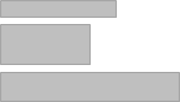
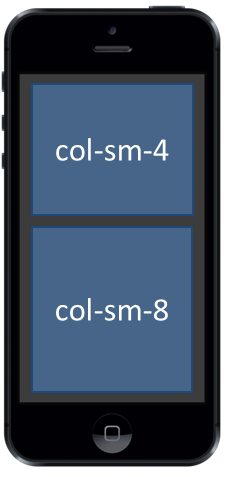
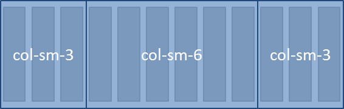
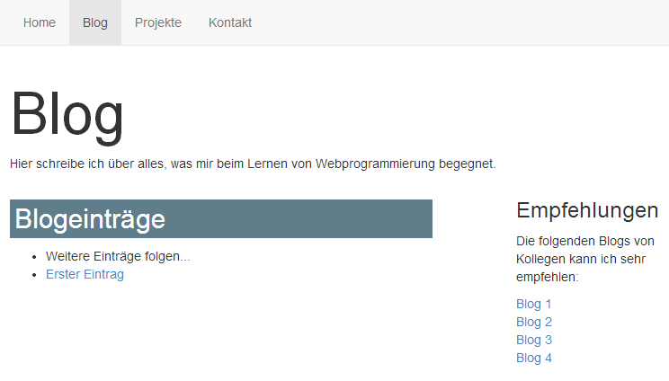

+++
title = "Website-Layout mit Bootstrap"
date = 2015-04-09
updated = 2018-08-28
description = "Lernen Sie, wie Elemente auf Webseiten angeordnet werden können mit dem Bootstrap Raster."
prettify = true
comments = true
commentsIdentifier = "/library/more-html-css/de/website-layout/"
aliases = [ 
  "/library/more-html-css/de/website-layout/" 
]
weight = 1

sidebarName = "<i class=\"fa fa-fw fa-th-large\"></i> Website-Layout mit Bootstrap"

# Custom Sidebars
[[sidebars]]
header = "Links"
[[sidebars.items]]
text = "<i class=\"fa fa-fw fa-external-link\"></i> HTML & CSS Tutorial"
link = "/de/library/html-css/"
+++

Diese Seite wurde aktualisiert für <a href="https://getbootstrap.com/" class="alert-link">Bootstrap 4</a>. 

Standardmässig werden HTML-Elemente auf zwei Arten angeordnet:

**Blockelemente** beginnen immer in einer neuen Zeile. Beispiele für Blockelemente sind `
`, `<h1>`, `
` und `<li>`.

**Inline-Elemente** stehen in der gleichen Zeile. Beispiele für Inline-Elemente sind ``, `<a>`, `<strong>`, `<em>` und ``.

Diese zwei Möglichkeiten reichen jedoch nicht, um ein richtiges Layout für eine Webseite zu erstellen. 

Die meisten Webseiten haben entweder ein Layout mit **zwei Spalten** ...

... oder ein Layout mit **drei Spalten**.

So etwas hinzubekommen ohne ein CSS-Framework wie *Bootstrap* wäre eine rechte Herausforderung. Mit Bootstrap wird es einfacher. 

Zusätzlich wird das Layout in Bootstrap automatisch auf die Bilschirmgrösse angepasst (sogenanntes [Responsive Layout](http://de.wikipedia.org/wiki/Responsive_Webdesign)). Wir können zum Beispiel angeben, dass auf kleinen Bilschirmen die Spalten untereinander angezeigt werden sollen, weil sie nebeneinander nicht mehr Platz hätten.

## Das Bootstrap Raster

Falls Sie Bootstrap in Ihrem Projekt noch nicht integriert haben, lesen Sie zuerst den Teil über <a href="/de/library/html-css/part7/" class="alert-link">Bootstrap Framework verwenden</a> aus dem HTML &amp; CSS Tutorial.

Bootstrap beinhaltet ein **12-spaltiges Rastersystem** für das Layout (siehe [Dokumentation des Bootstrap-Rasters](https://getbootstrap.com/docs/4.1/layout/grid/)). Ein Raster kann man sich vorstellen wie eine unsichtbare Tabelle mit zwölf Spalten:

Wir können nun unsere eigenen Spalten definieren, indem wir angeben, wie breit sie in diesem Raster sein sollen.

### Beispiel für ein 2-spaltiges Layout

In diesem Beispiel definieren wir eine linke Spalte mit der Breite von 4 und eine rechte Spalte mit der Breite von 8. Links könnte man zum Beispiel eine Navigation einfügen und rechts den Seiteninhalt.

Im HTML-Code würde dieses Layout wie folgt aussehen:

<pre class="prettyprint lang-html">
&lt;div class="<mark>container</mark>">
  &lt;div class="<mark>row</mark>">
    &lt;div class="<mark>col-sm-4</mark>">
      Hier kommt der Inhalt der linken Spalte.
    &lt;/div>
    &lt;div class="<mark>col-sm-8</mark>">
      Hier kommt der Inhalt der rechten Spalte.
    &lt;/div>
  &lt;/div>
&lt;/div>
</pre>

<strong>Zu Beachten beim Bootstrap-Raster:</strong>

<ul>
  <li>Das Raster sollte immer in einem <code>&lt;div></code> mit einer <code>container</code>-Klasse sein. (Wenn die Breite immer bis ganz zum Rand ausgefüllt werden soll, kann man alternativ die <code>container-fluid</code>-Klasse verwenden.)</li>
  <li>Innerhalb des Containers kommt ein <code>&lt;div></code> mit der Klasse <code>row</code>. Damit definieren wir eine Zeile im Raster.</li>
  <li>Innerhalb der Zeilen kommen schliesslich die Spalten mit den <code>col</code>-Klassen.  </li>
</ul>

### Bildschirmgrössen

Eine Spaltenangabe beinhaltet jeweils eine Angabe über die Bildschirmgrösse. Es gibt die folgenden vier Bildschirmgrössen:

* `col` - Spalte für Extra-Small-Geräte (Smartphones, schmaler als 576px)
* `col-sm` - Spalte für Small-Geräte (Smartphones, breiter als 576px)
* `col-md` - Spalte für Medium-Geräte (Tablets, breiter als 768px)
* `col-lg` - Spalte für Large-Geräte (Desktops, breiter als 992px)
* `col-xl` - Spalte für Extra-Large-Geräte (grosse Desktops, breiter als 1200px)

Die Angabe `col-sm-4` aus unserem Beispiel oben bedeutet also, dass ungefähr ab der Grösse eines Tablets eine Spalte der Breite 4 dargestellt wird. 

Alle Bildschirme, welche kleiner sind als die angegebene Grösse, stellen die Spalten automatisch untereinander dar.

So sieht unser Beispiel für das 2-spaltige Layout auf einem Smartphone aus:

### Beispiel für ein 3-spaltiges Layout

In diesem Beispiel definieren wir drei Spalten.

Im HTML-Code würde dieses Layout wie folgt aussehen:

<pre class="prettyprint lang-html">
&lt;div class="<mark>container</mark>">
  &lt;div class="<mark>row</mark>">
    &lt;div class="<mark>col-sm-3</mark>">
      Hier kommt der Inhalt der linken Spalte.
    &lt;/div>
    &lt;div class="<mark>col-sm-6</mark>">
      Hier kommt der Inhalt der mittleren Spalte.
    &lt;/div>
    &lt;div class="<mark>col-sm-3</mark>">
      Hier kommt der Inhalt der rechten Spalte.
    &lt;/div>
  &lt;/div>
&lt;/div>
</pre>

## Anwendung auf Portfolio-Blog

Im [HTML & CSS Tutorial](/de/library/html-css/) haben wir ein Portfolio entwickelt mit einer Blog-Seite. Das folgende Beispiel zeigt ein **2-Spalten-Layout** für diese Blog-Seite. In der linken Spalte ist der bisherige Inhalt. In der rechten Spalte haben wir neu Platz zum Beispiel für ein paar Links. 

##### blog/index.html

<pre class="prettyprint lang-html">
&lt;div class="container">
  &lt;h1 class="title">Blog&lt;/h1>

  &lt;p>Hier schreibe ich über alles, was mir beim Lernen von Webprogrammierung begegnet.&lt;/p>

  &lt;div class="<mark>row</mark>">
    &lt;div class="<mark>col-sm-8</mark>">
      &lt;h2>Blogeinträge&lt;/h2>
      &lt;ul>
        &lt;li>Weitere Einträge folgen...&lt;/li>
        &lt;li>&lt;a href="zweiter-eintrag/">Zweiter Eintrag&lt;/a>&lt;/li>
        &lt;li>&lt;a href="erster-eintrag/">Erster Eintrag&lt;/a>&lt;/li>
      &lt;/ul>
    &lt;/div>

    &lt;div class="<mark>col-sm-3 offset-sm-1</mark>">
      &lt;h3>Empfehlungen&lt;/h3>
      &lt;p>
        Die folgenden Blogs von Kollegen kann ich sehr empfehlen:
      &lt;/p>
      &lt;ul class="list-unstyled">
        &lt;li>&lt;a href="#">Blog 1&lt;/a>&lt;/li>
        &lt;li>&lt;a href="#">Blog 2&lt;/a>&lt;/li>
        &lt;li>&lt;a href="#">Blog 3&lt;/a>&lt;/li>
        &lt;li>&lt;a href="#">Blog 4&lt;/a>&lt;/li>
      &lt;/ul>
    &lt;/div>
  &lt;/div>

&lt;/div>
</pre>

#### Hinweise

* Bei der rechten Spalte wurde noch eine zweite CSS-Klasse hinzugefügt: `offset-sm-1`. Dies bedeutet, dass die rechte Spalte um eins nach rechts gerückt werden soll. Damit erhalten wir einen etwas grösseren Abstand zwischen den beiden Spalten.
* Testen Sie das Layout in unterschiedlichen Browsergrössen.
* Die Klasse `list-unstyled` bewirkt, dass die Listenelemente ohne Punkt angezeigt werden (siehe [Bootstrap Listen](https://getbootstrap.com/docs/4.1/content/typography/#unstyled)).

## Weitere Informationen zu Layout

Lesen Sie den Abschnitt über das [Raster-System](https://getbootstrap.com/docs/4.1/layout/grid/) in der Bootstrap Dokumentation.

Eine ausführliche Erklärung, wie das Raster-System funktioniert, finden Sie in [How the Bootstrap 4 Grid Works](https://uxplanet.org/how-the-bootstrap-4-grid-works-a1b04703a3b7).