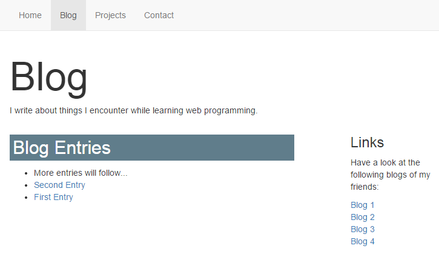

+++
title = "Website Layout with Bootstrap"
date = 2018-08-16
description = "Learn how to layout elements on web pages using the bootstrap grid."
prettify = true
comments = true
weight = 1

sidebarName = "<i class=\"fa fa-fw fa-th-large\"></i> Website Layout with Boostrap"

# Custom Sidebars
[[sidebars]]
header = "Links"
[[sidebars.items]]
text = "<i class=\"fa fa-fw fa-external-link\"></i> HTML & CSS Tutorial"
link = "/library/html-css/"
+++

<strong>Achtung:</strong> Diese Seite wird gerade aktualisiert auf Bootstrap 4, beinhaltet aber noch Informationen zu Bootstrap 3. Bitte verwenden Sie in der Zwischenzeit die <a class="alert-link" target="_blank" href="https://getbootstrap.com/">Originaldokumentation von Bootstrap.</a> 

By default, HTML elements are arranged in two ways:

**Block elements** always start on a new line. Examples of block elements are `
`, `<h1>`, `
`, and `<li>`.

**Inline Elements** are displayed in a line. Examples of inline elements are ``, `<a>`, `<strong>`, `<em>`, and ``.

However, these two options are not enough to create a proper layout for a web page.

Most websites either have a layout with **two columns** ...

... or they have a layout with **three columns**.

To create a layout like this without a CSS framework like *Bootstrap* would be quite a challenge. With Bootstrap it gets much easier.

In addition, the layout in Bootstrap is automatically adjusted to the screen size (so-called [Responsive Layout](http://en.wikipedia.org/wiki/Responsive_web_design)). For example, we can specify that the columns should be displayed below each other on small screens, because they would not fit if displayed horizontally.

## The Bootstrap Grid

  If you haven't yet integrated Bootstrap in your project, please read <a href="/library/html-css/part7/" class="alert-link">how to use the Bootstrap Framework</a> in the HTML &amp; CSS Tutorial.

Bootstrap contains a **12-column grid system** for the layout (see [documentation of the Bootstrap grid](http://getbootstrap.com/css/#grid)). A grid can be thought of as an invisible table with twelve columns.

We can define our own columns by specifying how many wide they should be inside the Bootstrap grid.

### Example for a Two-Column Layout

In this example, we define a left column with a width of 4 and a right column with a width of 8. On the left we could have a navigation while on the right we would put the page's content.

In the HTML code of this layout would look like the following:

<pre class="prettyprint lang-html">
&lt;div class="<mark>container</mark>">
  &lt;div class="<mark>row</mark>">
    &lt;div class="<mark>col-sm-4</mark>">
      Content of the left column.
    &lt;/div>
    &lt;div class="<mark>col-sm-8</mark>">
      Content of the right column.
    &lt;/div>
  &lt;/div>
&lt;/div>
</pre>

  **Hints about the Bootstrap grid:**

  <ul>
    <li>The grid should always be in a `
` with the `container` class. (To use a full width container, spanning the entire width of the viewport use the `container-fluid` class.)</li>
    <li>Inside the container is a `
` with class `row`. We this we define a row in the grid.</li>
    <li>Inside a row we define the columns with the various `col` classes.</li>
  </ul>

### Screen Sizes

Every Bootstrap column class contains an indication of the screen size. There are four scree sizes:

* `col-xs` - Column for extra small devices (smartphones, lower than 768px)
* `col-sm` - Column for small devices (tablets, 768px and up)
* `col-md` - Column for medium devices (desktops, 992px and up)
* `col-lg` - Column for large devices (large desktops, 1200px and up)

Specifying `col-sm-4` in our example above thus means, that a column of width 4 will be displayed on screens that have at least the size of a tablet.

On all screens that are smaller all columns will automatically be stacked vertically.

This is how our example for a two-column layout would look like **on a smartphone**:

### Example for a Three-Column Layout

In this example, we define three columns.

In HTML code this layout would look like this:

<pre class="prettyprint lang-html">
&lt;div class="<mark>container</mark>">
  &lt;div class="<mark>row</mark>">
    &lt;div class="<mark>col-sm-3</mark>">
      Content of the left column.
    &lt;/div>
    &lt;div class="<mark>col-sm-6</mark>">
      Content of the middle column.
    &lt;/div>
    &lt;div class="<mark>col-sm-3</mark>">
      Content of the right column.
    &lt;/div>
  &lt;/div>
&lt;/div>
</pre>

## Applying it to our Portfolio Blog

In the [HTML & CSS Tutorial](/library/html-css/) we developed a portfolio with a blog page. The following example shows a **two-column layout** for the blog page. The left column contains the list of blog entries. In the right column, we now have some space for things like a list of links.

##### blog/index.html

<pre class="prettyprint lang-html">
&lt;div class="container">
  &lt;h1 class="title">Blog&lt;/h1>
  &lt;p>I write about things I encounter while learning web programming.&lt;/p>

  &lt;div class="row">
    &lt;div class="col-sm-8">
      &lt;h2>Blog Entries&lt;/h2>
      &lt;ul>
        &lt;li>More entries will follow...&lt;/li>
        &lt;li>&lt;a href="second-entry/">Second Entry&lt;/a>&lt;/li>
        &lt;li>&lt;a href="first-entry/">First Entry&lt;/a>&lt;/li>
      &lt;/ul>
    &lt;/div>

    &lt;div class="col-sm-3 col-sm-offset-1">
      &lt;h3>Links&lt;/h3>
        &lt;p>
          Have a look at the following blogs of my friends:
        &lt;/p>
        &lt;ul class="list-unstyled">
          &lt;li>&lt;a href="#">Blog 1&lt;/a>&lt;/li>
          &lt;li>&lt;a href="#">Blog 2&lt;/a>&lt;/li>
          &lt;li>&lt;a href="#">Blog 3&lt;/a>&lt;/li>
          &lt;li>&lt;a href="#">Blog 4&lt;/a>&lt;/li>
        &lt;/ul>
    &lt;/div>
  &lt;/div>
&lt;/div>
</pre>

#### Explanations

* In the right column I've added a second CSS class called `col-sm-offset-1`. This causes that the right to be moved one position to the right. Thus we get a slightly larger distance between the two columns.
* Test the layout by resizing your browser window.
* The class `list-unstyled` removes the bullet points of the list items (see [Bootstrap Lists](http://getbootstrap.com/css/#type-lists)).

## More Infos on Bootstrap Layout

Read the section about the [Grid System](http://getbootstrap.com/css/#grid) in the Bootstrap documentation.

An extensive and very good explanation about how the Bootstrap grid system works can be found in [The Subtle Magic Behind Why the Bootstrap 3 Grid Works](http://www.helloerik.com/the-subtle-magic-behind-why-the-bootstrap-3-grid-works).